# 项目日志
#### 2025 FlowerC
|组员1|组员2|组员3|组员4|
|:---:|:---:|:---:|:---:|
|常如意|李佳浩|李桂昇|褚一满|
## 节点一（团队的组建和内容的选定）

#### 8月26日，我们成功组队，第一次开会确定了组名和要做的东西(HTML学习网站)，明确分工，并建立了微信群方便及时沟通。
{width=30%}

## 节点二（项目计划、任务表、网站设计图等初步文件的确立）

#### 9月1日，我们创建了大致的任务表并整理成Excel，讨论初步探索了Git与Gitee并建好了小组gitee库，初步探讨了技术实现问题（决定基本可以全部使用前端实现HTML、CSS、javascript）。
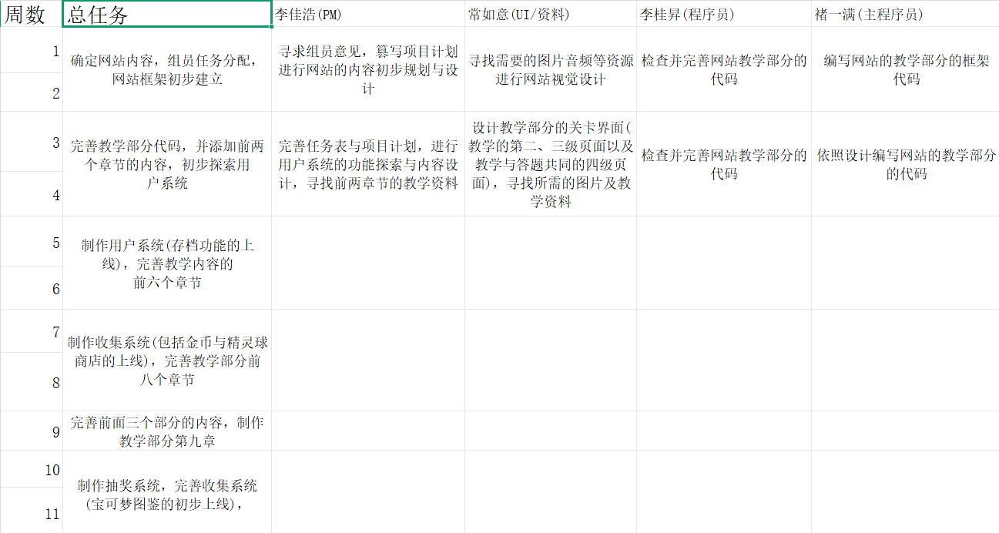{width=50%}
#### 9月2日，我们合力讨论完成了初版的项目计划word文档（虽然没有根据第四章内容不合格）
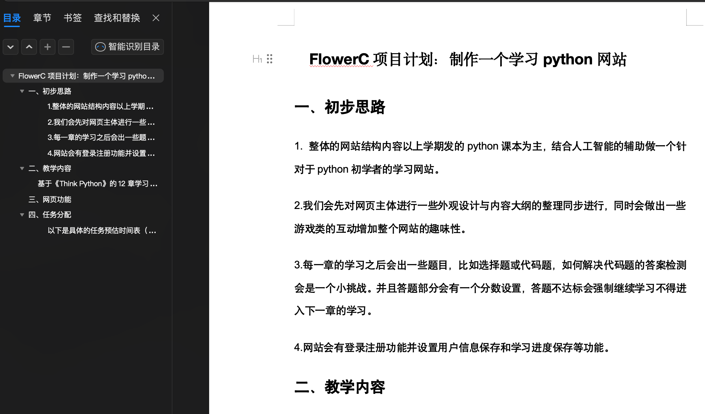{width=50%}

#### 9月8日，我们的网站页面设计图出炉，进行一些初步的资源整理后开始按照设计图纸与教授提供的资料进行网站框架的搭建
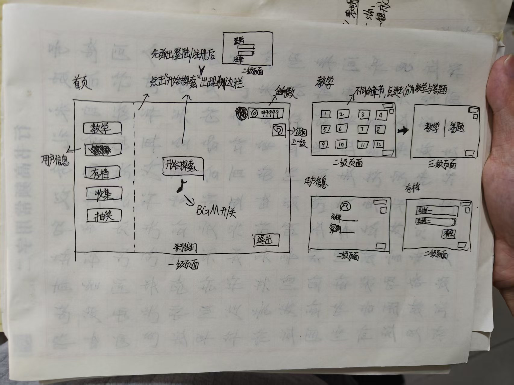{width=50%}

## 节点三（网页内容的制作与功能的实现）

#### 9月9日，已经制作出了首页和登录/注册界面的页面，我们在上课时制作了项目启动ppt并进行展示，更加明确了需要完成的内容与软件工程课程的教学目的。创建了Github库。
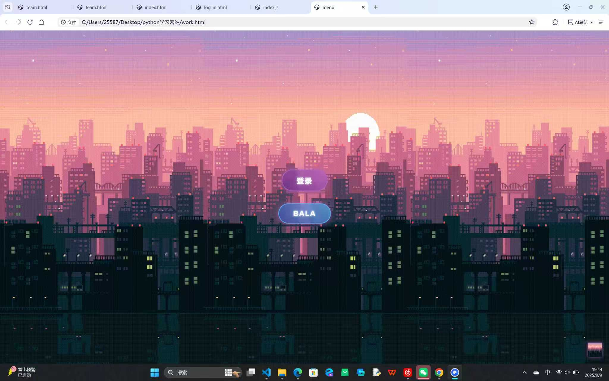{width=50%}
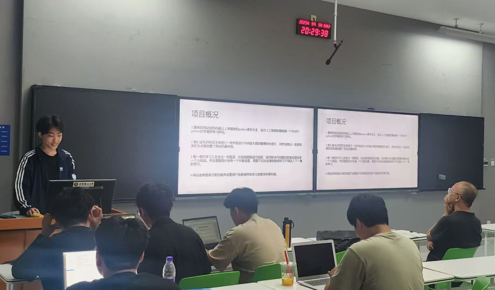{width=50%}

#### 9月16日，教授提出修改计划的三轮为两轮，我们在这周更新了任务表，对每周和每轮的任务目标进行了调整同时进一步分工，准备同时进行用户界面以及教学界面的制作
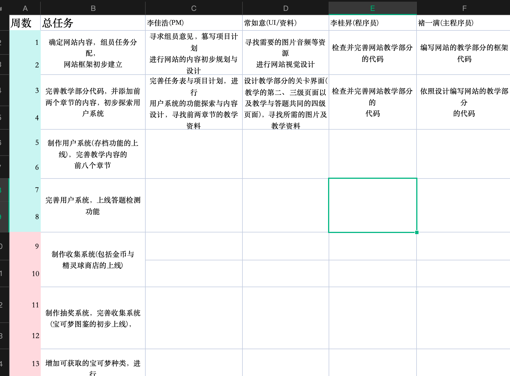{width=50%}

#### 9月23日，我们完成了菜单和教学部分第一级页面的制作，同时借助人工智能，使用indexedDB实现了登录/注册功能可用
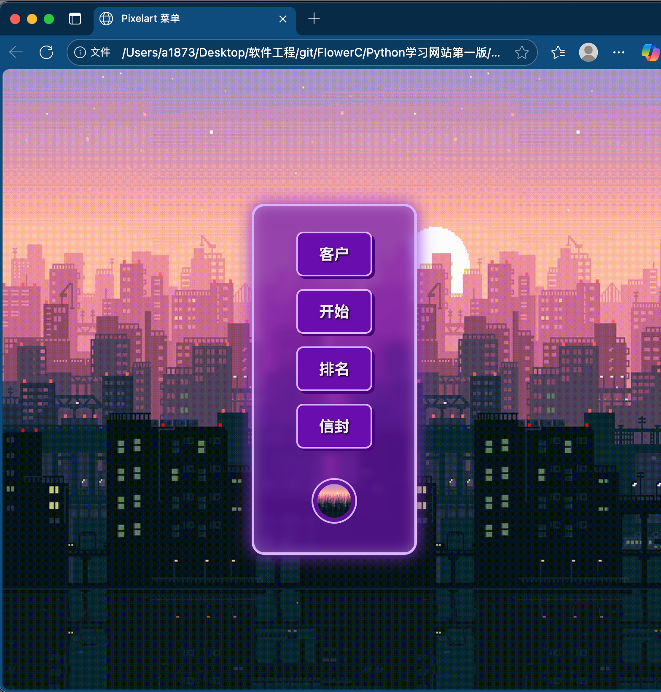{width=50%}
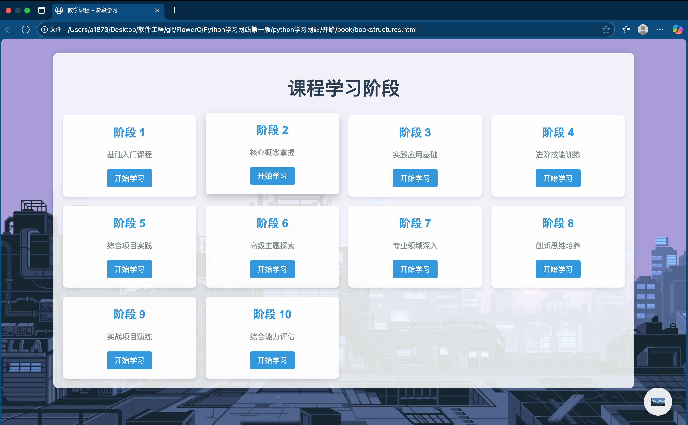{width=50%}
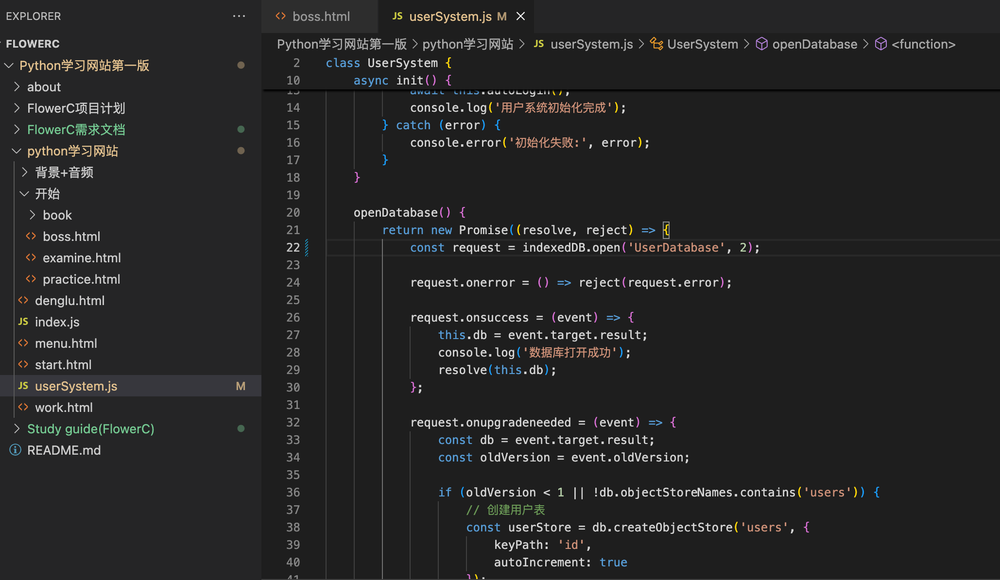{width=50%}

#### 9月27日，我们修改完善了项目计划，制作了需求文档以及study guide的前三个章节
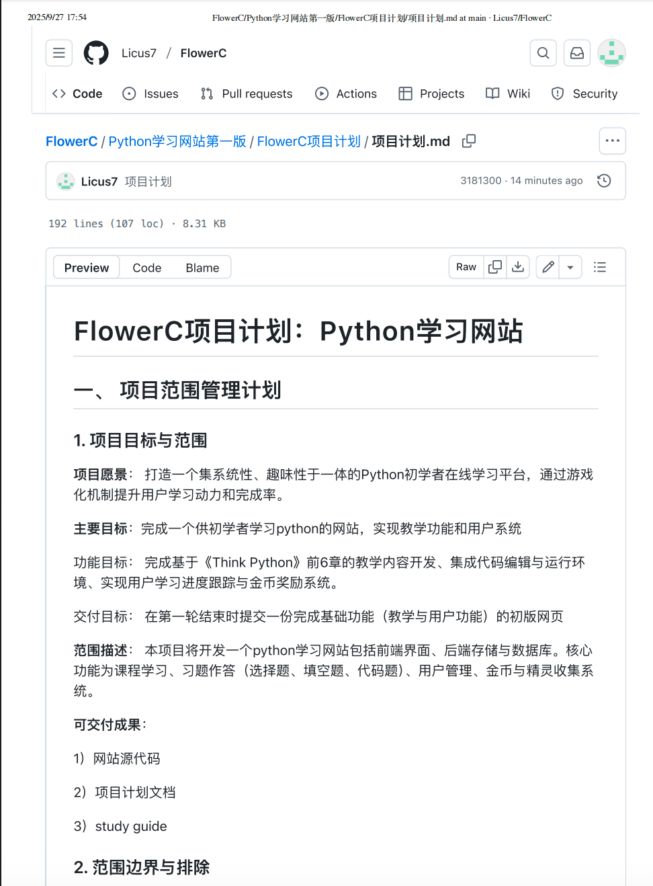{width=50%}
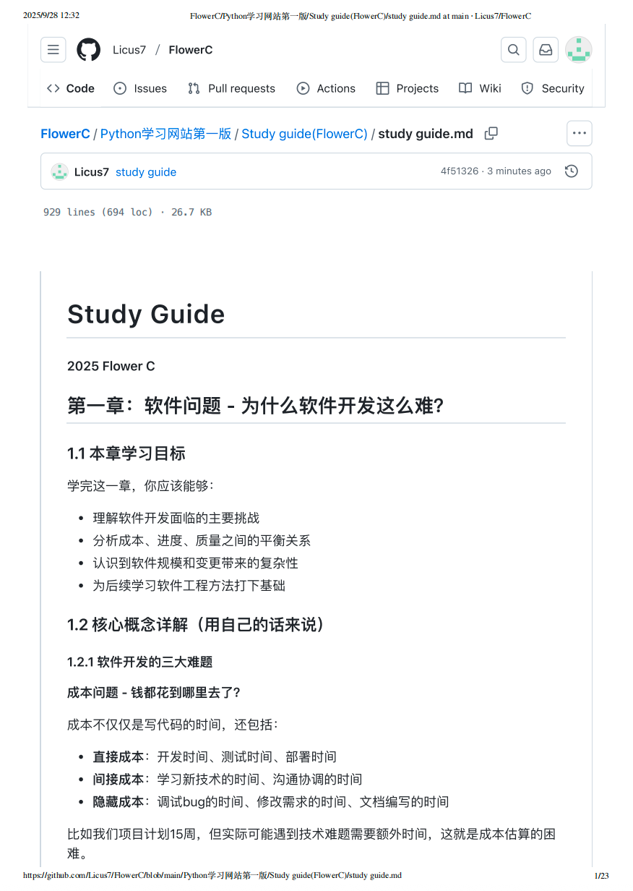{width=50%}

|组员|得分|
|:---:|:---:|
|李佳浩|95|
|常如意|100|
|李桂昇|100|
|褚一满|100|