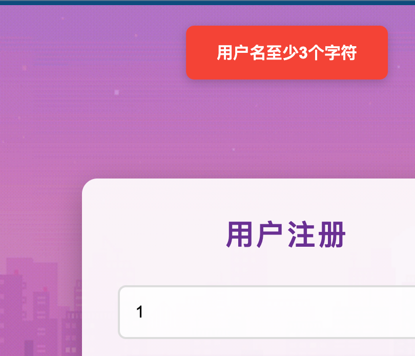
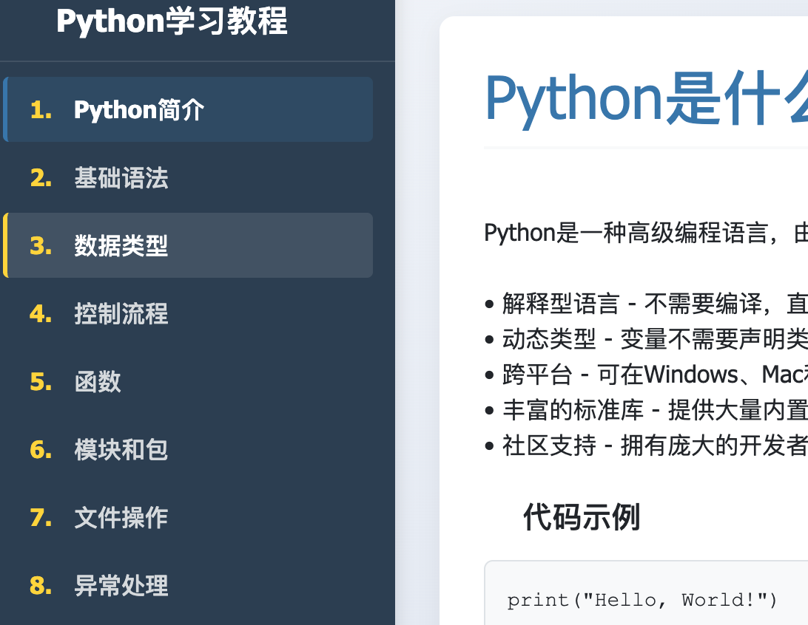
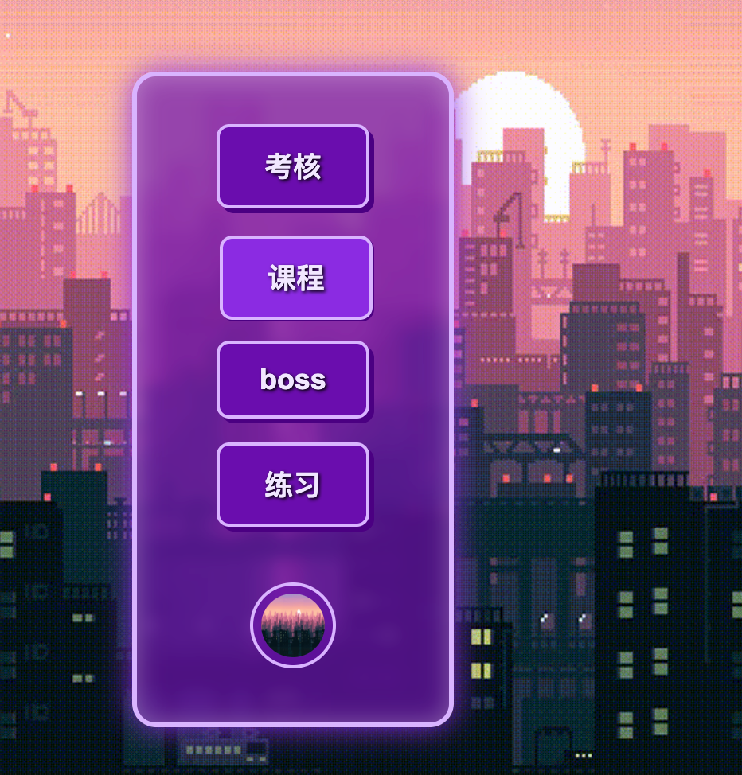
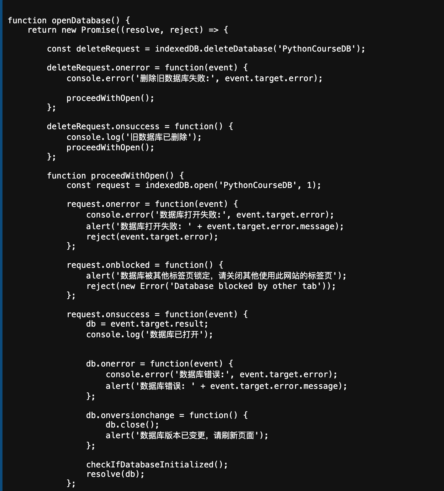
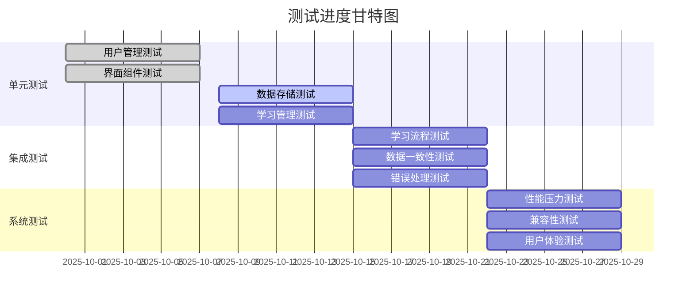
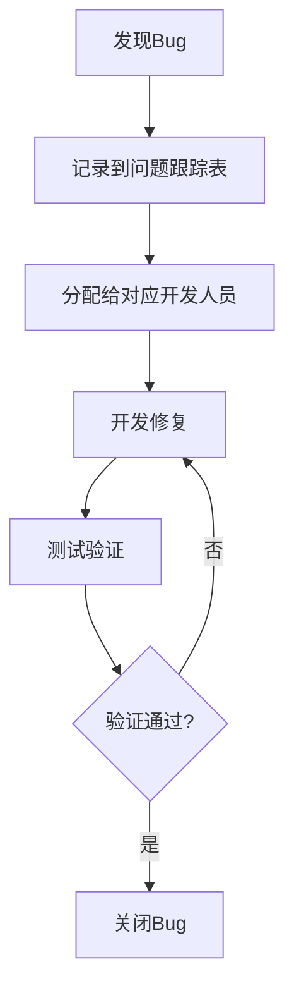

# 测试文档
版本：1.0
制作于2025年10月
*FlowerC*

## 1. 测试概述

### 1.1 测试目的
本文档记录了对Python学习网站项目的各个功能的测试，为确保各功能模块的质量和可行性。

### 1.2 测试范围
**本次测试（第一轮基础性功能）包含：**
- 用户管理功能测试
- 学习管理功能测试  
- 基础界面功能测试
- 数据存储功能测试

**暂不测试（第二轮目前制作中）：**
- 游戏化功能（金币、精灵收集）
- 完整的答题批改功能
- 高级代码检测功能

### 1.3 测试环境
- **浏览器**：Chrome、Safari、Edge
- **操作系统**：Windows 11、macOS
- **设备**：笔记本

## 2. 测试单元明细

### 2.1 用户管理模块

| 需求编号 | 测试条件 | 测试数据和设置 | 期望输出 | 完成情况 |
|---------|----------|----------------|----------|----------|
| **UT-001**<br>用户注册功能 | 1. 输入有效用户名和密码<br>2. 输入已存在的用户名<br>3. 输入不符合要求的密码<br>4. 输入不符合要求的用户名 | 1. 用户名: "111", 密码: "123456", <br>2. 用户名: "111（再次注册）", 密码: "123456", <br>3. 用户名: "123", 密码: "123", <br>4. 用户名: "1", 密码: "123456",| 1. 注册成功，跳转到登录页面<br>2. 提示"用户名已存在"<br>3. 提示"密码长度至少6位"<br>4. 提示"用户名至少三位" |已完成且达标|
| **UT-002**<br>用户登录功能 | 1. 输入正确的用户名和密码<br>2. 输入错误的密码<br>3. 输入不存在的用户名<br> | 1. 用户名: "test", 密码: "123456"<br>2. 用户名: "test", 密码: "wrongpass"<br>3. 用户名: "错名字", 密码: "123456"<br> | 1. 登录成功，进入学习主页<br>2. 提示"密码错误"<br>3. 提示"用户不存在"<br> |已完成且达标|
| **UT-003**<br>学习进度记录 | 1. 完成章节学习<br>2. 参加章节测试<br>3. 中途退出后重新进入 | 1. 用户完成第1章学习<br>2. 测试成绩85分<br>3. 学习到一半关闭页面 | 1. 进度标记为"已完成"<br>2. 成绩正确记录<br>3. 恢复到最后学习位置 |已完成且达标|

#### 注册测试图例（用户名不达标时）：


### 2.2 学习管理模块

| 需求编号 | 测试条件 | 测试数据和设置 | 期望输出 | 完成情况 |
|---------|----------|----------------|----------|----------|
| **UT-004**<br>章节内容展示 | 1. 访问已解锁章节<br>2. 访问未解锁章节<br>3. 章节内容完整性 | 1. 第1章（默认解锁）<br>2. 第2章（未完成第1章）<br>3. 检查所有12个章节 | 1. 正常显示教学内容<br>2. 提示"请先完成前一章节"<br>3. 所有章节内容完整显示 |已完成且达标|
| **UT-005**<br>学习进度控制 | 1. 完成当前章节学习<br>2. 考试成绩达到80分<br>3. 考试成绩低于80分 | 1. 学习完第1章所有内容<br>2. 第1章考试85分<br>3. 第1章考试75分 | 1. 可参加章节测试<br>2. 解锁第2章<br>3. 提示重新学习，第2章保持锁定 |制作中……|
| **UT-006**<br>界面导航功能 | 1. 章节间导航<br>2. 主菜单导航<br>3. 面包屑导航 | 1. 点击下一章/上一章<br>2. 点击菜单项跳转<br>3. 使用面包屑返回 | 1. 正确跳转到目标章节<br>2. 页面跳转流畅<br>3. 导航历史记录正确 |已完成且达标|
| **UT-007**<br>内容缓存机制 | 1. 重复访问同一章节<br>2. 网络连接不稳定<br>3. 清除浏览器缓存 | 1. 多次访问第1章内容<br>2. 模拟弱网环境<br>3. 清除缓存后访问 | 1. 从缓存快速加载<br>2. 降级到基础内容显示<br>3. 重新从服务器加载内容 |已完成且达标|

#### 学习界面导航（功能正常且流畅）：



### 2.3 界面展示模块

| 需求编号 | 测试条件 | 测试数据和设置 | 期望输出 | 完成情况 |
|---------|----------|----------------|----------|----------|
| **UT-008**<br>响应式布局 | 1. 桌面端显示（>1024px）<br>2. 平板端显示（768px）<br>3. 手机端显示（375px） | 1. Chrome浏览器全屏/缩小<br>2. Safari浏览器全屏/缩小<br>3.Edge浏览器全屏/缩小 |  按钮跟随，布局正常显示<br> |已完成且达标|
| **UT-09**<br>页面加载性能 | 1. 首次访问首页<br>2. 章节内容加载<br>3. 用户数据加载 | 1. 清除缓存首次访问<br>2. 点击进入第1章<br>3. 登录后加载用户数据 | 1. 加载时间≤3秒<br>2. 内容加载时间≤2秒<br>3. 数据加载时间≤1秒 |已完成且达标|
| **UT-010**<br>交互动效 | 1. 按钮点击反馈<br>2. 页面切换动画<br>3. 加载状态指示 | 1. 点击注册/登录按钮<br>2. 章节间切换<br>3. 数据保存过程中 | 1. 按钮有按压效果<br>2. 平滑的过渡动画<br>3. 显示加载进度条 |已完成且达标|

#### 按钮效果和音乐（可正常显示/播放）：


### 2.4 数据存储模块

| 需求编号 | 测试条件 | 测试数据和设置 | 期望输出 | 完成情况 |
|---------|----------|----------------|----------|----------|
| **UT-011**<br>IndexedDB连接 | 1. 首次访问网站<br>2. 再次访问网站| 1. 新用户第一次访问<br>2. 已登录用户重新切换回网站 | 1. 自动创建数据库<br>2.提示”数据库已更新，请刷新页面“|已完成且达标|
| **UT-012**<br>数据读写操作 | 1. 大量数据写入<br>2. 复杂查询操作<br>3. 数据删除操作 | 1. 保存12个章节进度<br>2. 查询用户所有学习记录<br>3. 清理测试数据 | 1. 写入成功，无数据丢失<br>2. 查询结果准确完整<br>3. 数据彻底删除 |制作中……|
| **UT-013**<br>数据一致性 | 1. 多标签页同时操作<br>2. 异常中断后恢复<br>3. 数据完整性验证 | 1. 同一用户在多个标签页学习<br>2. 浏览器突然关闭<br>3. 验证用户进度数据 | 1. 数据冲突正确处理<br>2. 恢复到最后一致状态<br>3. 所有关联数据保持一致 |已完成且达标|

数据库存储部分源代码：


## 3. 测试特征

### 3.1 功能正确性
**测试重点：**
- 用户注册流程是否完整
- 登录验证是否准确
- 学习进度是否正确保存和读取
- 界面跳转是否正常

**具体检查项常量：**
```javascript
// 用户注册功能检查点
const registrationChecks = [
    "用户名唯一性验证",
    "密码复杂度检查", 
    "注册成功后的页面跳转",
    "错误信息的友好提示"
];

// 学习功能检查点  
const learningChecks = [
    "章节内容加载完整性",
    "进度保存的及时性",
    "界面状态的正确性"
];
```

### 3.2 性能表现
**响应时间要求：**
- 页面加载时间 ≤ 3秒
- 用户操作响应 ≤ 1秒
- 数据保存延迟 ≤ 500毫秒

**资源使用要求：**
- 内存占用合理
- 本地存储空间使用优化
- 网络请求最小化

### 3.3 兼容性
**浏览器兼容：**
- Chrome 完全支持
- Safari 完全支持
- Edge   完全支持

**设备兼容：**
- 桌面端（≥1024px）完整功能
- 平板端（768px-1024px）适配布局
- 手机端（≥375px）核心功能

### 3.4 用户体验
**易用性测试：**
- 新用户学习成本（10分钟内上手）
- 操作流程简洁性（核心功能3步内完成）
- 错误提示的清晰度
- 界面一致性

## 4. 测试方法

### 4.1 单元测试


**测试用例示例：**
```javascript
// 用户注册功能测试
describe('用户注册功能', () => {
    test('应该成功注册新用户', async () => {
        const result = await registerUser({
            用户名: 'testuser',
            密码: '123456'
        });
        expect(result.success).toBe(true);
    });

    test('应该拒绝重复用户名', async () => {
        const result = await registerUser({
            用户名: 'existinguser', 
            密码: '123456'
        });
        expect(result.success).toBe(false);
        expect(result.message).toContain('用户名已存在');
    });
});

// 学习进度测试
describe('学习进度管理', () => {
    test('应该正确保存学习进度', async () => {
        const progressData = {
            用户名: 'testuser',
            chapterId: 1,
            score: 85,
            completed: true
        };
        const saveResult = await saveProgress(progressData);
        expect(saveResult.success).toBe(true);
        
        const loadResult = await loadProgress('testuser', 1);
        expect(loadResult.score).toBe(85);
    });
});
```

### 4.2 集成测试
**测试重点：**
- 模块间接口调用
- 数据流完整性
- 错误传递机制

**测试场景：**
```javascript
// 完整学习流程测试
const learningFlowTest = async () => {
    // 1. 用户登录
    const loginResult = await login(credentials);
    
    // 2. 选择章节学习
    const chapterContent = await loadChapter(1);
    
    // 3. 更新学习进度
    const progressResult = await updateProgress(progressData);
    
    // 4. 验证数据一致性
    const verifyResult = await verifyDataConsistency();
    
    return verifyResult.success;
};
```

### 4.3 界面测试

**测试内容：**
- 页面元素显示正确性
- 用户交互响应性
- 界面布局适应性
- 导航功能完整性

### 4.4 兼容性测试
**测试矩阵：**
| 浏览器 | 操作系统 | 屏幕尺寸 | 测试状态 |
|--------|----------|----------|----------|
| Chrome | Windows 10 | 桌面端 | ✅  |
| Chrome | macOS | 桌面端 | ✅  |
| Safari  | macOS | 桌面端 | ✅ |

## 5. 测试目标

### 5.1 质量目标
**功能质量：**
- 关键功能测试覆盖率 ≥ 95%
- 严重bug修复率 100%
- 一般bug修复率 ≥ 90%

**性能目标：**
- 页面加载达标率 ≥ 98%
- 操作响应达标率 ≥ 99%
- 数据保存成功率 ≥ 99.9%


## 6. 测试进度

### 6.1 里程碑节点


## 7. 测试任务流程

### 7.1 流程图

#### Bug处理流程：



## 8. 风险评估

### 8.1 测试风险识别
| 风险类型 | 风险描述 | 影响程度 | 应对措施 |
|----------|----------|----------|----------|
| 时间不足 | 测试周期紧张 | 高 | 优先测试核心功能 |
| 人员经验 | 测试经验有限 | 中 | 借助人工智能，学习测试方法 |
| 环境问题 | 测试环境不稳定 | 中 | 准备备用方案，及时维护 |
| 需求变更 | 测试范围扩大 | 高 | 严格变更控制，调整测试计划 |

### 8.2 应急计划
- **时间延误**：周末加班或调整测试范围
- **重大bug**：立即组织专项修复
- **环境故障**：启用备用测试环境
- **人员变动**：知识共享和任务重新分配

---
FlowerC 2025