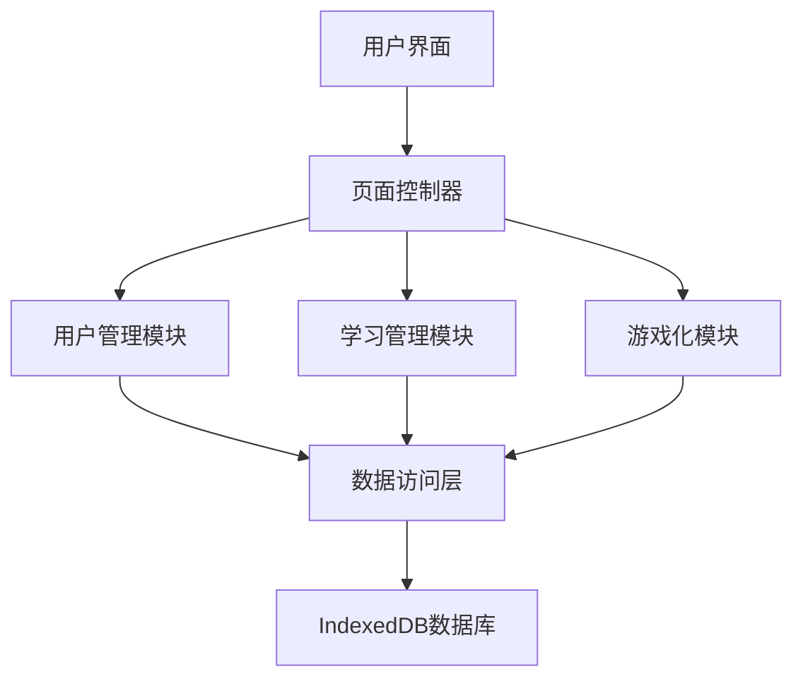

# 设计文档
##### FlowerC 2025 

## 1. 引言

### 1.1 编写目的
本文档为FlowerC小组制作Python学习网站的代码结构设计方案，包括系统架构、模块设计、数据库设计等

### 1.2 项目背景
- **项目名称**：Python学习网站
- **开发团队**：FlowerC小组
- **技术栈**：HTML5 + CSS3 + JavaScript + IndexedDB
- **开发周期**：16周

### 1.3 设计约束
- 纯前端解决方案，无后端服务器
- 使用浏览器本地存储(IndexedDB)
- 支持现代主流浏览器
- 4人团队协作开发

## 2. 总体设计

### 2.1 系统架构

#### 2.1.1 架构风格：分层架构
```
表示层 (Presentation Layer)
    ↓
业务逻辑层 (Business Logic Layer)  
    ↓
数据访问层 (Data Access Layer)
    ↓
持久化层 (Persistence Layer)
```

#### 2.1.2 架构详细说明


### 2.2 技术选型

| 层次 | 技术选择 | 理由 |
|------|----------|------|
| 表示层 | HTML + CSS + JavaScript | 标准Web技术，跨平台兼容 |
| 业务逻辑层 | JavaScript | 现代JavaScript，支持模块化 |
| 数据访问层 | IndexedDB| 浏览器端NoSQL数据库 |
| 开发工具 | VSCode + Git | 团队协作，版本控制 |

### 2.3 模块划分

```javascript
// 系统模块结构
FlowerC-System/
├── UserModule/          // 用户管理
├── LearningModule/      // 学习管理  
├── AssessmentModule/    // 练习评估
├── GamificationModule/  // 游戏化
└── Common/             // 公共组件
```

## 3. 详细设计

### 3.1 用户管理模块

#### 3.1.1 类设计
```javascript
/**
 * 用户管理核心类
 */
class UserManager {
    constructor() {
        this.currentUser = null;
        this.db = new UserDB();
    }
    
    // 用户注册
    async register(userData) {
        // 1. 验证输入数据
        // 2. 检查用户名唯一性
        // 3. 加密密码
        // 4. 保存到数据库
    }
    
    // 用户登录
    async login(credentials) {
        // 1. 验证用户凭证
        // 2. 创建用户会话
        // 3. 加载用户数据
    }
    
    // 保存学习进度
    async saveProgress(progressData) {
        // 1. 验证进度数据
        // 2. 更新数据库
        // 3. 返回保存结果
    }
    
    // 退出登录
    logout() {
        // 1. 清理会话数据
        // 2. 跳转到登录页
    }
}

/**
 * 用户数据库操作类
 */
class UserDB {
    async createUser(userData) { ... }
    async findUser(username) { ... }
    async updateProgress(userId, progress) { ... }
    async getUserProgress(userId) { ... }
}
```

#### 3.1.2 界面设计
```html
<!-- 注册页面结构 -->
<div class="register-container">
    <h2>用户注册</h2>
    <form id="registerForm">
        <input type="text" id="username" placeholder="用户名" required>
        <input type="password" id="password" placeholder="密码" required>
        <input type="password" id="confirmPassword" placeholder="确认密码" required>
        <button type="submit">注册</button>
    </form>
    <div id="errorMessage" class="error"></div>
</div>
```

### 3.2 学习管理模块

#### 3.2.1 类设计
```javascript
/**
 * 学习管理核心类
 */
class LearningManager {
    constructor() {
        this.currentChapter = 1;
        this.chapters = new Map();
    }
    
    // 加载章节内容
    async loadChapter(chapterId) {
        // 1. 检查章节解锁状态
        // 2. 从本地或网络加载内容
        // 3. 渲染到界面
    }
    
    // 检查章节解锁条件
    canUnlockChapter(chapterId) {
        // 1. 检查前一章节完成状态
        // 2. 检查测试成绩
        // 3. 返回是否可解锁
    }
    
    // 更新学习进度
    async updateProgress(chapterId, progress) {
        // 1. 验证进度数据
        // 2. 更新本地存储
        // 3. 触发进度事件
    }
}

/**
 * 内容加载器
 */
class ContentLoader {
    async loadTextContent(chapterId) { ... }
    async loadCodeExamples(chapterId) { ... }
    async loadExercises(chapterId) { ... }
}
```

#### 3.2.2 数据结构
```javascript
// 章节数据结构
const chapterSchema = {
    id: "number",
    title: "string",
    content: "string",
    codeExamples: "array",
    exercises: "array",
    isUnlocked: "boolean",
    isCompleted: "boolean",
    score: "number"
};
```

### 3.3 练习评估模块

#### 3.3.1 代码检测引擎设计
```javascript
/**
 * 代码检测引擎
 */
class CodeValidator {
    constructor() {
        this.sandbox = new CodeSandbox();
        this.rules = new ValidationRules();
    }
    
    // 验证代码语法
    async validateSyntax(code) {
        try {
            // 1. 使用AST解析代码结构
            // 2. 检查语法错误
            // 3. 返回验证结果
        } catch (error) {
            return {
                isValid: false,
                errors: [error.message]
            };
        }
    }
    
    // 运行测试用例
    async runTests(code, testCases) {
        // 1. 在沙箱中执行代码
        // 2. 运行每个测试用例
        // 3. 统计通过率
    }
    
    // 提供反馈建议
    generateFeedback(validationResult) {
        // 1. 分析错误类型
        // 2. 生成改进建议
        // 3. 返回格式化反馈
    }
}

/**
 * 代码执行沙箱
 */
class CodeSandbox {
    constructor() {
        this.timeout = 5000; // 5秒超时
        this.memoryLimit = 1000000; // 1MB内存限制
    }
    
    async execute(code) {
        // 1. 创建安全执行环境
        // 2. 设置资源限制
        // 3. 执行并返回结果
    }
}
```

#### 3.3.2 测试用例设计
```javascript
// 代码题测试用例结构
const testCaseSchema = {
    id: "string",
    input: "any",
    expectedOutput: "any",
    description: "string"
};

// 示例测试用例
const pythonTestCases = {
    "print_hello": {
        input: "",
        expectedOutput: "Hello World",
        description: "测试基础输出功能"
    },
    "sum_function": {
        input: [1, 2, 3],
        expectedOutput: 6,
        description: "测试求和函数"
    }
};
```

### 3.4 游戏化模块

#### 3.4.1 类设计
```javascript
/**
 * 金币管理系统
 */
class CoinSystem {
    constructor() {
        this.balance = 0;
        this.transactions = [];
    }
    
    // 奖励金币
    rewardCoins(activity, amount) {
        // 1. 验证活动类型
        // 2. 计算奖励数量
        // 3. 更新余额
        // 4. 记录交易
    }
    
    // 消费金币
    spendCoins(item, cost) {
        // 1. 检查余额是否足够
        // 2. 扣除金币
        // 3. 发放物品
    }
    
    // 获取交易记录
    getTransactionHistory() {
        return this.transactions;
    }
}

/**
 * 精灵收集系统
 */
class PokemonCollection {
    constructor() {
        this.collection = new Map();
        this.pokemonDB = new PokemonDB();
    }
    
    // 添加精灵
    async addPokemon(pokemonId) {
        // 1. 检查是否已拥有
        // 2. 添加到收藏
        // 3. 触发收集事件
    }
    
    // 随机获得精灵
    async getRandomPokemon() {
        // 1. 根据概率随机选择
        // 2. 返回精灵信息
    }
    
    // 获取收藏进度
    getCollectionProgress() {
        const total = this.pokemonDB.getTotalCount();
        const collected = this.collection.size;
        return {
            collected,
            total,
            percentage: (collected / total) * 100
        };
    }
}
```

## 4. 数据库设计

### 4.1 IndexedDB数据库设计

```javascript
// 数据库版本1
const dbSchema = {
    name: 'FlowerC_LearningDB',
    version: 1,
    stores: {
        users: {
            keyPath: 'username',
            indexes: [
                { name: 'createdAt', keyPath: 'createdAt' },
                { name: 'lastLogin', keyPath: 'lastLogin' }
            ]
        },
        progress: {
            keyPath: ['username', 'chapterId'],
            indexes: [
                { name: 'username', keyPath: 'username' },
                { name: 'chapterId', keyPath: 'chapterId' },
                { name: 'score', keyPath: 'score' }
            ]
        },
        collections: {
            keyPath: ['username', 'pokemonId'],
            indexes: [
                { name: 'username', keyPath: 'username' },
                { name: 'rarity', keyPath: 'rarity' },
                { name: 'obtainedAt', keyPath: 'obtainedAt' }
            ]
        },
        transactions: {
            keyPath: 'id',
            autoIncrement: true,
            indexes: [
                { name: 'username', keyPath: 'username' },
                { name: 'type', keyPath: 'type' },
                { name: 'timestamp', keyPath: 'timestamp' }
            ]
        }
    }
};
```

### 4.2 数据表结构

#### 4.2.1 用户表 (users)
| 字段名 | 类型 | 说明 | 约束 |
|--------|------|------|------|
| username | string | 用户名 | 主键，唯一 |
| password | string | 密码 | 非空 |
| email | string | 邮箱 | 可选 |
| createdAt | Date | 创建时间 | 非空 |

#### 4.2.2 学习进度表 (progress)
| 字段名 | 类型 | 说明 | 约束 |
|--------|------|------|------|
| username | string | 用户名 | 外键，复合主键 |
| chapterId | number | 章节ID | 复合主键 |
| score | number | 测试成绩 | 0-100 |
| completed | boolean | 是否完成 | 默认false |
| timeSpent | number | 学习时长(分钟) | 可选 |

#### 4.2.3 精灵收藏表 (collections)
| 字段名 | 类型 | 说明 | 约束 |
|--------|------|------|------|
| username | string | 用户名 | 外键，复合主键 |
| pokemonId | string | 精灵ID | 复合主键 |
| rarity | string | 稀有度 | common/rare/legendary |
| obtainedAt | Date | 获得时间 | 非空 |

## 5. 接口设计

### 5.1 模块间接口

#### 5.1.1 用户管理接口
```javascript
// 用户管理模块对外接口
const UserModuleAPI = {
    // 用户认证
    register: async (userData) => { ... },
    login: async (credentials) => { ... },
    logout: () => { ... },
    
    // 进度管理
    saveProgress: async (progress) => { ... },
    getProgress: async () => { ... },
    
    // 用户信息
    getCurrentUser: () => { ... },
    isLoggedIn: () => { ... }
};
```

#### 5.1.2 学习管理接口
```javascript
// 学习管理模块对外接口
const LearningModuleAPI = {
    // 内容管理
    loadChapter: async (chapterId) => { ... },
    getChapterList: async () => { ... },
    
    // 进度控制
    unlockChapter: async (chapterId) => { ... },
    completeChapter: async (chapterId, score) => { ... },
    
    // 导航
    getNextChapter: (currentChapterId) => { ... },
    getPreviousChapter: (currentChapterId) => { ... }
};
```

### 5.2 用户界面接口

#### 5.2.1 页面路由设计
```javascript
// 应用路由配置
const routes = {
    '/': 'HomePage',
    '/login': 'LoginPage',
    '/register': 'RegisterPage',
    '/learn': 'LearningPage',
    '/learn/chapter/:id': 'ChapterPage',
    '/practice': 'PracticePage',
    '/test/:chapterId': 'TestPage',
    '/collection': 'CollectionPage',
    '/gacha': 'GachaPage'
};
```

## 6. 部署设计

### 6.1 文件结构

```
FlowerC-Website/
├── index.html
├── css/
│   ├── style.css
│   ├── learning.css
│   └── game.css
├── js/
│   ├── app.js
│   ├── modules/
│   │   ├── user.js
│   │   ├── learning.js
│   │   ├── assessment.js
│   │   └── game.js
│   └── utils/
│       ├── database.js
│       ├── security.js
│       └── helpers.js
├── data/
│   ├── chapters/
│   └── exercises/
└── assets/
    ├── images/
    └── icons/
```


---
2025 FlowerC