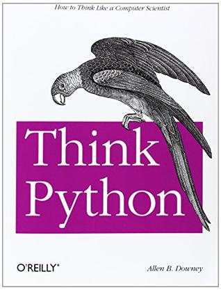

# FlowerC项目需求规格说明书

## 1 简介

### 1.1 目的
本文档旨在明确FlowerC项目——Python学习网站的功能需求、非功能需求和技术要求，为项目开发、测试和验收提供完整依据。本文档面向项目开发团队、测试人员及项目指导教师，确保所有利益相关者对项目需求有统一的理解。

### 1.2 范围
本项目开发一个面向Python初学者的在线学习平台，基于《Think Python》教材，结合游戏化元素提供互动学习体验。系统包括用户管理、教学内容展示、练习评估、游戏化奖励等核心功能。

**包含内容：**
- 基于《Think Python》前12章的完整教学内容
- 用户注册、登录和学习进度管理
- 交互式练习和自动化代码检测
- 金币奖励和精灵收集系统

**不包含内容：**
- 社交功能和好友对战系统
- 移动端原生应用开发
- 复杂的精灵养成系统
- 在线代码编译和执行环境

### 1.3 定义、首字母缩写和缩略语

| 术语 | 定义 |
|------|------|
| SRS | 软件需求规格说明书 (Software Requirements Specification) |
| HTML5 | 超文本标记语言第五版 |
| CSS3 | 层叠样式表第三版 |
| JavaScript | 一种直译式脚本语言 |
| IndexedDB | 浏览器端NoSQL数据库 |
### 1.4 参考文献
1. 《Think Python: How to Think Like a Computer Scientist》

2. 《软件工程导论》清华大学出版社
3. 项目计划文档v1.0 - FlowerC团队
4. IEEE软件需求规格说明书标准830-1998

### 1.5 概述
本文档后续章节组织如下：第2章提供产品的总体描述，包括产品视图、功能和用户特征；第3章详细说明所有功能和非功能需求。

## 2 总体描述

### 2.1 产品视图
FlowerC项目是一个基于Web的Python学习平台，将系统性的编程教学内容与游戏化元素相结合。产品通过奖励机制和进度可视化，为Python初学者提供有趣、有效的学习体验。

**关键价值主张：**
- 降低Python学习门槛
- 提高学习动力和完成率
- 通过游戏化增强学习趣味性
- 提供个性化的学习路径

### 2.2 产品功能
#### 核心功能模块：
1. **用户管理模块**
   - 用户注册和登录
   - 学习进度跟踪和保存
   - 个人成就展示

2. **教学管理模块**
   - 章节式教学内容展示
   - 学习路径控制
   - 进度可视化

3. **练习评估模块**
   - 随堂练习和即时反馈
   - 章节测试和自动评分
   - 代码检测引擎

4. **游戏化模块**
   - 金币奖励系统
   - 精灵收集机制
   - 抽奖互动功能

### 2.3 用户特征
#### 2.3.1 主要用户群体
| 用户类型 | 特征描述 | 技术能力 | 使用场景 |
|---------|----------|----------|----------|
| 编程零基础学生 | 无编程经验，需要系统学习 | 基础计算机操作 | 课堂学习、自学 |
| 有基础学习者 | 有编程经验，希望掌握Python | 中等技术水平 | 技能提升、项目准备 |
| 游戏化学习爱好者 | 偏好互动式学习方式 | 各类技术水平 | 兴趣学习、碎片化学习 |

#### 2.3.2 用户技能要求
- 基本的计算机操作能力
- 现代浏览器的使用经验
- 无需编程背景知识

### 2.4 一般约束
#### 2.4.1 技术约束
- 纯前端解决方案，无后端服务器
- 使用HTML5/CSS3/JavaScript技术栈
- 基于浏览器本地存储(IndexedDB)
- 支持现代主流浏览器

#### 2.4.2 业务约束
- 开发周期：16周
- 开发团队：4名成员
- 预算限制：无资金支持
- 部署环境：静态网页托管

#### 2.4.3 法规约束
- 遵守版权法规，教学内容基于开源教材
- 用户数据隐私保护
- 符合教育软件相关标准

### 2.5 假设与依赖
#### 2.5.1 技术假设
1. 用户使用现代浏览器访问系统
2. 浏览器支持HTML5和JavaScript功能
3. 客户端设备性能满足基本要求
4. 网络连接基本稳定可靠

#### 2.5.2 业务假设
1. 用户有学习Python的真实需求
2. 游戏化机制能有效提升学习动力
3. 教学内容基于标准Python教程
4. 用户愿意完成注册和使用系统

#### 2.5.3 项目依赖
- 《Think Python》教学内容的准确性
- 开发团队技术能力的匹配度
- 项目时间安排的可行性
- 指导教师的支持和反馈

## 3 详细需求

### 3.1 功能需求

#### 3.1.1 用户管理功能

**F1: 用户注册功能**
- **描述**: 新用户创建个人学习账户
- **优先级**: 高
- **输入**: 用户名、密码、确认密码
- **处理**:
  1. 验证用户名唯一性
  2. 验证密码复杂度（≥6位）
  3. 验证密码一致性
  4. 加密存储用户信息
- **输出**: 注册成功提示，跳转至登录页面
- **异常处理**:
  - 用户名重复：显示"用户名已存在"
  - 密码过短：显示"密码至少6位"
  - 密码不一致：显示"密码不匹配"

**F2: 用户登录功能**
- **描述**: 已注册用户通过凭证验证访问系统
- **优先级**: 高
- **输入**: 用户名、密码
- **处理**:
  1. 验证用户存在性
  2. 验证密码正确性
  3. 创建用户会话
  4. 加载学习数据
- **输出**: 登录成功，跳转至学习主页
- **异常处理**:
  - 用户不存在：显示"用户未找到"
  - 密码错误：显示"密码错误"

**F3: 学习进度管理**
- **描述**: 自动保存和恢复用户学习状态
- **优先级**: 高
- **数据内容**:
  - 已完成章节列表
  - 章节测试成绩记录
  - 金币余额状态
  - 精灵收集情况
  - 最后学习位置
- **同步机制**:
  - 学习活动后自动保存
  - 页面刷新时恢复状态

#### 3.1.2 教学管理功能

**F4: 课程内容展示**
- **描述**: 按章节展示《Think Python》教学内容
- **优先级**: 高
- **内容范围**: 第1-12章完整教学内容
- **展示形式**:

  - 关键词突出显示
- **导航特性**: 块状章节导航、进度指示器

**F5: 学习进度控制**
- **描述**: 控制用户学习路径，确保循序渐进
- **优先级**: 高
- **解锁机制**:
  - 第1章默认解锁
  - 完成当前章节(学习+测试≥80分)解锁下一章
  - 支持重复学习已解锁内容
- **进度可视化**:
  - 章节状态标识(未开始/进行中/已完成)
  - 总体进度百分比
#### 3.1.3 练习评估功能

**F6: 随堂练习**
- **描述**: 知识点学习后的即时巩固练习
- **优先级**: 中
- **题型分布**:
  - 单项选择题(70%)
  - 判断题(30%)
- **交互特性**:
  - 即时答案验证
  - 详细解析展示
  - 相关知识点链接
  - 不计入正式评分

**F7: 章节测试**
- **描述**: 章节学习完成后的综合能力评估
- **优先级**: 高
- **测试结构**:
  | 题型 | 题目数量 | 分值 | 时间要求 |
  |------|----------|------|----------|
  | 选择题 | 5题 | 50分 | 10分钟 |
  | 填空题 | 3题 | 30分 | 8分钟 |
  | 代码题 | 1题 | 20分 | 12分钟 |
- **评分规则**:
  - 总分100分，80分及格
  - 记录历史最佳成绩
  - 提供错题分析报告

**F8: 代码检测引擎**
- **描述**: 自动检测用户提交的Python代码正确性
- **优先级**: 高
- **技术方案**:
  ```javascript
  // 检测流程
  1. 代码风格检查
  2. 测试用例执行
  3. 输出结果比对
  4. 错误反馈生成 
  ```

#### 3.1.4 游戏化功能

**F9: 金币系统**
- **描述**: 通过虚拟金币激励学习行为
- **优先级**: 中
- **获取规则**:
  | 活动类型 | 金币奖励 | 条件说明 |
  |----------|----------|----------|
  | 完成章节 | +50金币 | 首次完成 |
  | 通过测试 | +100金币 | 成绩≥80分 |
  | 满分测试 | +50金币 | 额外奖励 |
  | 每日登录 | +20金币 | 连续加成 |
- **显示特性**: 实时显示、变化动画、收支记录

**F10: 精灵收集系统**
- **描述**: 通过收集虚拟精灵增强学习趣味性
- **优先级**: 中
- **精灵分类**:
  | 稀有度 | 概率 | 对应知识点 |
  |--------|------|------------|
  | 普通 | 70% | 基础语法 |
  | 稀有 | 25% | 核心概念 |
  | 传说 | 5% | 高级特性 |
- **精灵属性**: 名称、图片、描述、稀有度、关联章节

**F11: 抽奖机制**
- **描述**: 用户使用金币参与抽奖获得精灵
- **优先级**: 低
- **抽奖规则**:
  - 100金币兑换1次机会
  - 随机遇到不同稀有度精灵
  - 重复精灵转化为金币
- **交互体验**: 投掷动画、转盘效果、结果展示

### 3.2 非功能需求


#### 3.2.1 可用性需求
- **学习曲线**: 新用户10分钟内掌握基本操作
- **操作效率**: 核心功能操作步骤≤3步
- **错误处理**: 提供清晰错误提示
- **界面一致性**: 符合Web设计惯例

#### 3.2.2 可靠性需求
- **系统可用性**: 核心功能可用性≥99%
- **数据持久性**: 学习数据丢失率≤0.1%


### 3.3 接口需求

#### 3.3.1 用户界面
- **设计风格**: 科技教育风格，蓝紫色系
- **布局规范**: 响应式设计
- **交互模式**: 符合用户心理模型

#### 3.3.2 数据接口
```javascript
// IndexedDB数据库结构
const dbSchema = {
    users: {
        keyPath: 'username',
        indexes: ['createdAt']
    },
    progress: {
        keyPath: ['username', 'chapterId'],
        indexes: ['username', 'score']
    },
    collections: {
        keyPath: ['username', 'pokemonId'],
        indexes: ['username', 'rarity']
    }
};
```

### 3.4 其他需求

#### 3.4.1 可维护性需求
- 代码模块化设计
- 注释率≥30%
- 完整的项目文档

#### 3.4.2 可扩展性需求
- 插件化功能模块
- 配置化游戏规则
- 易于添加新内容

---
