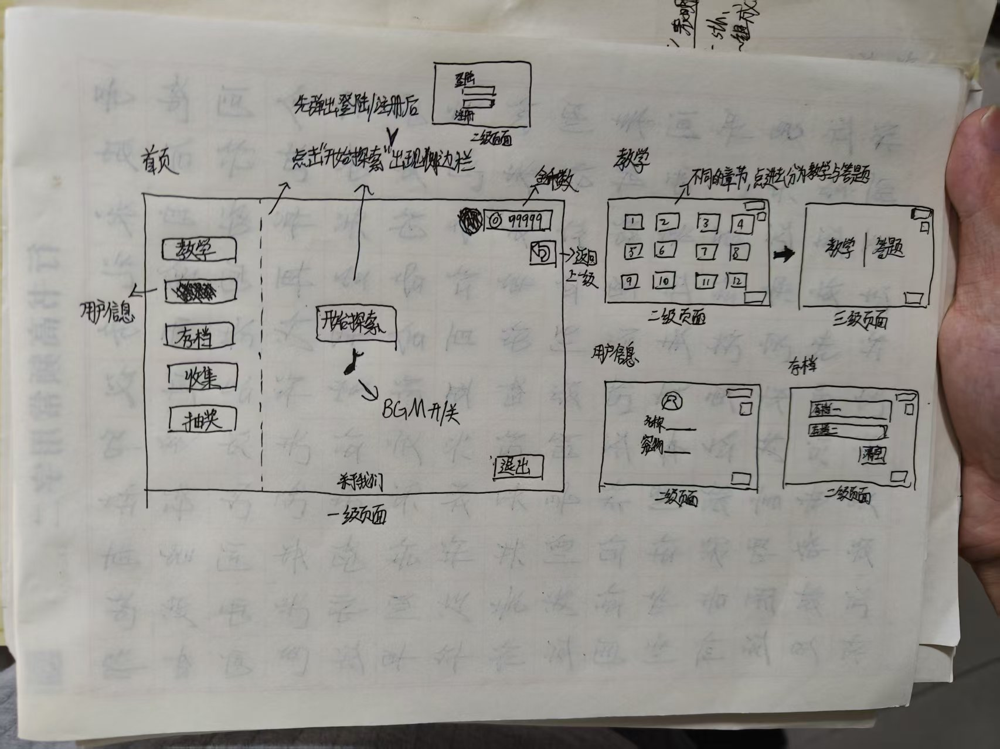

# FlowerC网站项目 - 需求规格说明书

## 1. 项目简介

### 1.1 项目是什么？
我们要做一个专门教Python编程的网站，很适合零基础的新手。这个网站最大的特点是把学习变成玩游戏，让你在收集精灵、赚取金币的过程中不知不觉学会Python。

### 1.2 为什么要做这个？
现在很多编程学习网站太枯燥了，学一会儿就想放弃。我们想做一个好玩又能真正学到东西的网站，让编程学习像打游戏一样上瘾！

### 1.3 项目范围
**我们主要做这些：**
- 完整的Python入门课程（12个章节）
- 用户账号和学习进度管理
- 智能代码批改系统
- 好玩的精灵收集和金币奖励

**暂时不做这些：**
- 社交好友功能
- 手机APP版本
- 复杂的精灵养成游戏

## 2. 整体说明

### 2.1 产品长什么样？
这是我们的初步网站设计图



### 2.2 主要用户是谁？
| 用户类型 | 特点 | 主要需求 |
|---------|------|----------|
| 编程新手 | 完全没基础，需要手把手教 | 简单易懂的教程，即时反馈 |
| 有基础的同学 | 学过其他语言，想快速掌握Python | 系统性的知识体系，实战练习 |
| 喜欢游戏化学习的人 | 讨厌枯燥，需要动力 | 奖励机制，进度成就感 |

### 2.3 系统架构
我们的网站采用**分层设计**，就像建房子一样：
- **展示层**：用户看到的界面（HTML/CSS）
- **逻辑层**：处理学习的核心功能（JavaScript）
- **数据层**：存储用户进度和游戏数据（浏览器本地存储）

```mermaid
flowchart TD
    A[用户界面] --> B[学习管理器]
    A --> C[练习批改器]
    A --> D[游戏系统]
    
    B --> E[数据存储器]
    C --> E
    D --> E
    
    E --> F[本地数据库]
    
    B --> A
    C --> A
    D --> A
```

## 3. 详细功能需求

### 3.1 用户账号管理

#### 3.1.1 注册账号
**我们要做什么：** 让新用户创建自己的学习账号

**具体功能：**
- 输入用户名和密码就能注册
- 系统会检查用户名是否被别人用了
- 密码要6位以上
- 注册成功自动跳到登录页面

**异常处理：**
- 用户名已存在：提示"用户名已存在"
- 密码太简单：提示"密码要6位以上"

#### 3.1.2 登录系统
**我们要做什么：** 验证用户身份，进入学习界面

**具体功能：**
- 输入正确的用户名密码就能登录
- 登录后自动加载上次的学习进度

#### 3.1.3 学习进度保存
**我们要做什么：** 自动记录用户学到哪里了

**具体功能：**
- 学完一节自动保存进度
- 做题的成绩实时记录
- 关掉网页再打开，进度不会丢失

### 3.2 课程学习功能

#### 3.2.1 章节内容展示
**我们要做什么：** 把Python课程12章内容完整的地展示出来
参考书籍《Think Python》


**课程结构：**
```
第1关：认识Python（什么是编程）
第2关：变量和数据类型（存储信息）
第3关：条件判断（让程序会思考）
...
第12关：综合项目（做个简单游戏）
```

**展示方式：**
- 文字讲解配图片说明
- 可运行的代码例子
- 重点内容高亮显示

#### 3.2.2 学习进度控制
**我们要做什么：** 确保用户按顺序学习，打好基础

**解锁规则：**
- 第1关直接可以学
- 必须学完当前关卡（包括考试及格）才能进入下一关
- 可以随时复习已经学过的内容

**进度显示：**
- 用进度条显示整体完成度
- 每关用星星表示成绩好坏
- 清楚看到哪些关已完成、哪些正在进行

### 3.3 练习和考试功能

#### 3.3.1 随堂练习
**我们要做什么：** 每个知识点后的小练习，巩固学习

**练习类型：**
- 选择题（70%）：四选一，考察概念理解
- 判断题（30%）：对错选择，考察基础知识

**特色功能：**
- 提交答案立刻知道对错
- 做错了会显示详细解析
- 不计入正式成绩，放心尝试

#### 3.3.2 章节考试
**我们要做什么：** 每章学完后的综合测试

**考试结构：**
| 题型 | 题数 | 分值 | 时间 |
|------|------|------|------|
| 选择题 | 5题 | 50分 | 10分钟 |
| 填空题 | 3题 | 30分 | 8分钟 |
| 代码题 | 1题 | 20分 | 12分钟 |

**评分规则：**
- 总分100分，80分及格
- 不及格可以无限次重考
- 记录历史最高分

#### 3.3.3 智能代码批改
**我们要做什么：** 自动检查用户写的Python代码

**检查流程：**
```mermaid
flowchart LR
    A[用户提交代码] --> B[检查语法]
    B --> C[运行测试]
    C --> D[比对结果]
    D --> E[生成反馈]
    E --> F[记录成绩]
```

**安全措施：**
- 在安全环境中运行用户代码
- 限制代码运行时间（最多5秒）
- 禁止使用危险功能

### 3.4 游戏化功能

#### 3.4.1 金币奖励系统
**我们要做什么：** 用金币激励用户学习

**赚金币方式：**
| 学习活动 | 金币奖励 | 说明 |
|----------|----------|------|
| 完成章节 | +50金币 | 每章第一次完成 |
| 通过考试 | +100金币 | 成绩80分以上 |
| 考试满分 | +50金币 | 额外奖励 |
| 每日登录 | +20金币 | 连续登录有加成 |

**花金币方式：**
- 100金币抽奖一次
- 300金币买高级精灵球
- 更多内容我们可能在后续补充

#### 3.4.2 精灵收集系统
**我们要做什么：** 让用户通过抽奖收集各种编程精灵

**精灵种类：**
| 稀有度 | 出现概率 | 对应知识点 |
|--------|----------|------------|
| 普通精灵 | 70% | 基础语法相关 |
| 稀有精灵 | 25% | 核心概念相关 |
| 传说精灵 | 5% | 高级特性相关 |

**精灵属性：**
- 可爱的名字和形象
- 与Python知识点关联的背景故事
- 不同的稀有度等级

#### 3.4.3 抽奖机制
**我们要做什么：** 用户用金币参与抽奖获得精灵

**抽奖规则：**
- 100金币抽一次
- 随机获得不同稀有度的精灵
- 抽到重复的精灵会自动换成金币

**用户体验：**
- 有精灵球投掷的动画效果
- 抽中稀有精灵有特殊庆祝
- 可以查看已收集的精灵图鉴

## 4. 数据设计

### 4.1 数据库关系图

我们的网站需要存储以下几种主要信息：

```mermaid
erDiagram
    用户 ||--o{ 学习进度 : 拥有
    用户 ||--o{ 精灵收藏 : 收集
    用户 ||--o{ 金币记录 : 产生
    课程章节 ||--o{ 练习题 : 包含
    课程章节 ||--o{ 考试题 : 包含
    
    用户 {
        string 用户名 PK "唯一标识"
        string 密码 "加密存储"
        int 金币数量 "当前金币"
        date 注册时间 "创建日期"
    }
    
    学习进度 {
        string 用户名 FK "谁的学习进度"
        int 章节编号 FK "哪个章节"
        int 考试分数 "0-100分"
        bool 是否完成 "true/false"
        int 学习时间 "分钟数"
    }
    
    精灵收藏 {
        string 用户名 FK "谁的收藏"
        string 精灵编号 FK "哪个精灵"
        string 稀有度 "普通/稀有/传说"
        date 获得时间 "什么时候获得"
    }
    
    金币记录 {
        int 记录编号 PK "唯一ID"
        string 用户名 FK "谁的金币"
        string 类型 "收入/支出"
        int 数量 "金币数量"
        string 说明 "原因描述"
    }
    
    课程章节 {
        int 章节编号 PK "第几章"
        string 章节标题 "章节名称"
        string 章节内容 "学习材料"
        int 排序号 "显示顺序"
    }
    
    练习题 {
        int 题目编号 PK "唯一ID"
        int 章节编号 FK "属于哪章"
        string 题目类型 "选择/填空/代码"
        string 题目内容 "问题描述"
        string 正确答案 "标准答案"
    }
```

### 4.2 完整学习流程

```mermaid
flowchart TD
    Start[开始学习] --> Register[注册账号]
    Register --> Login[登录系统]
    Login --> Choose[选择章节]
    Choose --> Check{检查是否解锁}
    
    Check -->|已解锁| Learn[学习内容]
    Check -->|未解锁| Message[提示先完成前面章节]
    
    Learn --> Practice[做练习题]
    Practice --> CheckAnswer{检查答案}
    
    CheckAnswer -->|正确| ShowRight[显示正确<br>获得学习成就感]
    CheckAnswer -->|错误| ShowWrong[显示解析<br>帮助理解知识点]
    
    ShowRight --> MorePractice{还有练习吗}
    ShowWrong --> MorePractice
    
    MorePractice -->|有| Practice
    MorePractice -->|没有| Exam[参加章节考试]
    
    Exam --> Grade{考试成绩}
    
    Grade -->|≥80分| Pass[考试通过<br>获得100金币]
    Grade -->|<80分| Fail[需要重新学习<br>查看错题解析]
    
    Pass --> Reward[解锁下一章<br开启新挑战]
    Reward --> Gacha[可以抽奖<br>收集新精灵]
    
    Fail --> Retry[重新学习<br>加强薄弱点]
    Retry --> Exam
    
    Gacha --> NewChapter[选择新章节]
    NewChapter --> Learn
```

### 4.3 游戏化激励循环

```mermaid
flowchart LR
    A[开始学习] --> B[完成课程内容]
    B --> C[获得金币奖励]
    C --> D[用金币抽奖]
    D --> E[收集新精灵]
    E --> F[获得成就感]
    F --> G[激发学习动力]
    G --> A
```

## 5. 性能和质量要求

### 5.1 使用体验要求
- **速度要快**：页面加载不超过3秒，代码批改不超过10秒
- **稳定可靠**：学习进度自动保存，不会突然丢失
- **简单易用**：新用户10分钟内就能上手基本操作
- **错误友好**：操作出错时给出清晰的提示和解决办法

### 5.2 兼容性要求
- 支持主流浏览器
- 不同屏幕尺寸下界面显示正常

### 5.3 安全性要求
- 用户密码加密存储
- 用户代码在安全环境中运行
- 防止恶意代码破坏系统

## 6. 界面设计想法

### 6.1 整体风格
- **主色调**：蓝紫色系，给人科技、学习的感觉
- **界面布局**：清晰简洁，重点突出学习内容
- **交互动画**：操作有反馈，增强使用体验

### 6.2 主要页面布局
```
网站头部（Logo、用户信息、金币显示）
┌─────────────────────────────────────┐
│ 左侧导航 │        主要内容区           │
|                    学习              |
│ 章节列表 │          练习.             │
|                  考试内容            | 
│ 进度显示 │                           │
└─────────────────────────────────────┘
网站尾部（about链接、版权信息）
```

## 7. 验收标准

### 7.1 功能验收清单
- [x] 新用户能顺利完成注册和登录
- [x] 能按顺序学习12个Python章节
- [x] 随堂练习能自动批改并给出反馈
- [ ] 章节考试能正确评分和记录成绩
- [ ] 学习能获得金币，金币能用于抽奖
- [ ] 抽奖能随机获得不同精灵
- [ ] 学习进度关掉网页后不会丢失

### 7.2 用户体验标准
- [x] 页面加载流畅，没有明显卡顿
- [x] 操作简单直观，不需要看说明书
- [x] 错误提示友好，能指导用户解决问题
- [x] 在不同浏览器上功能正常

## 8. 项目约束

### 8.1 技术限制
- 纯网页版，不需要安装
- 使用现代浏览器支持的技术
- 数据存储在用户本地

### 8.2 时间限制
- 总开发时间：16周
- 4人团队合作完成

### 8.3 资源限制
- 没有服务器预算
- 使用免费开发工具
- 团队成员都是学生

## 总结

我们要做一个**让Python学习像玩游戏一样有趣**的网站。通过精心设计的课程内容、智能的练习系统、好玩的精灵收集机制，让编程新手能够愉快地坚持学习，真正掌握Python编程。

---
**文档信息**
- 版本：v1.2
- 更新时间：2025年10月
- 制作团队：FlowerC