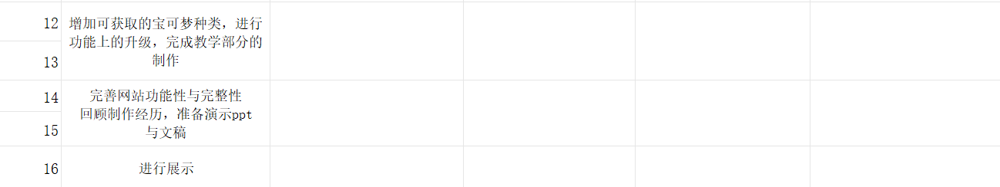
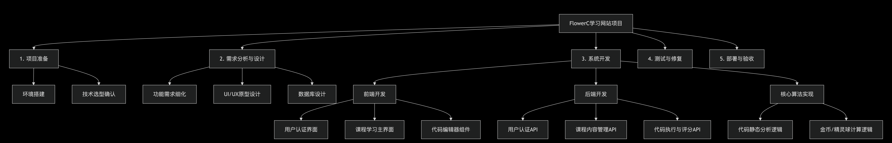

# FlowerC项目计划：Python学习网站

## 一、 项目范围管理计划

### 1. 项目目标与范围

   **项目愿景**： 打造一个集系统性、趣味性于一体的Python初学者在线学习平台，通过游戏化机制提升用户学习动力和完成率。

   **主要目标**：完成一个供初学者学习python的网站，实现教学功能和用户系统

   功能目标： 完成基于《Think Python》前6章的教学内容开发、集成代码编辑与运行环境、实现用户学习进度跟踪与金币奖励系统。

   交付目标： 在第一轮结束时提交一份完成基础功能（教学与用户功能）的初版网页

   **范围描述**： 本项目将开发一个python学习网站包括前端界面、后端存储与数据库。核心功能为课程学习、习题作答（选择题、填空题、代码题）、用户管理、金币与精灵收集系统。

**可交付成果**：

1）网站源代码

2）项目计划文档

3）study guide

### 2. 范围边界与排除

#### 本项目范围内包含：

   12章完整的教学文本内容。

   基本的文字/图片教学展示。

   选择题、填空题、代码题（基础检测）的作答与自动评分。

   用户注册、登录、个人进度保存。

   金币、精灵球、精灵的获取与展示。（第二轮）

#### 明确排除在本版本之外（后续版本考虑）：

   “好友对战系统”等高级社交功能。

   精灵的复杂交互或养成功能。
## 二、教学内容

### 基于《Think Python》的12章学习规划

**核心思想： 每章都包含了必须动手实践的练习（我们会增加代码检测功能）**

#### 第1章：程序之道 (The Way of the Program)

关键词： 编程语言、高级语言、低级语言、解释型语言、编译型语言、程序、调试、语法错误、运行时错误、语义错误
描述： 本章是编程世界的导览，介绍编程的基本概念、Python的定位以及最常见的错误类型。

#### 第2章：变量、表达式和语句 (Variables, Expressions and Statements)

关键词： 变量、赋值语句、变量名（标识符）、表达式、语句、值类型、运算符、操作数、求值顺序、注释
描述： 学习程序的基本构建块：如何用变量存储数据，如何用表达式进行计算，以及如何编写有效的语句。

#### 第3章：函数 (Functions)

关键词： 函数调用、内置函数、类型转换函数、数学函数、自定义函数、定义、参数、实参、形参、返回值、组合
描述： 本章介绍如何使用现成的函数，并开始学习如何创建自己的函数来组织和复用代码。

#### 第4章：接口设计 (Case Study: Interface Design)

关键词： turtle模块、接口设计、重构、开发计划、文档字符串
描述： 通过有趣的“海龟绘图”案例，学习如何逐步开发一个程序，并理解良好接口设计的重要性。

#### 第5章：条件和递归 (Conditionals and Recursion)

关键词： 模运算符、布尔表达式、逻辑运算符、条件语句、if/elif/else、链式条件、嵌套条件、递归
描述： 学习让程序根据不同条件做出判断，并初次接触递归这一强大的编程思想。

#### 第6章：有返回值的函数 (Fruitful Functions)

关键词： 返回值、增量开发、组合、布尔函数、栈图、程序框架、守卫
描述： 深入探讨如何编写“有结果”的函数，并学习增量开发和调试的重要方法——栈图。

#### 第7章：迭代 (Iteration)

关键词：while循环、重新赋值、break语句、平方根算法（案例）、算法
描述： 学习使用while循环进行迭代，并通过计算平方根的经典案例理解算法是如何一步步解决问题的。

#### 第8章：字符串 (Strings)

关键词： 字符串序列、len()、遍历for...in、字符串切片、不可变性、字符串方法、in运算符、字符串比较
描述： 将字符串作为一种序列来深入学习，掌握字符串的各种操作和方法。

#### 第9章：文字游戏 (Case Study: Word Play)

关键词： 字符串遍历、搜索循环、计数器、字符串方法实战
描述： 这是一个经典的字符串处理案例研究，通过分析文本中的单词来巩固字符串和循环的知识。

#### 第10章：列表 (Lists)

关键词： 列表序列、元素、索引、遍历、嵌套列表、列表切片、列表方法、映射、过滤、化简、对象和值、别名
描述： 学习最常用的数据结构——列表，掌握其基本操作和高级函数式编程概念（映射、过滤、化简）。

#### 第11章：字典 (Dictionaries)

关键词： 字典、键值对、映射、哈希、遍历字典、反向查找、字典作为计数器集合、备忘录、全局变量
描述： 学习另一种核心数据结构——字典，它通过键来存储和访问值，效率极高，用途广泛。

#### 第12章：元组 (Tuples)

关键词： 元组、不可变序列、元组赋值、作为返回值、变长参数元组、列表与元组的比较、序列的序列
描述： 学习元组这一不可变序列，理解其与列表的区别，并掌握元组在赋值、返回多个值等场景下的妙用。

## 三、网页功能

**==以下是一些初步的设计==**

开始界面包含

1. 教学部分Courses(包含教学文本或视频及随堂练，可获得大量金币)

2. 答题部分Pass levels(通过选择题，填空题和完成要求代码来获得不同数量的金币)

        {教学部分和答题部分包含同样的章节[关卡level]，将合并为同一个部分}

3. 用户系统user system(可查询存档数据和用户信息，后期如果有时间可以制作成就和好友对战系统)

4. 收集(道具/精灵)系统collecting system(可查看当前拥有的金币数量coin，精灵球ball，精灵Pokemon)

          {通过精灵陪伴与收集使用户获得动力，后续会增加精灵的功能}
        
5. 抽奖系统Catch Pokemon(通过金币[金币数量一直显示在右上角]兑换抽奖次数[表现为不同功能的精灵球，可以用等值的金币获取]，通过随机数来使得用户遇到随机的宝可梦，过程尽量简略)

6. 退出

## 四、项目进度规划

### 1.任务时间表

### 2.里程碑
- **里程碑1（第2周）**：完成项目原型设计和基础框架搭建
- **里程碑2（第5周）**：实现用户系统和教学内容
- **里程碑3（第7周）**：完成第一轮所有核心功能（教学、用户存储）开发和集成测试
- **里程碑4（第8周）**：项目部署和验收演示

## 五、人员任务分配

**李佳浩**负责总要负责编写前端代码；
体的制作进度和推进，网站内容的编写与完善，并记录组员制作过程，制作小组项目文档；

**褚一满**主要进行前端代码的编写与测试；

**常如意**进行界面与内容设计，搜集图片及文本资源；

**李桂昇**进行后端代码的编写与调试；

**任务视阶段具体情况如需可由其余非该任务组员进行分担**

## 六、技术方案
使用**HTML5**做网页架构，**CSS**进行整体的修饰渲染，用**JavaScript和indexedDB**做核心功能架构，例如在做登录注册系统时，保存用户信息需要用到。

## 七、工作分解结构（WBS）

树状图（可自行放大）：

## 八、风险管理计划

1) Q:**技术风险**：代码题的自动检测与评分算法复杂度高，开发周期可能超出预期。
A:通过**人工智能以及教学视频**进行辅导学习，解决各种技术问题

2) Q:**进度风险**：团队成员可能因课程、考试等原因导致任务延期。
A:制定计划时预留10%-15%的**缓冲时间**；实行每周进度同步会，尽早发现延迟。应急：项目经理**重新分配任务**，确保关键路径任务优先完成。

## 九、沟通管理计划
**例会制度：**

每周站会（线下）： 每周一次，每人同步进度、计划和遇到的困难，时长不超过30分钟。

迭代评审会（每两周）： 展示阶段性成果，调整后续计划。
**沟通工具：**
即时沟通： 微信

文档协作： Git

任务跟踪： GitHub

文档保存： 所有项目相关文档统一保存在项目GitHub仓库的目录下。
