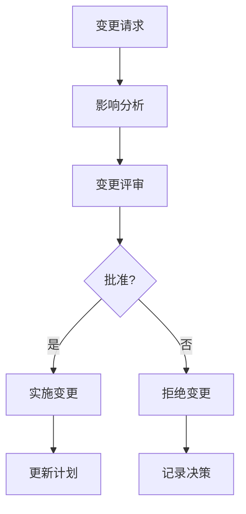

# Study Guide
#### 2025 Flower C

## 第一章：软件问题 - 为什么软件开发这么难？

### 1.1 本章学习目标
学完这一章，你应该能够：
- 理解软件开发面临的主要挑战
- 分析成本、进度、质量之间的平衡关系
- 认识到软件规模和变更带来的复杂性
- 为后续学习软件工程方法打下基础

### 1.2 核心概念详解（用自己的话来说）

#### 1.2.1 软件开发的三大难题

**成本问题 - 钱都花到哪里去了？**

成本不仅仅是写代码的时间，还包括：
- **直接成本**：开发时间、测试时间、部署时间
- **间接成本**：学习新技术的时间、沟通协调的时间
- **隐藏成本**：调试bug的时间、修改需求的时间、文档编写的时间

比如我们项目计划15周，但实际可能遇到技术难题需要额外时间，这就是成本估算的困难。

**进度问题 - 为什么总是延期？**
我们小组有时遇到这种情况：
- **乐观估计**：开始觉得2天能完成的功能，实际要5天
- **意外情况**：组员生病、考试冲突、技术难题

就像我们的项目计划，虽然分了15周，但中间必须留出缓冲时间。

**质量问题 - 什么是好软件？**
好的软件不仅要能运行，还要：
- **正确性**：功能符合需求（比如我们的代码检测要准确）
- **可靠性**：稳定不崩溃（网站不能经常打不开）
- **易用性**：用户操作方便（界面要直观）
- **可维护性**：后续修改容易（代码要清晰，模块化留有余地）

#### 1.2.2 规模和变更的挑战

**规模的影响**
小型项目（比如个人作业）和大型项目（比如我们的网站）完全不同：
- **沟通成本**：多个人开发需要开会交流进度想法等，一个人开发就不需要
- **复杂度**：功能越多，代码越复杂，可能的bug越多
- **协调难度**：每个人负责的模块要能完美对接

**变更的必然性**
我们在开发过程中遇到：
- 教授提出新要求
- 技术方案需要调整
- 用户体验需要优化
变更不是坏事，但需要管理。

### 1.3 学习资源推荐

#### 📹 视频资源
- **[Software Engineering: Crash Course](https://www.youtube.com/watch?v=O753uuptq50)** - 16分钟快速了解软件工程，讲解生动有趣
- **[为什么软件项目会失败](https://www.youtube.com/watch?v=RhdlBHHimeM)** - 分析真实项目失败案例，很有启发性
- **[软件开发生命周期](https://www.youtube.com/watch?v=Wt4lZPl0p8c)** - 9分钟讲清楚整个开发过程

#### 📚 实用网站
- **[GeeksforGeeks软件工程专题](https://www.geeksforgeeks.org/software-engineering/)** - 概念解释很清晰，有代码示例
- **[TutorialsPoint教程](https://www.tutorialspoint.com/software_engineering/software_engineering_overview.htm)** - 适合初学者，循序渐进
- **[软件工程知识体系SWEBOK](https://www.computer.org/education/bodies-of-knowledge/software-engineering)** - 权威参考

#### 🎯 重点阅读
- **《人月神话》** - 软件工程的经典，讲了很多真实项目的经验教训
- **教材第一章** - 一定要精读，掌握基本概念

### 1.4 习题
#### 选择题
软件危机的主要表现不包括以下哪项？
A. 软件开发成本超出预算
B. 软件产品质量无法保证
C. 软件开发进度难以控制
D. 软件用户数量增长过快

根据教材，软件维护成本通常占整个生命周期成本的：
A. 10%-20%
B. 30%-40%
C. 50%-60%
D. 70%-80%

"软件规模"这一概念主要描述的是：
A. 软件代码的行数多少
B. 软件项目的复杂程度和大小
C. 软件开发团队的人数规模
D. 软件安装包的大小

软件需求变更难以控制的主要原因是：
A. 开发人员技术水平不足
B. 用户需求本身具有模糊性和变化性
C. 项目管理工具不够先进
D. 软件开发方法选择不当

教材中提到的"软件=程序+数据+文档"公式强调了：
A. 软件不仅仅是程序代码
B. 数据比程序更重要
C. 文档是软件的核心
D. 三者同等重要

#### 判断题
( ) 软件危机只存在于大型软件项目中。

( ) 软件维护成本可以通过良好的设计来降低。

( ) 软件规模的增长会导致开发成本线性增长。

( ) 需求变更是软件项目的异常情况，应该尽量避免。

#### 简答题
简述软件危机的主要表现及其产生原因。

为什么软件维护成本通常很高？如何降低维护成本？

软件规模对软件开发有哪些影响？

### 答案
选择题：

D - 软件用户数量增长过快（这不是危机表现）

D - 70%-80%（教材强调维护成本很高）

B - 软件项目的复杂程度和大小

B - 用户需求本身具有模糊性和变化性

A - 软件不仅仅是程序代码

判断题：

×（软件危机存在于各种规模的项目中）

√（良好设计可以降低维护成本）

×（规模增长导致成本非线性增长）

×（需求变更是正常现象）

简答题：

软件危机表现：成本超支、进度延误、质量低下、维护困难。原因：软件复杂性、需求变化、管理不当等。

维护成本高原因：软件规模大、结构复杂、文档不全。降低方法：提高软件质量、完善文档、采用良好架构。

规模影响：开发成本增加、进度难以控制、质量保证困难、团队协作复杂。

### 1.5 案例分析：我们的Python学习网站项目

**质量要求的平衡：**
既要功能完整又要界面美观，在时间不充裕的情况下我们不得不：
- 优先保证核心功能（学习系统）
- 简化游戏化功能（精灵收集）
- 在质量和进度之间找到平衡点

#### 实用建议
给同学们的建议：
1. **成本估算**：在实际时间基础上增加30%缓冲
2. **进度管理**：使用GitHub或gitee，每周检查进度
3. **质量保证**：从开始就注重代码质量和测试
4. **变更处理**：GitHub上有详细的变更记录表

---

## 第二章：软件过程 - 如何有序地开发软件？

### 2.1 本章学习目标
- 掌握各种软件开发过程的优缺点
- 理解敏捷开发的核心思想
- 学会为项目选择合适的过程模型
- 能够在实际项目中应用过程方法

### 2.2 核心概念详解

#### 2.2.1 传统过程模型比较

**瀑布模型 - 按部就班**
就像建房子一样，必须按顺序来：
- 优点：计划明确，文档完整，适合需求固定的项目
- 缺点：不能适应变化，后期修改成本高
- **适合**：政府项目、银行系统等需求稳定的项目

**增量模型 - 分批交付**
我们项目就用了这种方法：
- 先做核心功能（用户系统+学习功能）
- 再添加增强功能（游戏化系统）
- 优点：早期看到成果，风险分散
- 缺点：需要良好的架构设计

**螺旋模型 - 重视风险**
像蜗牛壳一样一圈圈扩大：
- 每轮都进行风险分析
- 适合大型复杂项目

#### 2.2.2 敏捷开发实战理解

**敏捷的核心思想**：快速响应变化，持续交付价值**

**Scrum框架的实用解读**
我们小组实际应用的简化版Scrum：

**产品待办列表** - 把所有要做的功能列出来，按优先级排序
```
1. 用户注册登录 [高]
2. 章节内容展示 [高] 
3. 选择题测试 [中]
4. 代码检测功能 [高]
5. 精灵收集系统 [低]
```


### 2.3 学习资源推荐

#### 🎥 推荐视频
- **[瀑布vs敏捷直观对比](https://www.youtube.com/watch?v=K1X1q-Gbd0A)** - 用动画展示区别，很直观
- **[Scrum实战演示](https://www.youtube.com/watch?v=vuBFzAdaHDY)** - 真实团队如何开Scrum会议
- **[敏捷开发误区](https://www.youtube.com/watch?v=Z9QbYZh1YXY)** - 避免把敏捷用成混乱

#### 🛠️ 实用工具
- **Trello** - 免费的看板工具，适合学生项目
- **GitHub Projects** - 和代码仓库集成，很方便
- **微信群** - 我们小组的交流工具

#### 📖 延伸阅读
- **教材第二章** - 重点理解各种模型的适用场景
- **Scrum指南** - 只有十几页，但很精华

### 2.4 习题
#### 选择题
瀑布模型最适合以下哪种情况？
A. 需求不明确的项目
B. 需要快速开发原型的项目
C. 需求明确且变化较少的项目
D. 高风险的大型项目

敏捷开发方法的核心思想是：
A. 详细的文档和严格的流程
B. 快速响应变化和持续交付价值
C. 完整的架构设计
D. 严格的阶段评审

螺旋模型区别于其他模型的特点是：
A. 线性开发过程
B. 强调风险分析
C. 不需要用户参与
D. 文档驱动

在增量模型中，系统是：
A. 一次性完整交付
B. 分批次逐步交付
C. 永远处于测试状态
D. 不需要集成测试

Scrum框架中的"产品待办列表"包含：
A. 已完成的功能列表
B. 所有已知的需求项
C. 技术难题列表
D. 项目风险列表

#### 判断题
( ) 瀑布模型允许在开发后期进行需求变更。

( ) 敏捷开发方法适用于所有类型的软件项目。

( ) 螺旋模型在每个迭代中都进行风险分析。

( ) 增量开发可以降低项目风险。

#### 简答题
比较瀑布模型和敏捷开发方法的优缺点。

为什么说螺旋模型特别适合高风险项目？

在Scrum框架中，冲刺（Sprint）的主要活动有哪些？
### 答案
选择题：

C - 需求明确且变化较少的项目

B - 快速响应变化和持续交付价值

B - 强调风险分析

B - 分批次逐步交付

B - 所有已知的需求项

判断题：

×（瀑布模型难以适应后期变更）

×（不是所有项目都适合敏捷）

√（风险分析是螺旋模型的核心）

√（早期交付可以降低风险）

简答题：

瀑布模型优点：过程明确、文档完整。缺点：难以适应变化。敏捷优点：灵活、快速响应变化。缺点：文档相对简单。

螺旋模型适合高风险项目原因：每个迭代都进行风险分析，可以及时调整方向，降低整体风险。

Scrum冲刺活动：冲刺规划、每日站会、开发工作、冲刺评审、冲刺回顾。


### 2.5 案例分析：我们项目的开发过程

#### 真实过程分享
**我们为什么选择迭代增量模型？**
- 需求相对明确
- 但细节会调整（根据开发情况）
- 需要早期看到成果（给教授演示）
- 团队规模小（4人），适合敏捷

**实际执行中的调整**
**第一轮迭代（第1-8周）**：
- 计划：完成用户系统+基础框架
- 实际：用户系统完成，但代码编辑器遇到技术难题
- 调整：先跳过代码编辑器，用简单文本框代替

**经验教训：**
- **计划要灵活**：留出20%时间应对意外
- **沟通要频繁**：各职责组员间及时同步进度与需要的配合

#### 给同学的建议
1. **从小开始**：先尝试2周的迭代周期
2. **重视回顾**：每次迭代后总结改进点
3. **工具适宜**：选择团队都能熟练使用的工具
4. **持续改进**：过程模型不是一成不变的

---

## 第三章：软件计划 - 详细学习指南

### 3.1 本章概述

软件计划是软件工程过程中的关键环节，是项目管理的基础。计划阶段的主要任务包括：确定软件范围、资源需求、成本估算、进度安排、风险分析等。一个良好的软件计划是项目成功的保证。

### 3.2 核心概念详解

#### 3.2.1 软件范围定义

#### 目标确定
软件范围的定义是计划的基础，必须明确：
- 软件的功能和性能要求
- 系统的接口特性
- 可靠性要求
- 交付成果和验收标准

#### 资源确定
资源包括三大类：
1. **人力资源**：开发人员、测试人员、管理人员等
2. **环境资源**：硬件设备、软件工具、开发环境
3. **时间资源**：项目总体时间框架和里程碑

#### 3.2.2 成本估算方法

##### 自顶向下估算方法
这种方法基于历史项目的总体数据，通过类比的方式进行估算。

**特点：**
- **适用场景**：项目初期，需求不够明确时
- **优点**：估算快速，不需要详细设计
- **缺点**：精度较低，依赖估算者的经验
- **典型技术**：专家判定法、Delphi技术

##### 自底向上估算方法
将项目分解为各个模块，分别估算每个模块的成本，然后汇总。

**特点：**
- **适用场景**：需求明确，设计详细时
- **优点**：估算精度高，基于详细分析
- **缺点**：耗时较长，需要完整的工作分解结构
- **典型技术**：代码行技术、功能点技术

#### 3.2.3 具体的估算技术

##### 代码行技术（LOC）
这是一种简单的量化估算方法：

```math
工作量 = 代码行数 ÷ 生产率
```

其中生产率基于历史数据，如：500行/人月

**优缺点分析：**
- **优点**：直观、容易理解
- **缺点**：依赖编程语言、对设计质量敏感

##### 功能点技术（FP）
Albrecht提出，从用户视角度量软件规模：

**计算步骤：**
1. **计算未调整功能点（UFP）**
   - 外部输入（EI）、外部输出（EO）、外部查询（EQ）
   - 内部逻辑文件（ILF）、外部接口文件（EIF）
   
2. **计算值调整因子（VAF）**
   - 考虑14个系统特性
   - 每个特性评分0-5分
   
3. **计算调整功能点（AFP）**
   ```math
   AFP = UFP × (0.65 + 0.01 × ∑Fi)
   ```

#### COCOMO模型
由Boehm提出，分为三个层次：

**基本COCOMO**
静态单变量模型：
```math
工作量 = a × (规模)^b
```
```math
时间 = c × (工作量)^d
```

**中间COCOMO**
在基本模型基础上，考虑四类成本驱动属性：
1. **产品属性**：可靠性、数据库规模、复杂性
2. **计算机属性**：执行时间约束、存储约束等
3. **人员属性**：分析员能力、应用经验等
4. **项目属性**：现代编程实践、软件工具使用等

**详细COCOMO**
包括中间模型的所有特性，再加上对软件工程过程中各个步骤的影响分析。

### 3.2.4 进度安排

#### 甘特图
**特点：**
- 水平条形图显示任务时间安排
- 直观展示任务开始和结束时间
- 便于进度跟踪和控制

**局限性：** 不能很好显示任务之间的依赖关系

#### 工程网络技术

**关键路径法（CPM）**
- 确定项目中最长的路径
- 计算最早开始时间（ES）、最晚开始时间（LS）
- 计算时差（浮动时间）
- 识别关键任务

**计划评审技术（PERT）**
- 考虑时间估计的不确定性
- 使用三种时间估计：乐观时间、最可能时间、悲观时间
- 计算期望时间和方差

### 3.2.5 风险分析

#### 风险识别
识别可能影响项目的各种风险因素：

| 风险类型 | 具体表现 |
|---------|----------|
| **技术风险** | 技术不成熟、技术难度大 |
| **管理风险** | 资源不足、进度安排不当 |
| **商业风险** | 市场变化、竞争对手行动 |

#### 风险估计
定量分析风险：
- **发生概率**：风险事件发生的可能性
- **影响程度**：风险发生后的损失大小
- **风险暴露量** = 概率 × 影响

#### 风险应对策略

| 策略类型 | 实施方法 | 适用场景 |
|---------|----------|----------|
| **风险规避** | 改变计划消除风险 | 高风险、高影响 |
| **风险转移** | 将风险转嫁给第三方 | 可外包的风险 |
| **风险缓解** | 采取措施减轻风险影响 | 大多数风险 |
| **风险接受** | 准备应急计划接受风险 | 低概率、低影响 |

### 3.3 软件计划的主要内容

#### 3.3.1 项目目标与范围
- 明确软件要解决的问题
- 定义软件的功能边界
- 确定交付物和验收标准

#### 3.3.2 资源计划
**人力资源计划：**
```markdown
- 项目经理：1人（全程）
- 开发工程师：3人（编码阶段）
- 测试工程师：1人（测试阶段）
- 文档工程师：1人（文档阶段）
```

**环境资源计划：**
- 开发工具：IDE、版本控制系统
- 测试环境：测试服务器、测试数据
- 生产环境：服务器配置、网络要求

#### 3.3.3 成本估算报告
应包括：
- 估算方法说明
- 估算结果明细
- 估算假设和约束
- 风险储备金计算

#### 3.3.4 进度计划表
使用甘特图或网络图展示：
- 任务分解结构
- 任务依赖关系
- 关键路径分析
- 里程碑设置

#### 3.3.5 质量计划
**质量目标：**
- 功能完整性
- 性能指标要求
- 可靠性目标
- 可用性标准

**质量保证措施：**
- 评审计划
- 测试策略
- 质量度量

#### 3.3.6 风险应对计划
**风险登记册内容：**
- 风险描述
- 概率影响评估
- 应对策略
- 责任人分配

### 3.4 软件计划的制定过程

#### 3.4.1 信息收集阶段
- 收集用户需求
- 分析技术可行性
- 调研市场环境
- 评估组织能力

#### 3.4.2 方案设计阶段
- 确定技术方案
- 设计系统架构
- 制定开发策略
- 选择过程模型

#### 3.4.3 计划编制阶段
- 编制详细计划
- 进行风险评估
- 制定应急计划
- 准备计划文档

#### 3.4.4 评审确认阶段
- 内部评审
- 用户确认
- 管理层批准
- 基线化建立

### 3.5 软件计划的管理与控制

#### 3.5.1 计划跟踪机制
**进度跟踪：**
- 每周进度报告
- 里程碑检查
- 偏差分析

**成本控制：**
- 实际成本跟踪
- 成本绩效分析
- 预算调整

#### 3.5.2 变更管理流程


#### 3.5.3 风险监控活动
- 定期风险评审
- 新风险识别
- 应对措施跟踪
- 风险状态报告

### 3.6 案例分析：Python学习网站项目计划

#### 3.6.1 项目范围定义
**项目目标：**
开发一个面向Python初学者的互动学习平台，包含完整的教学、练习、评估功能。

**范围边界：**
- **包含**：12章教学内容、代码练习系统、用户进度跟踪
- **不包含**：移动端APP、社交功能、在线编译器

#### 3.6.2 成本估算实践

##### 采用自底向上估算
**模块分解：**

| 模块名称 | 工作量(人天) | 说明 |
|---------|------------|------|
| 用户管理 | 12 | 注册、登录、权限管理 |
| 内容管理 | 24 | 章节内容、进度跟踪 |
| 练习系统 | 20 | 题目管理、自动评分 |
| 游戏化功能 | 16 | 金币、成就系统 |
| 系统集成 | 8 | 模块整合、测试 |
| **总计** | **80人天** | |

##### 使用COCOMO模型验证
基于中间COCOMO模型，考虑调整因子：
- 产品复杂性：高（1.15）
- 团队经验：中等（1.00）
- 开发环境：良好（0.90）

```math
调整后工作量 = 80 × 1.15 × 1.00 × 0.90 = 82.8人天
```

### 3.6.3 进度安排设计

#### 工作分解结构（WBS）


#### 关键路径分析
**关键路径：**
需求分析 → 系统设计 → 内容系统开发 → 系统测试

**总工期：** 15周
**关键路径时长：** 2 + 2 + 3 + 2 = 9周

### 3.6.4 风险管理计划

#### 风险识别与评估
| 风险项 | 概率 | 影响 | 风险值 | 等级 |
|--------|------|------|--------|------|
| 技术难题 | 0.7 | 0.8 | 0.56 | 高 |
| 进度延误 | 0.6 | 0.7 | 0.42 | 中 |
| 需求变更 | 0.5 | 0.6 | 0.30 | 中 |
| 人员变动 | 0.3 | 0.8 | 0.24 | 低 |

#### 风险应对措施
**技术风险应对：**
- 提前技术调研和原型验证
- 准备技术备选方案
- 安排技术培训

**进度风险应对：**
- 制定详细的WBS
- 设置里程碑检查点
- 预留10%的缓冲时间

### 3.7 软件计划的质量保证

#### 3.7.1 计划评审要点
**完整性检查：**
- 是否覆盖所有重要方面
- 是否有遗漏的任务
- 资源分配是否合理

**一致性检查：**
- 成本、进度、资源是否匹配
- 任务依赖关系是否正确
- 风险应对措施是否可行

#### 3.7.2 计划优化方法
**资源平衡：**
- 解决资源冲突
- 优化资源利用率
- 平衡工作负荷

**时间优化：**
- 关键路径压缩
- 并行任务安排
- 浮动时间利用


### 3.8 习题

### 一、选择题

#### 单项选择题

1. **软件计划阶段的主要任务不包括：**
   A. 确定项目范围
   B. 编写程序代码
   C. 估算项目成本
   D. 制定进度计划

2. **自顶向下估算方法的主要特点是：**
   A. 先估算模块成本再汇总
   B. 从系统整体出发进行估算
   C. 需要详细的设计文档
   D. 估算精度很高

3. **下列哪项不是功能点技术考虑的功能组件：**
   A. 外部输入
   B. 内部逻辑文件
   C. 代码行数
   D. 外部查询

4. **在COCOMO模型中，考虑产品、硬件、人员、项目属性的是：**
   A. 基本COCOMO
   B. 中间COCOMO
   C. 详细COCOMO
   D. 扩展COCOMO

5. **关键路径法的主要作用是：**
   A. 计算项目成本
   B. 确定最短项目工期
   C. 分配人力资源
   D. 评估代码质量

6. **风险暴露量的计算公式是：**
   A. 风险概率 + 风险影响
   B. 风险概率 × 风险影响
   C. 风险概率 / 风险影响
   D. 风险影响 - 风险概率

7. **甘特图的主要优点是：**
   A. 能显示任务依赖关系
   B. 能计算关键路径
   C. 直观显示时间进度
   D. 能自动优化资源分配

8. **自底向上估算方法最适合在哪个阶段使用：**
   A. 项目立项阶段
   B. 需求分析阶段
   C. 详细设计阶段
   D. 测试阶段

#### 多项选择题

9. **软件计划包括的主要内容有：**
   A. 成本估算
   B. 进度安排
   C. 风险分析
   D. 代码编写
   E. 资源分配

10. **下列属于风险应对策略的有：**
    A. 风险规避
    B. 风险转移
    C. 风险忽略
    D. 风险缓解
    E. 风险接受

11. **COCOMO模型的三个层次包括：**
    A. 基本COCOMO
    B. 中间COCOMO
    C. 详细COCOMO
    D. 简化COCOMO
    E. 扩展COCOMO

12. **工程网络技术包括：**
    A. 甘特图法
    B. 关键路径法（CPM）
    C. 计划评审技术（PERT）
    D. 代码行技术
    E. 功能点技术

### 二、判断题

1. ( ) 软件计划只需要在项目开始时制定一次。
2. ( ) 自底向上估算方法适用于项目初期阶段。
3. ( ) 代码行技术需要依赖历史项目数据。
4. ( ) 关键路径上的任务可以有时差。
5. ( ) 甘特图能够清晰显示任务之间的依赖关系。
6. ( ) 风险缓解是消除风险的策略。
7. ( ) 功能点技术是从用户角度度量软件规模的方法。
8. ( ) 软件计划的质量直接影响项目成功率。

### 三、简答题

1. 比较自顶向下和自底向上两种估算方法的优缺点及适用场景。

3. 风险管理的四个主要步骤是什么？每个步骤的重点工作有哪些？

4. 为什么说软件计划是一个迭代的过程？在项目中应该如何进行计划的调整？

5. 结合Python学习网站项目，说明如何制定一个完整的软件计划。


### 四、案例分析题

**某高校要开发一个"在线考试系统"，请根据以下需求制定软件计划：**

**系统需求：**
- 支持5000名学生同时在线考试
- 包含题库管理、试卷生成、在线考试、自动评分功能
- 6个月内完成开发
- 开发团队8人

**请回答：**
1. 采用什么估算方法比较合适？为什么？
2. 如何制定进度计划？使用什么工具？
3. 识别至少3个主要风险，并制定应对策略。
4. 如何保证软件计划的质量？


### 答案

#### 一、选择题答案

#### 单项选择题答案
1. **B** - 编写程序代码（属于实现阶段）
2. **B** - 从系统整体出发进行估算
3. **C** - 代码行数（功能点技术的五个组件是：外部输入、外部输出、外部查询、内部逻辑文件、外部接口文件）
4. **B** - 中间COCOMO
5. **B** - 确定最短项目工期
6. **B** - 风险概率 × 风险影响
7. **C** - 直观显示时间进度
8. **C** - 详细设计阶段

#### 多项选择题答案
9. **ABCE** - 代码编写不属于计划内容
10. **ABDE** - 风险忽略不是正式应对策略
11. **ABC** - COCOMO模型的三个标准层次
12. **BC** - 关键路径法和计划评审技术属于工程网络技术

#### 二、判断题答案

1. **×** - 软件计划需要随项目进展不断调整
2. **×** - 自底向上需要详细设计，更适合项目中后期
3. **√** - 代码行技术需要历史生产率数据
4. **×** - 关键路径上的任务没有时差
5. **×** - 甘特图不能很好显示任务依赖关系
6. **×** - 风险缓解是减轻风险影响，不是消除
7. **√** - 功能点技术从用户角度度量
8. **√** - 好的计划是项目成功的基础

#### 三、简答题答案

#### 1. 估算方法比较

**自顶向下估算：**
- **优点**：快速、整体性强、适合初期
- **缺点**：精度低、依赖经验
- **适用场景**：项目立项、可行性分析阶段

**自底向上估算：**
- **优点**：精度高、基于详细分析
- **缺点**：耗时、需要完整设计
- **适用场景**：详细设计完成后


#### 2. 风险管理步骤

**四个步骤：**
1. **风险识别**：发现可能的风险因素
2. **风险估计**：评估概率和影响程度
3. **风险评价**：确定风险优先级排序
4. **风险应对**：制定应对策略和计划

#### 3. 计划的迭代性

**迭代原因：**
- 需求会变化和明确
- 技术方案可能调整
- 风险情况发生变化
- 资源可用性变化

**调整方法：**
- 定期评审计划（每月/每阶段）
- 根据实际情况更新估算
- 调整进度和资源分配
- 更新风险应对计划

#### 4. Python项目计划实例

**计划制定步骤：**
1. **范围定义**：明确12章教学内容边界
2. **成本估算**：采用自底向上，模块分解估算
3. **进度安排**：15周总工期，关键路径分析
4. **资源分配**：4人团队，按技能分配任务
5. **风险管理**：识别技术、进度、资源风险


#### 四、案例分析题答案

##### 1. 估算方法选择
**选择中间COCOMO模型**，因为：
- 项目规模中等，需求相对明确
- 有历史数据可以参考
- 需要较高的估算精度

##### 2. 进度计划制定
**工具选择：**
- 甘特图：直观显示时间安排
- 关键路径法：识别关键任务
- 网络计划技术：优化资源分配

**制定步骤：**
1. 工作分解结构（WBS）
2. 任务工期估算
3. 依赖关系分析
4. 关键路径计算

##### 3. 风险识别与应对

**主要风险：**
1. **性能风险**（5000人并发）
   - **应对**：压力测试、性能优化、负载均衡

2. **安全风险**（考试系统安全性）
   - **应对**：安全审计、加密传输、防作弊机制

3. **进度风险**（6个月工期紧张）
   - **应对**：增量开发、优先级排序、预留缓冲

##### 4. 计划质量保证

**质量保证措施：**
- **多方评审**：技术评审、管理评审、用户评审
- **经验借鉴**：参考类似项目历史数据
- **持续改进**：根据实际情况调整优化
- **文档规范**：完整的计划文档和变更记录
---
## 第四章：需求分析 - 如何搞清楚用户想要什么？

### 3.1 本章学习目标
学完这一章，你应该能够：
- 掌握需求获取的各种技术方法
- 学会编写清晰的需求规格说明
- 理解需求验证和管理的重要性
- 在我们的Python学习网站项目中实践需求工程

### 3.2 核心概念详解（用自己的话来说）

#### 3.2.1 需求工程过程

**需求获取 - 学会"听"的艺术**
就像我们项目开始时，要搞清楚用户到底想要什么：
- **访谈技巧**：和组员聊天，了解他们的真实需求
- **观察法**：看教授发的资料别人如何制作，内化于心
- **原型演示**：先做个简单版本，收集反馈再改进

**需求分析 - 从混乱到有序**
我们面对一堆需求时要做：
- **分类整理**：哪些是必须的，哪些是锦上添花
- **优先级排序**：先做核心功能，再做高级功能
- **解决冲突**：当不同用户需求矛盾时，要找到平衡点

**需求规约 - 写清楚的"说明书"**
就像我们写需求文档：
- 要用准确的语言描述功能
- 让开发和测试都能看懂
- 避免模糊的说法，比如"系统要快"要说"页面加载不超过3秒"（可验证性！）

**需求验证 - 确认没理解错**
做完需求文档后要：
- 找教授评审
- 用原型演示确认
- 提前想好测试用例

#### 3.2.2 需求建模技术

**数据流图 - 看清信息的流动**
就像我们的学习网站：
```
学生 → [学习系统] → 学习记录
         ↓
     教学内容
         ↓
     练习结果
```

**实体关系图 - 理清数据关系**
我们的用户和进度关系：
```
用户 ----- 拥有 ----- 学习进度
 |                    |
 |                    |
考试记录            包含章节
```

**用例图 - 描述系统功能**
比如"学生参加章节测试"就是一个典型用例

#### 3.2.3 需求管理

**需求跟踪**
我们要建立需求与代码的对应关系，确保每个需求都实现了

**变更控制**
当教授提出新需求时，我们要：
1. 记录变更请求
2. 分析对进度的影响
3. 团队讨论决定
4. 更新相关文档

### 3.3 学习资源推荐

#### 📹 视频资源
- **[需求工程概述](https://www.youtube.com/watch?v=Al6Yawu2t-c)** - 系统讲解需求分析全过程
- **[用户故事编写技巧](https://www.youtube.com/watch?v=apOvF9NVdBA)** - 实战技巧，很实用
- **[用例图绘制教程](https://www.youtube.com/watch?v=zid-MVo7M-E)** - 手把手教学，适合初学者

#### 📚 实用网站
- **[Draw.io在线绘图](https://app.diagrams.net/)** - 免费画数据流图、用例图
- **[需求管理工具介绍](https://www.joint.com/requirements-management/)** - 了解专业需求管理
- **[敏捷需求实践](https://www.agilealliance.org/glossary/user-stories/)** - 用户故事编写指南

#### 🎯 重点阅读
- **教材第三章** - 精读需求分析方法和工具
- **《掌握需求过程》** - 需求工程的实用指南
- **IEEE需求标准** - 了解行业标准格式

### 3.4 习题

#### 选择题

1. **需求工程的首要任务是：**
   A. 编写详细的需求文档
   B. 获取和理解用户需求
   C. 设计系统架构
   D. 制定项目计划

2. **功能需求主要描述的是：**
   A. 系统的性能指标
   B. 系统必须完成的功能
   C. 系统的界面设计
   D. 系统的安全要求

3. **非功能需求不包括：**
   A. 系统响应时间要求
   B. 用户界面美观要求
   C. 数据存储容量要求
   D. 用户权限管理功能

4. **用例图主要用于描述：**
   A. 系统的数据结构
   B. 系统与用户的交互
   C. 系统的处理流程
   D. 系统的网络拓扑

5. **需求验证的主要目的是：**
   A. 确认需求符合用户真实需要
   B. 估算项目成本
   C. 制定开发计划
   D. 设计系统架构

#### 判断题

1. ( ) 需求工程只在项目开始阶段进行。
2. ( ) 功能需求比非功能需求更重要。
3. ( ) 用例图可以描述系统的功能需求。
4. ( ) 需求变更应该完全避免。

#### 简答题

1. 简述需求工程包括哪些主要活动？
2. 功能需求和非功能需求有什么区别？各举两个例子。
3. 为什么需要进行需求验证？有哪些常用的验证方法？

### 3.5 答案

#### 选择题答案：
1. **B** - 获取和理解用户需求（这是需求工程的基础）
2. **B** - 系统必须完成的功能（功能需求描述"做什么"）
3. **D** - 用户权限管理功能（这是功能需求）
4. **B** - 系统与用户的交互（用例图展示系统功能边界）
5. **A** - 确认需求符合用户真实需要（避免开发偏差）

#### 判断题答案：
1. **×** - 需求工程贯穿项目全过程，需要持续调整
2. **×** - 两者都重要，非功能需求影响用户体验
3. **√** - 用例图是描述功能需求的有效工具
4. **×** - 需求变更需要管理，而不是完全避免

#### 简答题答案：

1. **需求工程主要活动：**
   - 需求获取：收集用户需求
   - 需求分析：整理和优先级排序
   - 需求规约：编写需求文档
   - 需求验证：确认需求正确性
   - 需求管理：跟踪和变更控制

2. **功能需求 vs 非功能需求：**
   - 功能需求：系统做什么（如用户登录、数据查询）
   - 非功能需求：系统做得怎么样（如性能、安全、可用性）
   - 例子：功能需求是"用户能搜索产品"，非功能需求是"搜索响应时间小于2秒"

3. **需求验证的必要性和方法：**
   - **必要性**：确保需求正确、完整、一致，避免开发偏差
   - **验证方法**：需求评审、原型验证、测试用例设计、用户确认

### 3.6 案例分析：我们的Python学习网站需求分析

#### 真实经验分享

**需求获取的挑战：**
开始我们以为需求很明确，实际发现：
- 组员间说的需求和彼此真正想要的有差异
- 技术诸多限制影响需求实现

**我们的解决方案：**
1. **多次确认**：和组员开会，用示例原型确认理解
2. **优先级排序**：明确什么必须做，什么可以简化

**需求文档的演变：**
第一版需求文档很简略，后来发现不够用：
- 增加了详细的用例描述
- 补充了非功能需求（可用性）
- 添加了界面原型截图
- 明确了验收标准

### 实用工具和模板

**示例用的需求跟踪表：**
| 需求ID | 需求描述 | 优先级 | 状态 | 负责人 | 验收标准 |
|-------|---------|-------|------|-------|---------|
| REQ-001 | 用户注册功能 | Must | 完成 | 张三 | 能成功创建账户，用户名唯一性检查 |
| REQ-002 | 代码检测功能 | Must | 开发中 | 李四 | 准确识别语法错误，响应<5秒 |

**变更请求记录：**
| 变更ID | 提出人 | 变更内容 | 影响分析 | 决策 | 状态 |
|-------|-------|---------|---------|------|------|
| CR-001 | 李佳浩 | 增加游戏性玩法 | 增加一轮开发 | 接受 | 已完成 |

### 给同学的建议

1. **尽早开始需求分析**：越早发现问题，修改成本越低
2. **多方求证**：从不同角度理解需求，避免片面
3. **文档化一切**：好记性不如烂笔头，记录所有需求决策
4. **保持沟通**：需求不是一次性的，要持续与用户沟通

---

## 第五章：软件设计 - 如何把需求变成代码蓝图？

### 5.1 本章学习目标
学完这一章，应该能够：
- 掌握软件设计的基本概念和原则
- 理解不同的软件体系结构风格
- 学会为项目选择合适的设计方案
- 在我们的Python学习网站中应用设计原则

### 5.2 核心概念详解（用自己的话来说）

#### 5.2.1 设计概念和原则

**抽象 - 抓住重点，忽略细节**
就像我们设计用户模块时：
- 只关心用户能注册、登录、保存进度
- 不关心密码具体怎么加密（那是实现细节）

**体系结构风格 - 项目的"骨架"**
我们选择了**分层架构**：
```
界面层（HTML/CSS） ← 用户看到的
    ↓
逻辑层（JavaScript） ← 核心功能
    ↓
数据层（IndexedDB） ← 数据存储
```

**模块化 - 分而治之**
把大系统拆成小模块：
- **用户管理模块**：处理注册登录
- **学习管理模块**：管理课程进度
- **游戏化模块**：处理金币抽奖精灵
每个模块相对独立，一个出问题不影响其他

#### 5.2.2 体系结构设计

**我们的系统结构选择**
为什么选分层架构：
- **易于理解**：每层职责明确
- **便于维护**：改界面不影响业务逻辑
- **适合团队开发**：不同人负责不同层

**模块划分策略**
按功能领域划分：
- 用户相关功能在一起
- 学习相关功能在一起
- 游戏相关功能在一起

#### 5.2.3 详细设计

**组件设计 - 每个模块的详细规划**
比如用户管理模块：
```javascript
class UserManager {
    // 负责用户注册、登录、数据管理
    register(userData) { ... }
    login(credentials) { ... }
    saveProgress(progress) { ... }
}
```

**用户界面设计**
我们遵循的原则：
- **一致性**：所有页面风格统一
- **反馈**：用户操作后有明确提示
- **简洁**：重点突出，不堆砌功能

**数据库设计**
IndexedDB表设计考虑：
- 如何高效查询用户进度
- 如何保证数据一致性
- 如何备份和恢复

### 5.3 学习资源推荐

#### 📹 视频资源
- **[软件架构模式详解](https://www.youtube.com/watch?v=Ztvem6Iaa6c)** - 各种架构模式对比
- **[面向对象设计原则](https://www.youtube.com/watch?v=6dN8Qp2RRgk)** - SOLID原则通俗讲解
- **[数据库设计基础](https://www.youtube.com/watch?v=ztbllkll45U)** - 从零开始学数据库设计

#### 📚 实用网站
- **[UML图教程](https://www.uml-diagrams.org/)** - 学习各种UML图的画法
- **[设计模式指南](https://refactoring.guru/design-patterns)** - 设计模式图文详解
- **[架构模式目录](https://martinfowler.com/architecture/)** - 各种架构模式介绍

#### 🎯 重点阅读
- **教材第五章** - 精读设计原则和模式
- **《设计模式》** - 经典的设计模式书籍
- **《企业应用架构模式》** - 实用的架构指导

### 5.4 习题

#### 选择题

1. **在软件设计中，模块化的主要目的是：**
   A. 减少代码行数
   B. 提高系统复杂度和耦合度
   C. 提高可维护性和可理解性
   D. 增加开发时间

2. **下列哪项不是好的设计原则：**
   A. 高内聚，低耦合
   B. 信息隐藏
   C. 全局变量大量使用
   D. 模块功能独立

3. **分层架构的主要优点是：**
   A. 开发速度最快
   B. 系统性能最高
   C. 职责分离，易于维护
   D. 不需要设计文档

4. **在面向对象设计中，封装是指：**
   A. 把数据和方法包装在一起
   B. 创建更多的类
   C. 使用继承关系
   D. 提高代码执行速度

5. **软件体系结构描述的是：**
   A. 系统的源代码结构
   B. 系统的总体结构和组织
   C. 用户界面设计
   D. 数据库表结构

#### 判断题

1. ( ) 设计模式可以解决所有的设计问题。
2. ( ) 接口设计是软件设计的重要组成部分。
3. ( ) 好的设计应该能够适应未来的需求变化。
4. ( ) 设计文档在项目完成后就不再需要了。

#### 简答题

1. 简述软件设计为什么要遵循"高内聚、低耦合"原则？
2. 比较分层架构和微服务架构的优缺点。
3. 在面向对象设计中，继承和组合有什么区别？各在什么场景下使用？

### 5.5 答案

#### 选择题答案：
1. **C** - 提高可维护性和可理解性（模块化的核心价值）
2. **C** - 全局变量大量使用（这会导致高耦合）
3. **C** - 职责分离，易于维护（分层架构的核心优势）
4. **A** - 把数据和方法包装在一起（封装的基本概念）
5. **B** - 系统的总体结构和组织（体系结构的定义）

#### 判断题答案：
1. **×** - 设计模式是经验总结，不是万能药
2. **√** - 接口设计影响系统可用性和扩展性
3. **√** - 好的设计具有灵活性和可扩展性
4. **×** - 设计文档对维护和升级很重要

#### 简答题答案：

1. **高内聚低耦合的重要性：**
   - 高内聚：模块功能专注，易于理解和维护
   - 低耦合：模块间依赖少，修改一个不影响其他
   - 好处：提高可维护性、可测试性、可复用性

2. **分层架构 vs 微服务架构：**
   - **分层架构**：适合中小项目，开发简单，但单体应用难以扩展
   - **微服务架构**：适合大型项目，易于扩展，但复杂度高，需要运维支持
   - 我们项目选择分层架构，因为规模小且团队经验有限

3. **继承与组合的区别：**
   - **继承**："是一个"关系，代码复用，但耦合度高
   - **组合**："有一个"关系，灵活性好，耦合度低
   - 优先使用组合，只有在确实是"是一种"关系时才用继承

### 5.6 案例分析：我们的Python学习网站设计

#### 设计决策和经验

**架构选择理由：**
我们选择**分层架构**因为：
- 项目规模中等，不需要微服务复杂度
- 团队成员对分层架构更熟悉
- 便于分工合作，界面、逻辑、数据层可以并行开发

**模块设计实践：**
```javascript
// 用户模块
class UserManager {
    // 专注用户相关功能
}

// 学习模块  
class LearningManager {
    // 专注学习进度和内容
}

// 游戏模块
class GameManager {
    // 专注金币和精灵系统
}
```

**数据库设计考虑：**
```javascript

const dbSchema = {
    users: { 
        // 用户名做主键，保证唯一性
        keyPath: 'username'
    },
    progress: {
        // 用户名+章节ID做复合主键
        // 一个用户在一个章节只有一条进度记录
        keyPath: ['username', 'chapterId']
    }
};
```

### 遇到的设计挑战

**挑战1：代码检测模块设计**
- **问题**：如何安全执行用户代码
- **解决方案**：限制执行时间和资源

**挑战2：数据一致性**
- **问题**：多个操作可能同时修改数据
- **解决方案**：事务处理，确保操作原子性

**挑战3：扩展性考虑**
- **问题**：未来可能增加新功能
- **解决方案**：插件化设计，预留扩展接口

### 实用建议

1. **先设计后编码**：花时间做好设计，编码会更顺利
2. **考虑变化**：设计时要想到需求可能变化，留出扩展空间
3. **团队统一**：确保所有人都理解并遵循设计规范
4. **文档化设计**：用图表和文字记录设计决策和理由

---

## 第六章：软件实现 - 如何把设计变成真正可运行的代码？

### 6.1 本章学习目标
学完这一章，你应该能够：
- 掌握良好的编程实践和编码标准
- 理解代码质量保证的重要性
- 学会调试和测试的基本方法
- 在我们的Python学习网站项目中编写高质量代码

### 6.2 核心概念详解

#### 6.2.1 编程实践

**编码标准 - 团队的"交通规则"**
我们项目制定的规范：
- **命名规则**：变量用小驼峰，类用大驼峰
- **代码格式**：统一缩进2个空格，括号换行一致
- **注释要求**：复杂逻辑必须注释，函数说明参数和返回值

**编程风格选择**
我们主要用：
- **面向对象**：用类来组织用户、课程、精灵等概念
- **函数式思想**：尽量写纯函数，避免副作用
- **异步编程**：处理网络请求和文件操作

#### 6.2.2 代码质量

**代码审查 - 互相检查代码**
我们每周进行的活动：
- 看别人的代码，提出改进建议
- 学习好的编程习惯
- 发现潜在bug和坏味道

**重构 - 改善代码结构**
当发现代码问题时：
- 函数太长就拆分成小函数
- 重复代码提取成公共函数
- 复杂条件简化逻辑

#### 6.2.3 调试技术

**调试策略**
我们解决问题的步骤：
1. **复现问题**：找到重现bug的方法
2. **定位原因**：用调试工具一步步跟踪
3. **修复验证**：修改后测试是否真正解决

**调试工具使用**
浏览器开发者工具是我们的好朋友：
- Console看错误信息
- Debugger设断点单步执行
- Network检查请求问题

### 6.3 学习资源推荐

#### 📹 视频资源
- **[调试技巧大全](https://www.youtube.com/watch?v=8dG9F8ZbBbg)** - 各种调试方法和工具使用
- **[代码重构实战](https://www.youtube.com/watch?v=3gB912pkM1I)** - 看别人如何重构代码
- **[代码审查最佳实践](https://www.youtube.com/watch?v=0dlqblMi5AU)** - 如何有效进行代码审查

#### 📚 实用网站
- **[ESLint规则说明](https://eslint.org/docs/rules/)** - JavaScript代码检查规则
- **[调试技巧博客](https://dzone.com/articles/top-10-debugging-tips)** - 实用的调试技巧
- **[重构目录](https://refactoring.com/catalog/)** - 各种重构手法详解

#### 🎯 重点阅读
- **教材第六章** - 精读实现和测试方法
- **《代码整洁之道》** - 编写高质量代码的实践指南
- **《重构》** - 改善既有代码的设计

### 6.4 习题

#### 选择题

1. **代码审查的主要目的是：**
   A. 批评别人的代码
   B. 尽早发现缺陷，分享知识
   C. 延长开发时间
   D. 增加文档工作量

2. **下列哪项不是好的编程实践：**
   A. 使用有意义的变量名
   B. 函数尽量长，减少调用开销
   C. 适当的代码注释
   D. 错误处理机制

3. **重构是指：**
   A. 重写整个系统
   B. 改善代码设计而不改变功能
   C. 修复已知的bug
   D. 添加新功能

4. **单元测试主要测试：**
   A. 整个系统功能
   B. 用户界面交互
   C. 单个函数或模块
   D. 系统性能

5. **调试过程中，首先应该：**
   A. 直接修改代码尝试修复
   B. 找到重现问题的步骤
   C. 查看系统日志
   D. 重启系统

#### 判断题

1. ( ) 代码注释越多越好。
2. ( ) 所有发现的bug都应该立即修复。
3. ( ) 测试驱动开发(TDD)是先写测试再写代码。
4. ( ) 编程风格一致性对团队合作很重要。

#### 简答题

1. 为什么代码规范对软件项目很重要？
2. 描述一个完整的调试过程。
3. 代码审查应该关注哪些方面？

### 6.5 答案

#### 选择题答案：
1. **B** - 尽早发现缺陷，分享知识（代码审查的核心价值）
2. **B** - 函数尽量长，减少调用开销（函数应该短小专注）
3. **B** - 改善代码设计而不改变功能（重构的定义）
4. **C** - 单个函数或模块（单元测试的范围）
5. **B** - 找到重现问题的步骤（调试的基础）

#### 判断题答案：
1. **×** - 注释要精炼有用，不是越多越好
2. **×** - 要根据bug严重性和影响决定修复优先级
3. **√** - TDD确实是先写测试用例
4. **√** - 一致的风格提高代码可读性和团队效率

#### 简答题答案：

1. **代码规范的重要性：**
   - 提高代码可读性和可维护性
   - 便于团队协作和知识传递
   - 减少错误和提高代码质量
   - 方便代码审查和自动化检查

2. **完整的调试过程：**
   - 重现问题：找到稳定重现的步骤
   - 定位原因：使用调试工具分析
   - 分析根源：找到问题的根本原因
   - 修复验证：修改后测试是否真正解决
   - 预防再发生：思考如何避免类似问题

3. **代码审查关注点：**
   - 代码正确性：逻辑是否正确
   - 代码质量：是否符合规范，有无坏味道
   - 可维护性：是否易于理解和修改
   - 安全性：有无安全漏洞
   - 性能：有无性能问题

### 6.6 案例分析：我们的Python学习网站实现

#### 编码实践和经验

**我们的编码标准：**
```javascript
// 好的例子 - 清晰易懂
class UserManager {
    /**
     * 用户注册
     * @param {Object} userData - 用户数据
     * @returns {Promise<boolean>} 注册是否成功
     */
    async register(userData) {
        try {
            await this.validateUserData(userData);
            await this.saveUserToDB(userData);
            return true;
        } catch (error) {
            this.logger.error('注册失败', error);
            return false;
        }
    }
}

// 不好的例子 - 难以理解
function a(b) {
    let c = b.x + b.y;
    if (c > 10) return true;
    else return false;
}
```


#### 质量保证措施

**单元测试示例：**
```javascript
// 用户管理测试
describe('UserManager', () => {
    test('注册成功案例', async () => {
        const userManager = new UserManager();
        const result = await userManager.register({
            username: 'testuser',
            password: '123456'
        });
        expect(result).toBe(true);
    });

    test('用户名重复处理', async () => {
        // 测试重复用户名的错误处理
    });
});
```


#### 遇到的实现挑战

**挑战1：浏览器兼容性**
- **问题**：不同浏览器对IndexedDB支持有差异
- **解决方案**：特性检测，提供降级方案


**挑战2：错误恢复**
- **问题**：网络异常时数据可能丢失
- **解决方案**：重试机制，本地缓存，数据同步

### 实用建议

1. **写可读的代码**：代码是给人看的，顺便让计算机执行
2. **早测试，常测试**：不要等到最后才测试
3. **善用工具**：调试工具、代码检查工具能大大提高效率
4. **持续学习**：编程技术不断更新，要保持学习心态
5. **团队协作**：代码审查、知识分享让团队共同进步

### 给同学的建议

1. **从简单开始**：先实现核心功能，再添加高级特性
2. **重视代码质量**：烂代码的代价远高于重写的时间
3. **学会求助**：遇到问题及时寻求帮助，不要死磕
4. **保持耐心**：调试可能很耗时，但解决问题后的成就感很大

---
2025 FlowerC