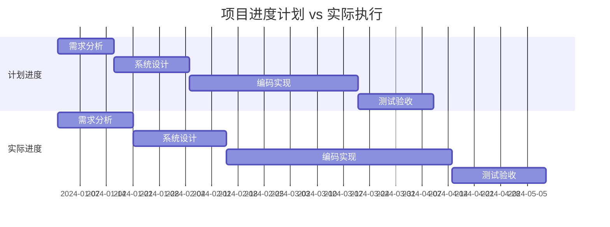
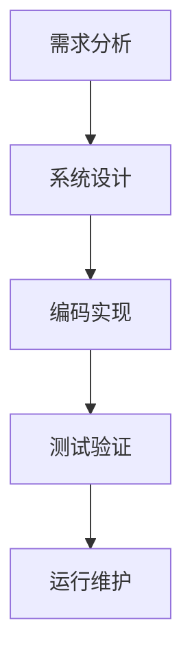
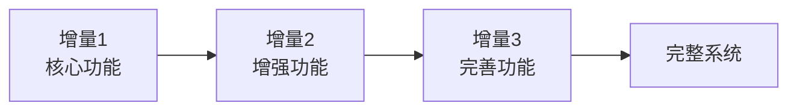
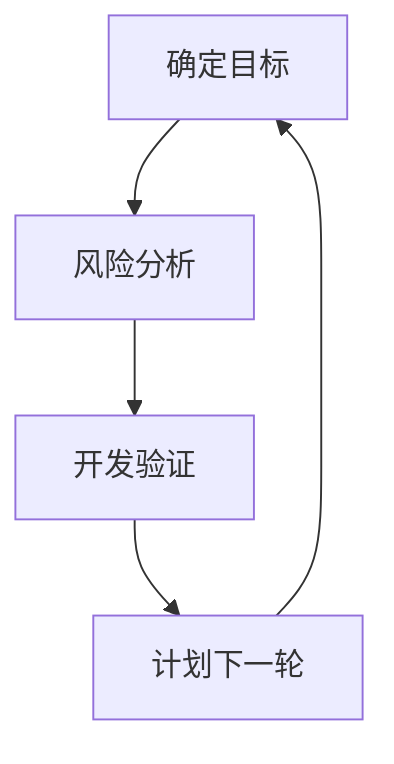
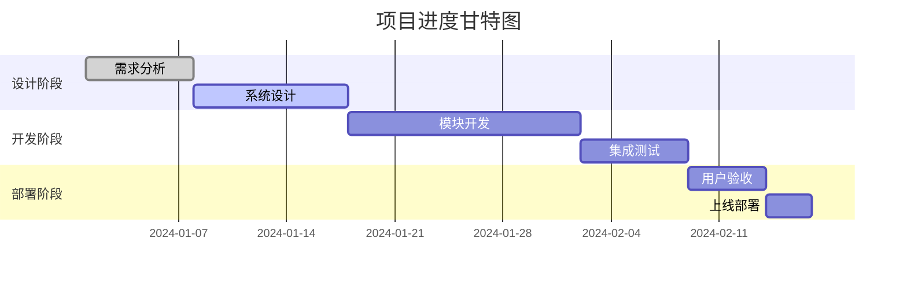
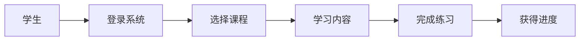
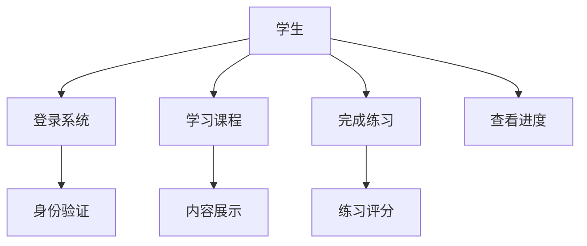
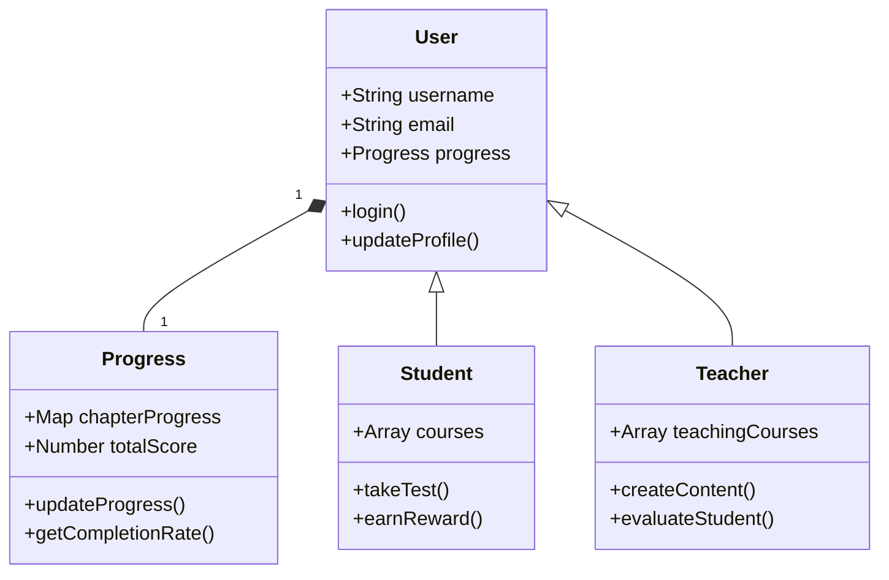
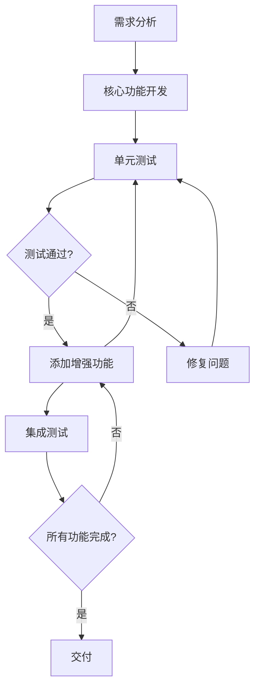

# 🎓 Study Guide

##### 小组：FlowerC 2025 | 制作组员：李桂昇，李佳浩

## 📋 目录

---

#### 1.🎯学习建议与方法
#### 2.📖第一章：软件问题
#### 3.📖第二章：软件过程
#### 4.📖第三章：软件计划
#### 5.📖第四章：需求分析
#### 6.📖第五章：软件体系结构
#### 7.📖第六章：设计
#### 8.📖第七章：编码和单元测试
#### 9.📖第八章：测试
#### 10.📚学习资源大全
#### 11.💻词汇表

---

🎯 学习建议与方法
========================================
### 📚 推荐学习路径

初学者路径：按章节顺序学习，每章完成习题

实践导向：结合我们的Python网站案例理解概念

复习强化：使用思维导图回顾核心概念

---

📖 第一章：软件问题 - 为什么软件开发这么难？
========================================

**本章定位**：软件工程是解决"软件危机"的学科方法。通过本章学习，你将理解软件开发面临的根本挑战，为后续学习软件工程方法建立认知基础。

🎯 学习目标
-------

1. 理解软件开发面临的**三大核心难题**（成本、进度、质量）
2. 分析成本、进度、质量之间的**平衡关系**
3. 认识到**软件规模**和**需求变更**带来的复杂性
4. 为后续学习软件工程方法打下基础

📌 核心概念详解
---------

### 1.1 软件开发的三大难题


#### 成本问题 - 钱都花到哪里去了？

**成本构成**：
- **直接成本**：开发时间、测试时间、部署时间
- **间接成本**：学习新技术的时间、沟通协调的时间  
- **隐藏成本**：调试bug的时间、修改需求的时间、文档编写的时间

**成本特性**：软件成本主要体现为**人力成本**，且维护成本通常占整个生命周期的70%-80%。

#### 进度问题 - 为什么总是延期？



**进度挑战**：
- **乐观估计**：开始觉得2天能完成的功能，实际要5天
- **意外情况**：技术难题、人员变动、需求变更
- **学生综合征**：工作总是拖到最后一刻才开始

#### 质量问题 - 什么是好软件？

**质量维度**：
- **正确性**：功能符合需求
- **可靠性**：稳定不崩溃
- **易用性**：用户操作方便
- **可维护性**：后续修改容易
- **效率**：资源利用率高

### 1.2 规模和变更的挑战

#### 规模的影响

```python
# 小型项目 vs 大型项目复杂度对比
def small_project():
    # 一个人可以掌握所有代码
    handle_ui()
    process_data()
    manage_storage()

def large_project():
    # 需要团队协作，模块化设计
    ui_team.handle_interface()
    backend_team.process_business_logic()
    database_team.manage_data()
    integration_team.assemble_modules()
```

**规模效应**：
- **沟通成本**：团队规模越大，沟通成本指数级增长
- **复杂度**：功能越多，代码越复杂，可能的bug越多
- **协调难度**：模块间接口和集成复杂度增加

#### 变更的必然性

**变更来源**：
- 用户提出新要求
- 技术方案需要调整
- 市场环境变化
- 法律法规更新

**变更管理**：变更不是坏事，但需要有效管理，避免"范围蔓延"。

📚 学习资源推荐
---------

#### 📹 视频资源
- **[Software Engineering: Crash Course](https://www.youtube.com/watch?v=O753uuptq50)** - 16分钟快速了解软件工程
- **[为什么软件项目会失败](https://www.youtube.com/watch?v=RhdlBHHimeM)** - 分析真实项目失败案例
- **[软件开发生命周期](https://www.youtube.com/watch?v=Wt4lZPl0p8c)** - 讲清楚整个开发过程

#### 📚 实用网站
- **[GeeksforGeeks软件工程专题](https://www.geeksforgeeks.org/software-engineering/)** - 概念解释清晰，有代码示例
- **[TutorialsPoint教程](https://www.tutorialspoint.com/software_engineering/software_engineering_overview.htm)** - 适合初学者
- **[软件工程知识体系SWEBOK](https://www.computer.org/education/bodies-of-knowledge/software-engineering)** - 权威参考

#### 🎯 重点阅读
- **《人月神话》** - 软件工程经典，讲项目经验教训
- **教材第一章** - 精读掌握基本概念

🧑💻 案例分析：我们的Python学习网站项目
-------------------------


**质量要求的平衡**：
在时间有限的情况下我们做出权衡：
- 优先保证核心功能（学习系统）
- 简化游戏化功能（精灵收集）
- 在质量和进度之间找到平衡点

**实用建议**：
1. **成本估算**：在实际时间基础上增加30%缓冲
2. **进度管理**：使用版本控制工具，定期检查进度
3. **质量保证**：从开始就注重代码质量和测试
4. **变更处理**：建立变更记录和管理流程

🎯 本章小结
-------
软件问题
- **三大难题**
  - 成本问题
  - 进度问题  
  - 质量问题
- **规模挑战**
  - 沟通成本
  - 复杂度增长
  - 协调难度
- **变更管理**
  - 需求变更
  - 技术变更
  - 环境变更


软件开发的复杂性源于其**无形性、复杂性、易变性**。关键要点：

- 软件危机表现为**成本超支、进度延误、质量低下**
- **规模增长**导致复杂度非线性增加
- **需求变更**是常态而非例外
- 需要在**成本、进度、质量**之间寻求平衡

通过理解这些根本挑战，我们才能更好地应用软件工程方法来解决实际问题。

### 📝 习题
#### 选择题
软件危机的主要表现不包括以下哪项？

A. 软件开发成本超出预算

B. 软件产品质量无法保证

C. 软件开发进度难以控制

D. 软件用户数量增长过快

根据教材，软件维护成本通常占整个生命周期成本的：

A. 10%-20%

B. 30%-40%

C. 50%-60%

D. 70%-80%

以下哪项不是软件规模增长带来的直接挑战？

A. 沟通成本指数级增加

B. 代码复杂度非线性增长

C. 硬件成本大幅上升

D. 团队协调难度加大

#### 判断题
( ) 软件危机只存在于大型软件项目中。

( ) 软件维护成本可以通过良好的设计来降低。

( ) 需求变更是软件项目的异常情况，应该尽量避免。

#### 简答题
请结合一个实际项目案例，分析在成本、进度和质量这三个约束条件中，为什么往往只能同时满足两个？
这种"不可能三角"在项目管理中应该如何应对？

### 第一章答案
#### 选择题：

D - 软件用户数量增长过快（这不是软件危机的表现，而是市场成功的表现）

D - 70%-80%（教材强调软件维护成本通常很高）

C - 硬件成本大幅上升（软件规模增长主要影响人力成本和复杂度）

#### 判断题：

× - 软件危机存在于各种规模的项目中，只是大型项目表现更明显

√ - 良好的设计可以提高代码的可维护性，从而降低维护成本

× - 需求变更是软件开发中的正常现象，需要管理而不是避免

#### 简答题参考答案：
软件项目的成本、进度和质量构成"不可能三角"，因为资源有限。例如，要加快进度可能需增加成本（加班、加人）或降低质量（减少测试）。
应对策略包括：明确优先级、阶段性交付、风险管理和客户沟通，在约束间寻找动态平衡。

---

📖 第二章：软件过程 - 如何有序地开发软件？
======================================

**本章定位**：软件过程是软件开发的"路线图"，定义了从概念到交付的完整生命周期。通过本章学习，你将掌握不同过程模型的适用场景，为项目选择合适开发方法。

🎯 学习目标
-------

1. 掌握各种软件开发过程的**优缺点**
2. 理解**敏捷开发**的核心思想
3. 学会为项目**选择合适的过程模型**
4. 能够在实际项目中**应用过程方法**

📌 核心概念详解
---------

### 2.1 传统过程模型比较

#### 瀑布模型 - 按部就班



**特点**：
- **优点**：计划明确，文档完整，适合需求固定的项目
- **缺点**：不能适应变化，后期修改成本高
- **适合**：政府项目、银行系统等需求稳定的项目

#### 增量模型 - 分批交付



**特点**：
- 先做核心功能，再添加增强功能
- **优点**：早期看到成果，风险分散
- **缺点**：需要良好的架构设计

#### 螺旋模型 - 重视风险



**特点**：
- 每轮都进行风险分析
- 适合大型复杂项目
- **优势**：强调风险驱动

### 2.2 敏捷开发实战理解

**敏捷的核心思想**：快速响应变化，持续交付价值

**Scrum框架的实用解读**

```python
# Scrum流程示例
class ScrumProcess:
    def __init__(self):
        self.product_backlog = []  # 产品待办列表
        self.sprint_backlog = []   # 冲刺待办列表
        
    def sprint_planning(self):
        """冲刺规划 - 选择当前迭代要完成的功能"""
        self.sprint_backlog = self.select_items_from_product_backlog()
        
    def daily_standup(self):
        """每日站会 - 快速同步进度和问题"""
        questions = [
            "昨天做了什么？",
            "今天计划做什么？", 
            "遇到什么困难？"
        ]
        
    def sprint_review(self):
        """冲刺评审 - 展示成果并获得反馈"""
        self.demo_functionality()
        self.collect_feedback()
        
    def sprint_retrospective(self):
        """冲刺回顾 - 总结经验改进过程"""
        self.identify_improvements()
```

**敏捷宣言四大价值观**：
1. **个体和互动** 高于 流程和工具
2. **可工作的软件** 高于 详尽的文档
3. **客户合作** 高于 合同谈判
4. **响应变化** 高于 遵循计划

📚 学习资源推荐
---------

#### 🎥 推荐视频
- **[瀑布vs敏捷直观对比](https://www.youtube.com/watch?v=K1X1q-Gbd0A)** - 用动画展示区别
- **[Scrum实战演示](https://www.youtube.com/watch?v=vuBFzAdaHDY)** - 真实团队如何开Scrum会议
- **[敏捷开发误区](https://www.youtube.com/watch?v=Z9QbYZh1YXY)** - 避免把敏捷用成混乱

#### 🛠️ 实用工具
- **Trello** - 免费的看板工具，适合学生项目
- **GitHub Projects** - 和代码仓库集成
- **微信/钉钉** - 团队日常交流工具

#### 📖 延伸阅读
- **教材第二章** - 重点理解各种模型的适用场景
- **Scrum指南** - 简洁精华的Scrum框架说明

🧑💻 案例分析：我们项目的开发过程
-------------------------

#### 真实过程分享


**我们为什么选择迭代增量模型？**
- 需求相对明确但细节会调整
- 需要早期看到成果（给教授演示）
- 团队规模小（4人），适合敏捷

**实际执行中的调整**

**第一轮迭代**：
- **计划**：完成用户系统+基础框架
- **实际**：用户系统完成，但代码编辑器遇到技术难题
- **调整**：先跳过代码编辑器，用简单文本框代替

**经验教训**：
- **计划要灵活**：留出缓冲时间应对意外
- **沟通要频繁**：团队成员间及时同步进度

#### 给同学的建议
1. **从小开始**：先尝试2周的迭代周期
2. **重视回顾**：每次迭代后总结改进点
3. **工具适宜**：选择团队都能熟练使用的工具
4. **持续改进**：过程模型不是一成不变的

🎯 本章小结
-------
| 过程模型 | 适用场景 | 优点 | 缺点 |
|-----|------|------|-----|
| 瀑布模型 | 需求明确的大型项目 | 计划性强，文档完整|难以适应变化|
| 敏捷开发 | 需求多变的创新项目 | 灵活响应变化| 文档相对简单|
| 增量模型 | 中等规模项目 | 风险分散，早期交付| 需要良好架构|
| 螺旋模型 | 高风险复杂项目 | 强调风险管理 | 过程复杂|


选择合适的过程模型是项目成功的**关键前提**：

- **瀑布模型**适合需求明确、变化少的项目
- **增量模型**平衡了计划性和灵活性
- **敏捷开发**适合需求多变、需要快速响应的项目
- 实际项目中常**混合使用**不同模型

没有"最好"的过程模型，只有"最适合"项目特性的模型。

### 习题
#### 选择题
瀑布模型最适合以下哪种情况？

A. 需求不明确的项目

B. 需要快速开发原型的项目

C. 需求明确且变化较少的项目

D. 高风险的大型项目

敏捷开发方法的核心思想是：

A. 详细的文档和严格的流程

B. 快速响应变化和持续交付价值

C. 完整的架构设计

D. 严格的阶段评审

在增量模型中，系统是：

A. 一次性完整交付

B. 分批次逐步交付

C. 永远处于测试状态

D. 不需要集成测试

#### 判断题
( ) 瀑布模型允许在开发后期进行需求变更。

( ) 敏捷开发方法适用于所有类型的软件项目。

( ) 增量开发可以降低项目风险。

#### 简答题
假设你要为一个银行核心系统和一个创业公司的社交APP选择开发过程模型，你会分别为它们选择哪种模型？请详细说明你的选择理由和预期的优缺点。

### 第二章答案
#### 选择题：

C - 需求明确且变化较少的项目（瀑布模型适合需求稳定的项目）

B - 快速响应变化和持续交付价值（这是敏捷开发的核心思想）

B - 分批次逐步交付（增量模型的特点就是分批交付功能）

#### 判断题：

× - 瀑布模型难以适应后期需求变更，变更成本很高

× - 敏捷开发并非适用于所有项目，比如对安全性、可靠性要求极高的系统可能更适合传统模型

√ - 增量开发可以早期发现风险，降低整体项目风险

#### 简答题参考答案：
银行核心系统选择瀑布模型，因为需求稳定、安全性要求高、文档完整性强；社交APP选择敏捷开发，因为需求变化快、需要快速迭代、用户反馈重要。银行系统的优点是质量可控，缺点是灵活性差；社交APP的优点是响应快，缺点是文档相对简单。


---

📖 第三章：软件计划 - 如何制定可行的项目蓝图？
========================================

**本章定位**：软件计划是项目管理的基石，决定了项目的方向、资源和成功标准。通过本章学习，你将掌握从范围定义到风险控制的完整计划方法。

🎯 学习目标
-------

1. 掌握**软件范围定义**的方法和要点
2. 理解不同**成本估算技术**的适用场景
3. 学会制定**进度计划**和**风险管理计划**
4. 能够为实际项目制定完整的软件计划

📌 核心概念详解
---------

### 3.1 软件范围定义

#### 目标确定
- **功能需求**：软件必须完成的功能
- **性能要求**：响应时间、吞吐量等指标
- **接口特性**：与外部系统的交互方式
- **可靠性要求**：系统可用性、容错能力
- **交付成果**：最终交付的产品和文档

#### 资源确定
1. **人力资源**：开发人员、测试人员、管理人员
2. **环境资源**：硬件设备、软件工具、开发环境
3. **时间资源**：项目总体时间框架和里程碑

### 3.2 成本估算方法

#### 自顶向下估算方法
- **适用场景**：项目初期，需求不够明确时
- **优点**：估算快速，不需要详细设计
- **缺点**：精度较低，依赖估算者的经验

#### 自底向上估算方法
- **适用场景**：需求明确，设计详细时
- **优点**：估算精度高，基于详细分析
- **缺点**：耗时较长，需要完整的工作分解结构

### 3.3 具体的估算技术

#### 代码行技术（LOC）
```math
工作量 = 代码行数 ÷ 生产率
```
- **优点**：直观、容易理解
- **缺点**：依赖编程语言、对设计质量敏感

#### 功能点技术（FP）
从用户视角度量软件规模：
**计算步骤**：
1. 计算未调整功能点（UFP）
2. 计算值调整因子（VAF）
3. 计算调整功能点（AFP）

#### COCOMO模型
由Boehm提出，分为三个层次：
- **基本COCOMO**：静态单变量模型
- **中间COCOMO**：考虑四类成本驱动属性
- **详细COCOMO**：包括中间模型所有特性加上步骤影响分析

### 3.4 进度安排

#### 甘特图


**特点**：
- 水平条形图显示任务时间安排
- 直观展示任务开始和结束时间
- 便于进度跟踪和控制

#### 工程网络技术
- **关键路径法（CPM）**：确定项目中最长的路径
- **计划评审技术（PERT）**：考虑时间估计的不确定性

### 3.5 风险分析

#### 风险识别
- **技术风险**：技术不成熟、技术难度大
- **管理风险**：资源不足、进度安排不当
- **商业风险**：市场变化、竞争对手行动

#### 风险估计
- 发生概率：风险事件发生的可能性
- 影响程度：风险发生后的损失大小
- 风险暴露量 = 概率 × 影响

#### 风险应对策略
- **风险规避**：改变计划消除风险
- **风险缓解**：采取措施减轻风险影响
- **风险接受**：准备应急计划接受风险

📚 学习资源推荐
---------

#### 📹 视频资源
- **[项目计划与估算实战](https://www.youtube.com/watch?v=example1)** - 实际项目计划案例
- **[风险管理最佳实践](https://www.youtube.com/watch?v=example2)** - 风险识别和应对策略
- **[敏捷项目规划](https://www.youtube.com/watch?v=example3)** - 敏捷环境下的计划制定

#### 📚 实用网站
- **[Project Management Institute](https://www.pmi.org/)** - 项目管理专业组织
- **[敏捷估算技术](https://www.agilealliance.org/glossary/planning-poker/)** - 敏捷估算方法介绍

#### 🎯 重点阅读
- **教材第三章** - 精读成本估算和进度安排
- **《人月神话》** - 项目计划和估算的经典著作

🧑💻 案例分析：Python学习网站项目计划
-------------------------

#### 项目范围定义
**项目目标**：
开发一个面向Python初学者的互动学习平台

**范围边界**：
- **包含**：12章教学内容、代码练习系统、用户进度跟踪
- **不包含**：移动端APP、社交功能、在线编译器

#### 成本估算实践
**采用自底向上估算**

| 模块名称 | 工作量(人天) | 说明 |
|---------|------------|------|
| 用户管理 | 12 | 注册、登录、权限管理 |
| 内容管理 | 24 | 章节内容、进度跟踪 |
| 练习系统 | 20 | 题目管理、自动评分 |
| 游戏化功能 | 16 | 金币、成就系统 |
| 系统集成 | 8 | 模块整合、测试 |
| **总计** | **80人天** | |

#### 进度安排设计
**关键路径**：
需求分析 → 系统设计 → 内容系统开发 → 系统测试

**总工期**：15周

#### 风险管理计划
**主要风险**：
1. **技术难题**：代码检测功能实现困难
2. **进度延误**：考试冲突影响开发时间
3. **需求变更**：教授提出新要求

**风险应对措施**：
- **技术风险**：提前技术调研，准备备选方案
- **进度风险**：设置里程碑检查点，预留缓冲时间
- **需求风险**：建立变更控制流程

🎯 本章小结
-------

软件计划是项目成功的**路线图**：

- **范围定义**是计划的基础，必须明确清晰
- **成本估算**需要选择合适的估算方法
- **进度安排**要识别关键路径，合理分配资源
- **风险管理**要提前识别、评估和应对潜在风险

好的计划不是一成不变的，需要根据项目进展**持续调整和优化**。

### 习题
#### 选择题
软件计划阶段的主要任务不包括：

A. 确定项目范围

B. 编写程序代码

C. 估算项目成本

D. 制定进度计划

自顶向下估算方法的主要特点是：

A. 先估算模块成本再汇总

B. 从系统整体出发进行估算

C. 需要详细的设计文档

D. 估算精度很高

风险暴露量的计算公式是：

A. 风险概率 + 风险影响

B. 风险概率 × 风险影响

C. 风险概率 / 风险影响

D. 风险影响 - 风险概率

#### 判断题
( ) 软件计划只需要在项目开始时制定一次。

( ) 自底向上估算方法适用于项目初期阶段。

( ) 关键路径上的任务可以有时差。

#### 简答题
在项目计划中，为什么说"计划本身没有价值，计划的过程才有价值"？请结合具体的计划活动（如WBS分解、风险评估等）说明计划过程如何帮助项目成功。

### 第三章答案
#### 选择题：

B - 编写程序代码（这是实现阶段的任务）

B - 从系统整体出发进行估算

B - 风险概率 × 风险影响

#### 判断题：

× - 软件计划需要在整个项目周期中持续更新和调整

× - 自底向上估算需要详细的任务分解，适合项目中期

× - 关键路径上的任务没有时差，任何延迟都会影响项目总工期

#### 简答题参考答案：
计划的价值在于让团队深入理解项目：WBS分解帮助识别所有工作包，风险评估促进提前准备应对措施，资源计划避免瓶颈，进度安排明确依赖关系。这个过程建立了团队共识，暴露了潜在问题，为项目执行奠定了坚实基础。


---

📖 第四章：需求分析 - 如何搞清楚用户想要什么？
========================================

**本章定位**：需求分析是连接用户和开发者的桥梁，决定了软件的方向和价值。通过本章学习，你将掌握从需求获取到需求管理的完整流程。

🎯 学习目标
-------

1. 掌握**需求获取**的各种技术方法
2. 学会编写清晰的**需求规格说明**
3. 理解**需求验证**和**需求管理**的重要性
4. 能够在项目中实践需求工程

📌 核心概念详解
---------

### 4.1 需求工程过程

#### 需求获取 - 学会"听"的艺术
- **访谈技巧**：和用户深入交流了解真实需求
- **观察法**：观察用户实际工作流程
- **原型演示**：先做简单版本，收集反馈再改进
- **问卷调查**：大规模收集用户意见

#### 需求分析 - 从混乱到有序
- **分类整理**：区分必须功能和增强功能
- **优先级排序**：先做核心功能，再做高级功能
- **解决冲突**：当不同用户需求矛盾时，找到平衡点
- **建立模型**：用图形化方式表达需求

#### 需求规约 - 写清楚的"说明书"
- 用准确的语言描述功能
- 让开发和测试都能看懂
- 避免模糊说法，要有可验证性
- 遵循标准格式（如IEEE标准）

#### 需求验证 - 确认没理解错
- 找用户评审
- 用原型演示确认
- 提前想好测试用例
- 进行需求审查

### 4.2 需求建模技术

#### 数据流图 - 看清信息的流动


**作用**：展示数据在系统中的流动过程


#### 用例图 - 描述系统功能


**作用**：从用户角度展示系统功能边界

### 4.3 需求管理

#### 需求跟踪
建立需求与设计、代码、测试的对应关系，确保：
- 每个需求都得到实现
- 每个设计元素都有需求依据
- 每个测试用例都有需求覆盖

#### 变更控制
当需求变化时的处理流程：
1. **记录变更请求**：详细描述变更内容
2. **分析影响**：评估对进度、成本、质量的影响
3. **评审决策**：团队讨论决定是否接受变更
4. **实施更新**：更新相关文档和计划

📚 学习资源推荐
---------

#### 📹 视频资源
- **[需求工程概述](https://www.youtube.com/watch?v=Al6Yawu2t-c)** - 系统讲解需求分析全过程
- **[用户故事编写技巧](https://www.youtube.com/watch?v=apOvF9NVdBA)** - 实战技巧
- **[用例图绘制教程](https://www.youtube.com/watch?v=zid-MVo7M-E)** - 手把手教学

#### 📚 实用网站
- **[Draw.io在线绘图](https://app.diagrams.net/)** - 免费画数据流图、用例图
- **[需求管理工具介绍](https://www.joint.com/requirements-management/)** - 了解专业需求管理

#### 🎯 重点阅读
- **教材第四章** - 精读需求分析方法和工具
- **《掌握需求过程》** - 需求工程的实用指南

🧑💻 案例分析：我们的Python学习网站需求分析
-------------------------

#### 真实经验分享
**需求获取的挑战**：
开始以为需求很明确，实际发现：
- 用户说的需求和真正想要的有差异
- 技术限制影响需求实现

**我们的解决方案**：
1. **多次确认**：用示例原型确认理解
2. **优先级排序**：明确什么必须做，什么可以简化

**需求文档的演变**：
第一版需求文档很简略，后来发现不够用：
- 增加了详细的用例描述
- 补充了非功能需求
- 添加了界面原型截图
- 明确了验收标准

#### 实用工具和模板
**需求跟踪表示例**：
| 需求ID | 需求描述 | 优先级 | 状态 | 负责人 | 验收标准 |
|-------|---------|-------|------|-------|---------|
| REQ-001 | 用户注册功能 | Must | 完成 | 张三 | 能成功创建账户 |

**变更请求记录**：
| 变更ID | 提出人 | 变更内容 | 影响分析 | 决策 | 状态 |

**需求规格模板**：
### 需求规格模板

#### 功能需求
- **需求ID**: REQ-001
- **描述**: 用户注册功能
- **优先级**: 高
- **验收标准**:
  - 用户能输入用户名、邮箱、密码
  - 系统验证输入格式
  - 成功创建用户账户
  - 发送验证邮件

#### 非功能需求
- **性能**: 注册响应时间 < 2秒
- **安全性**: 密码加密存储
- **可用性**: 95%的时间可用

🎯 本章小结
-------

需求分析是项目成功的**第一道防线**：

- **需求获取**需要多种技术组合使用
- **需求分析**要将用户需求转化为可执行的技术需求
- **需求建模**帮助团队建立共同理解
- **需求管理**确保需求在整个生命周期中可控

好的需求分析能够**减少返工、控制范围、确保价值交付**。

### 习题
#### 选择题
需求工程的首要任务是：

A. 编写详细的需求文档

B. 获取和理解用户需求

C. 设计系统架构

D. 制定项目计划

功能需求主要描述的是：

A. 系统的性能指标

B. 系统必须完成的功能

C. 系统的界面设计

D. 系统的安全要求

用例图主要用于描述：

A. 系统的数据结构

B. 系统与用户的交互

C. 系统的处理流程

D. 系统的网络拓扑

#### 判断题
( ) 需求工程只在项目开始阶段进行。

( ) 功能需求比非功能需求更重要。

( ) 需求变更应该完全避免。

#### 简答题
在需求获取过程中，用户常常无法准确表达自己的真实需求。请描述三种有效获取用户真实需求的技术方法，并举例说明每种方法在什么场景下最有效。

### 第四章答案
#### 选择题：

B - 获取和理解用户需求

B - 系统必须完成的功能

B - 系统与用户的交互

#### 判断题：

× - 需求工程贯穿整个项目生命周期

× - 功能需求和非功能需求同等重要，缺一不可

× - 需求变更是正常现象，需要管理而非避免

#### 简答题参考答案：

1.原型演示：制作可交互原型，用户通过实际操作提供反馈，适合界面和流程需求；
2.场景分析：让用户描述典型使用场景，发现真实工作流程，适合业务流程复杂的系统；
3.观察法：观察用户实际工作，发现未言明的需求，适合优化现有工作流程的场景。

---

📖 第五章：软件体系结构 - 系统的"骨架"设计
======================================

**本章定位**：软件体系结构是系统的高层设计，决定了软件的质量属性和演化能力。通过本章学习，你将掌握架构设计的原则、模式和方法。

🎯 学习目标
-------

1. 理解软件体系结构的**重要作用**
2. 掌握不同的**体系结构视图**
3. 识别**构件**和**连接件**的概念
4. 应用常见的**体系结构模式**
5. 为项目选择合适的架构风格

📌 核心概念详解
---------

### 5.1 软件体系结构的作用

#### 什么是软件体系结构？
软件的"骨架"，决定系统如何组织：
- **宏观规划**：系统整体组织结构
- **沟通工具**：团队成员共同理解的基础
- **质量基础**：影响可维护性、可扩展性、性能等质量属性
- **决策框架**：指导后续设计和实现决策

### 5.2 体系结构视图

#### 不同的"视角"看系统：
- **构件和连接件视图**：系统由哪些部件组成，怎么连接
- **模块视图**：代码如何组织成模块
- **分配视图**：软件如何部署到硬件
- **用例视图**：系统如何满足功能需求

### 5.3 构件和连接件视图

#### 构件 - 系统的"积木块"
每个构件都有：
- **接口**：提供什么功能，需要什么输入
- **功能**：具体做什么事情
- **状态**：保存什么数据
- **约束**：使用条件和限制

#### 连接件 - 构件间的"胶水"
包括：
- **函数调用**：模块间函数调用
- **事件传递**：事件触发其他模块更新
- **数据共享**：共享数据存储
- **消息传递**：异步通信机制

### 5.4 体系结构模式

#### 管道-过滤器模式
```python
# 管道-过滤器模式示例
class DataFilter:
    def process(self, data):
        # 处理数据并传递给下一个过滤器
        processed_data = self.transform(data)
        return processed_data

class Pipeline:
    def __init__(self):
        self.filters = []
    
    def add_filter(self, filter):
        self.filters.append(filter)
    
    def execute(self, data):
        for filter in self.filters:
            data = filter.process(data)
        return data
```

**特点**：
- 像流水线一样处理数据：`输入 → [过滤器1] → [过滤器2] → 输出`
- **适合**：数据处理管道
- **优点**：高重用性、可维护性
- **缺点**：不适合交互式应用

#### 分层架构
```
表示层 → 业务层 → 数据层
```

**特点**：
- **适合**：中等规模项目，便于分工开发
- **优点**：关注点分离，易于测试和维护
- **缺点**：可能产生性能开销

#### 客户端-服务器模式
**特点**：
- **适合**：分布式系统
- **优点**：集中管理，易于扩展
- **缺点**：单点故障风险

#### 模型-视图-控制器（MVC）
**特点**：
- **适合**：用户交互密集型应用
- **优点**：分离数据、显示和控制逻辑
- **缺点**：复杂度较高

📚 学习资源推荐
---------

#### 📹 视频资源
- **[软件架构模式详解](https://www.youtube.com/watch?v=Ztvem6Iaa6c)** - 各种架构模式对比
- **[分层架构实战](https://www.youtube.com/watch?v=BCXcYsTat3Y)** - 分层架构的具体实现
- **[架构设计原则](https://www.youtube.com/watch?v=5OjXJSaWLwI)** - 好的架构设计思路

#### 📚 实用网站
- **[架构模式目录](https://martinfowler.com/architecture/)** - 各种架构模式介绍
- **[UML图教程](https://www.uml-diagrams.org/)** - 学习架构图绘制

#### 🎯 重点阅读
- **教材第五章** - 精读体系结构概念和模式
- **《软件体系结构实践》** - 实战经验分享

🧑💻 案例分析：我们的Python学习网站架构
-------------------------

#### 架构设计决策
**为什么选择分层架构：**
```javascript
// 分层架构在我们的体现
表示层: HTML/CSS/JavaScript - 用户界面和交互
业务层: UserManager, LearningEngine, GameSystem - 核心业务逻辑
数据层: IndexedDB操作封装 - 数据持久化
工具层: 通用工具函数 - 跨层共享功能
```

**构件设计考虑：**
```javascript
// 每个构件的职责明确分离
UserManager: 只负责用户认证、权限管理
LearningEngine: 只负责学习进度、内容管理
GameSystem: 只负责游戏化功能、奖励系统
// 构件间通过清晰接口通信，内部实现隐藏
```

#### 架构评估
**我们的架构优点**：
- **可维护性**：每层职责清晰，修改影响小
- **可测试性**：可以分层测试，Mock依赖
- **团队协作**：4个人可以分层次发
- **可扩展性**：新功能可以方便添加

**可能的改进点**：
- **性能优化**：某些操作可能跨层调用较多
- **错误处理**：需要统一的错误处理机制

🎯 本章小结
-------

软件体系结构是系统设计的**战略决策**：

- 架构决定了系统的**质量属性**（性能、安全性、可维护性等）
- 不同的**架构模式**适用于不同的应用场景
- **构件和连接件**是架构的基本构建块
- 好的架构应该在**简单性**和**灵活性**之间找到平衡

架构不是一成不变的，应该随着需求和技术的发展而**演进**。

### 习题
#### 选择题
软件体系结构的主要作用不包括：

A. 定义系统的总体结构

B. 指导具体的代码编写

C. 促进团队沟通和理解

D. 支持系统质量属性

在构件和连接件视图中，连接件的作用是：

A. 实现具体的业务逻辑

B. 在构件之间传递信息

C. 存储系统数据

D. 提供用户界面

管道-过滤器模式最适合：

A. 需要共享状态的系统

B. 数据流水线处理系统

C. 实时交互系统

D. 分布式计算系统

#### 判断题
( ) 软件体系结构只在项目开始时设计一次。

( ) 构件应该尽可能大，减少构件数量。

( ) 好的体系结构应该能够适应需求变化。

#### 简答题
请对比分析分层架构与微服务架构在可维护性、性能、团队协作和部署复杂度四个维度的差异，并说明在什么情况下应该选择哪种架构风格。

### 第五章答案
#### 选择题：

B - 指导具体的代码编写（这是详细设计的任务）

B - 在构件之间传递信息

B - 数据流水线处理系统

#### 判断题：

× - 软件体系结构需要随着系统演进不断调整

× - 构件应该遵循单一职责原则，大小适中

√ - 好的架构应该具有良好的可扩展性和适应性

#### 简答题参考答案：
分层架构在可维护性和部署复杂度方面占优，适合中小型项目；微服务在团队协作和独立扩展方面更好，但部署复杂。选择依据：项目规模小、团队集中选分层；大型系统、多团队协作、需要技术异构选微服务。


---

📖 第六章：设计 - 从架构到详细实现
================================

**本章定位**：设计是将架构转化为具体实现方案的桥梁，关注模块内部结构和交互细节。通过本章学习，你将掌握从高层设计到详细设计的完整方法。

🎯 学习目标
-------

1. 掌握**耦合、内聚**等设计基本概念
2. 理解**面向功能设计**和**面向对象设计**
3. 学会使用**UML**进行设计建模
4. 掌握**详细设计**的方法
5. 应用**设计原则**改进软件质量

📌 核心概念详解
---------

### 6.1 设计的基本概念

```

高内聚低耦合核心概念一句话概括：

高内聚： 一个模块（或类）内部“志同道合”，所有成员齐心协力完成一个单一、明确的目标。
        比如我们制作网站html时style部分里面的css和<p>内容</p>里面的文字内容都是为了让“内容”这两个字按照我们理想的方式出现

低耦合： 模块之间“君子之交淡如水”，保持独立，一个模块的变化不容易影响到其他模块。
        比如我们组制作网站的基本功能与游戏性功能互相不影响，如果金币系统出bug了，用户也可以进行章节学习
```

#### 耦合 - 模块间的"亲密程度"
```

正面例子：低耦合的“轻松达人”点餐法
场景描述：
你用美团/饿了么APP点同一份宫保鸡丁：
1.你在APP上选好菜品，在备注里写“花生少一点，鸡肉切小块”
2.加入购物车，直接下单付款
3.剩下的所有事情：餐厅接单、厨师做菜、平台派单、骑手取餐、送到你家——全部由系统自动协调
4.你只需要看着地图上骑手的位置，等着门铃响就行了

低耦合分析：

·你只与美团APP这个统一接口交互
·你不关心是哪个厨师做菜、哪个骑手送餐、餐厅有几个后门
·厨师换人、骑手变更、餐厅装修，都不会影响你点餐
·各个模块（餐厅、骑手、支付系统）独立运作，通过标准接口协作

# 高耦合的反例
反面例子：高耦合的“麻烦精”点餐法
场景描述：
你想点一份宫保鸡丁外卖，但你是这样操作的：
你直接给餐厅厨师打电话：“王师傅，我要一份宫保鸡丁，花生少一点，鸡肉切小块！”
然后你又给外卖小哥打电话：“小李，你10分钟后到人民路那家川菜馆后门等着，我的饭好了你从厨房窗口拿。”
饭做到一半，你又给厨师打电话：“王师傅，再加瓶可乐！要冰镇的！”
你还要随时盯着，看到外卖员快到小区了，你又给小区保安打电话：“张大哥，等下有外卖员叫小李，你让他从东门进来！”

高耦合分析：

·你直接依赖于具体的厨师、具体的外卖员、具体的保安
·任何一个环节换人（厨师休息、外卖员请假、保安换班），你的整个点餐流程就崩溃了
·你需要了解每个环节的内部细节（餐厅后门在哪、厨房窗口位置、小区门禁规则）
·牵一发而动全身：想改个菜量都要亲自联系厨师

```

**耦合类型**：
- **数据耦合**：通过参数传递数据（推荐）
- **标记耦合**：传递数据结构
- **控制耦合**：传递控制信息
- **公共耦合**：共享全局数据
- **内容耦合**：直接修改内部数据（避免）

#### 内聚 - 模块内的"团结程度"
```
# 高内聚的例子
场景描述：
公司设有设计部（负责所有视觉设计）、财务部（负责所有资金往来）、IT部（负责所有技术运维）、市场部（负责所有客户对接）。

高内聚： 每个部门都集中了相关领域的专业人才，只处理高度相关的业务。设计部的员工专注于提升设计技能和效率。

# 低内聚的反例
想象这样的场景：
公司里有一个“综合办公室”，里面的员工小王今天要设计海报，明天要核算工资，后天要修理打印机，大后天要接待客户。

低内聚：这个办公室的职能五花八门，涉及设计、财务、IT、行政等多个领域。
       员工很难成为专家，工作流程混乱，找特定的人办特定的事非常困难。

```

**内聚类型**：
- **功能内聚**：所有元素为单一功能服务（最佳）
- **顺序内聚**：元素按顺序处理数据
- **通信内聚**：元素操作相同数据
- **逻辑内聚**：元素逻辑相关但功能不同
- **偶然内聚**：元素无明确关系（最差）

#### 设计原则

**开闭原则** - 对扩展开放，对修改关闭
```python
class RewardSystem:
    def __init__(self):
        self.reward_strategies = {}
    
    def add_strategy(self, reward_type, strategy):
        """可以扩展新的奖励类型而不修改现有代码"""
        self.reward_strategies[reward_type] = strategy
    
    def apply_reward(self, reward_type, user):
        strategy = self.reward_strategies.get(reward_type)
        if strategy:
            strategy.apply(user)
```

**单一职责原则**：一个类只应有一个引起变化的原因
**里氏替换原则**：子类应该能够替换父类
**接口隔离原则**：客户端不应依赖不需要的接口
**依赖倒置原则**：依赖抽象而不是具体实现

### 6.2 面向功能设计

#### 结构图 - 功能的层次分解
```
Python学习系统
├── 用户管理子系统
│   ├── 注册模块
│   ├── 登录模块
│   └── 权限控制模块
├── 学习功能子系统
│   ├── 内容管理模块
│   ├── 进度跟踪模块
│   └── 练习评估模块
└── 游戏化子系统
    ├── 积分系统模块
    ├── 成就系统模块
    └── 排行榜模块
```

#### 结构化设计方法
**自顶向下，逐步细化**：
1. 确定系统要做什么
2. 拆分成主要功能模块
3. 每个模块继续拆分，直到可以编码
4. 定义模块间接口

### 6.3 面向对象设计

#### 面向对象基本概念
- **类**：对象的模板（User）
- **对象**：类的实例（张三用户）
- **继承**：学生用户继承自用户
- **多态**：不同用户类型有不同的行为
- **封装**：隐藏内部实现细节

#### UML设计建模


#### 设计方法论
从需求到设计的步骤：
1. **识别类和对象**：从需求中找出名词
2. **定义类的属性和方法**：分析对象的行为和状态
3. **建立类之间的关系**：继承、关联、依赖、组合
4. **优化设计结构**：应用设计模式改进设计

### 6.4 详细设计

#### 逻辑/算法设计
```python
def calculate_chapter_score(test_results):
    """
    计算章节得分算法设计
    输入：测试结果列表
    输出：章节得分(0-100)
    步骤：
    1. 验证输入有效性
    2. 计算正确率
    3. 考虑时间因素（如果有时限）
    4. 应用权重计算最终得分
    5. 返回标准化分数
    """
    if not test_results:
        return 0
    
    correct_count = sum(1 for result in test_results if result.is_correct)
    total_count = len(test_results)
    accuracy = correct_count / total_count
    
    # 考虑时间惩罚（如果有时间限制）
    time_penalty = calculate_time_penalty(test_results)
    
    final_score = accuracy * 100 - time_penalty
    return max(0, min(100, final_score))  # 确保在0-100范围内
```

#### 类状态模型
```python
class UserSession:
    def __init__(self):
        self.state = 'LOGGED_OUT'
    
    def login(self):
        if self.state == 'LOGGED_OUT':
            self.state = 'LOGGED_IN'
        elif self.state == 'LOGGED_IN':
            raise Exception("Already logged in")
    
    def logout(self):
        if self.state == 'LOGGED_IN':
            self.state = 'LOGGED_OUT'
```

📚 学习资源推荐
---------

#### 📹 视频资源
- **[面向对象设计原则](https://www.youtube.com/watch?v=6dN8Qp2RRgk)** - SOLID原则通俗讲解
- **[UML图实战教程](https://www.youtube.com/watch?v=WnMQ8HlmeXc)** - 手把手画UML图
- **[设计模式详解](https://www.youtube.com/watch?v=6dN8Qp2RRgk)** - 常用设计模式讲解

#### 📚 实用网站
- **[UML图教程](https://www.uml-diagrams.org/)** - 各种UML图的画法
- **[设计模式指南](https://refactoring.guru/design-patterns)** - 设计模式图文详解

#### 🎯 重点阅读
- **教材第六章** - 精读设计概念和方法
- **《设计模式》** - 经典的设计模式书籍
- **《UML精粹》** - UML快速入门指南

🧑💻 案例分析：我们的Python学习网站设计
-------------------------

#### 设计原则应用

**内聚性保证**：
```javascript
class ProgressTracker {
    constructor() {
        this.progress = new Map();
    }
    
    // 只负责进度跟踪相关功能
    updateProgress(chapter, score) {
        this.progress.set(chapter, score);
    }
    
    getProgress(chapter) {
        return this.progress.get(chapter);
    }
    
    getOverallCompletion() {
        return this.progress.size / TOTAL_CHAPTERS;
    }
    
    // 不处理用户认证或界面显示
}
```

#### 面向对象设计

**类设计实例**：
```javascript
class User {
    constructor(username, email) {
        this.username = username;
        this.email = email;
        this.progress = new ProgressTracker();
        this.joinDate = new Date();
    }
    
    // 用户基本行为
    updateProfile(newEmail) {
        if (this.validateEmail(newEmail)) {
            this.email = newEmail;
            return true;
        }
        return false;
    }
    
    validateEmail(email) {
        const emailRegex = /^[^\s@]+@[^\s@]+\.[^\s@]+$/;
        return emailRegex.test(email);
    }
}

class Student extends User {
    constructor(username, email) {
        super(username, email);
        this.courses = [];
        this.rewards = [];
    }
    
    // 学生特有行为
    takeTest(chapter, answers) {
        const score = this.evaluateAnswers(answers);
        this.progress.updateProgress(chapter, score);
        return score;
    }
    
    earnReward(reward) {
        this.rewards.push(reward);
    }
}
```

#### 设计模式应用

**策略模式**在奖励系统中的应用：
```javascript
class RewardStrategy {
    apply(user) {
        throw new Error("Method must be implemented");
    }
}

class PointsReward extends RewardStrategy {
    apply(user) {
        user.points += 100;
    }
}

class BadgeReward extends RewardStrategy {
    apply(user) {
        user.badges.push("Chapter Master");
    }
}

class RewardSystem {
    constructor() {
        this.strategies = new Map();
    }
    
    registerStrategy(rewardType, strategy) {
        this.strategies.set(rewardType, strategy);
    }
    
    applyReward(rewardType, user) {
        const strategy = this.strategies.get(rewardType);
        if (strategy) {
            strategy.apply(user);
        }
    }
}
```

🎯 本章小结
-------

设计是软件工程的**核心技术活动**：

- **高内聚低耦合**是良好设计的基本原则
- **面向对象设计**通过封装、继承、多态提高代码复用性
- **设计模式**提供了常见问题的解决方案
- **UML**是表达设计思想的标准语言
- **详细设计**要具体到算法和数据结构层面

好的设计应该平衡**功能性**和**非功能性需求**，为后续实现和维护奠定基础。

### 习题
#### 选择题
低耦合的设计目标是：

A. 增加模块间的依赖

B. 减少模块间的依赖

C. 让所有模块共享数据

D. 提高代码执行速度

高内聚意味着：

A. 模块功能多样

B. 模块功能集中单一

C. 模块代码行数多

D. 模块接口复杂

开闭原则的主要目的是：

A. 让系统完全封闭不能修改

B. 支持扩展而避免修改现有代码

C. 开放所有源代码

D. 关闭不必要的功能

#### 判断题
( ) 耦合度越低越好，应该追求零耦合。

( ) 一个类应该只有一个引起变化的原因。

( ) 面向功能设计比面向对象设计更先进。

#### 简答题
请通过一个具体的设计案例，说明如何运用单一职责原则、开闭原则和依赖倒置原则来改进一个设计不佳的类，并分析改进后的设计在可维护性和可扩展性方面的优势。

### 第六章答案
#### 选择题：

B - 减少模块间的依赖

B - 模块功能集中单一

B - 支持扩展而避免修改现有代码

#### 判断题：

× - 耦合度需要适度，过度解耦会增加复杂度

√ - 这是单一职责原则的核心思想

× - 两种设计方法各有适用场景，没有绝对的先进性

#### 简答题参考答案：
以订单处理类为例，原始设计包含计算价格、保存数据、发送通知等多个职责。改进：拆分订单计算器、订单仓储、通知服务三个类，通过接口抽象依赖。优势：修改价格策略不影响数据存储，新增通知方式不修改核心逻辑，大大提升可维护性和扩展性。

---

📖 第七章：编码和单元测试 - 从设计到实现
====================================

**本章定位**：编码是将设计转化为可执行代码的关键阶段，单元测试是保证代码质量的第一道防线。通过本章学习，你将掌握编写高质量代码和有效测试的方法。

🎯 学习目标
-------

1. 掌握**编程原则**和编码标准
2. 理解**增量开发**和**测试驱动开发**
3. 学会**代码重构**和版本管理
4. 掌握**单元测试**的方法和工具
5. 了解**代码检查**和**代码度量**

📌 核心概念详解
---------

### 7.1 编程原则和指南

#### 7.1.1 结构化编程
```python
# 结构化编程示例 - 使用三种基本结构
def calculate_student_grade(scores, attendance_rate):
    """
    计算学生最终成绩
    使用顺序、选择、循环三种基本结构
    """
    # 顺序结构 - 初始化变量
    total_score = 0
    valid_scores_count = 0
    
    # 循环结构 - 处理每个分数
    for score in scores:
        # 选择结构 - 验证分数有效性
        if 0 <= score <= 100:
            total_score += score
            valid_scores_count += 1
    
    # 选择结构 - 计算最终成绩
    if valid_scores_count > 0:
        average_score = total_score / valid_scores_count
        # 考虑出勤率的影响
        if attendance_rate >= 0.8:
            final_grade = average_score
        else:
            penalty = (0.8 - attendance_rate) * 20
            final_grade = max(0, average_score - penalty)
    else:
        final_grade = 0
    
    return final_grade
```

**核心思想**：用"顺序、选择、循环"三种基本结构组织代码，避免使用`goto`等跳转语句。

#### 7.1.2 信息隐藏
```python
class BankAccount:
    def __init__(self, account_holder, initial_balance=0):
        self._account_holder = account_holder  # 受保护的属性
        self.__balance = initial_balance       # 私有属性
        self.__transaction_history = []        # 实现细节隐藏
    
    # 只暴露必要的公共接口
    def deposit(self, amount):
        """存款操作"""
        if amount > 0:
            self.__balance += amount
            self.__record_transaction("DEPOSIT", amount)
            return True
        return False
    
    def withdraw(self, amount):
        """取款操作"""
        if 0 < amount <= self.__balance:
            self.__balance -= amount
            self.__record_transaction("WITHDRAW", amount)
            return True
        return False
    
    def get_balance(self):
        """查询余额 - 不暴露内部实现"""
        return self.__balance
    
    def get_transaction_count(self):
        """获取交易次数 - 不暴露具体交易记录"""
        return len(self.__transaction_history)
    
    # 私有方法 - 外部无法访问
    def __record_transaction(self, type, amount):
        """记录交易历史 - 实现细节隐藏"""
        transaction = {
            'type': type,
            'amount': amount,
            'timestamp': datetime.now(),
            'balance': self.__balance
        }
        self.__transaction_history.append(transaction)
```

#### 7.1.3 程序设计实践经验

**实用技巧**：
- **单一职责**：一个函数只做一件事
- **见名知意**：使用有意义的变量名和函数名
- **避免重复**：提取公共代码为函数或类
- **错误处理**：合理处理异常情况

```python
# 好的实践示例
def calculate_discount(original_price, user_type, has_coupon=False):
    """
    计算商品折扣
    符合单一职责原则，函数名和变量名清晰
    """
    # 基础折扣
    if user_type == "VIP":
        base_discount = 0.2
    elif user_type == "MEMBER":
        base_discount = 0.1
    else:
        base_discount = 0.05
    
    # 优惠券折扣
    coupon_discount = 0.1 if has_coupon else 0
    
    # 计算最终价格
    total_discount = base_discount + coupon_discount
    final_price = original_price * (1 - total_discount)
    
    return max(final_price, original_price * 0.5)  # 最低5折
```

#### 7.1.4 编码标准

**Python编码规范（PEP 8）**：
```python
# 好的编码风格示例
class StudentProgressTracker:
    """学生进度跟踪器"""
    
    def __init__(self, student_id):
        self.student_id = student_id
        self.chapter_scores = {}
        self.total_study_time = 0
    
    def update_chapter_score(self, chapter_number, score):
        """更新章节分数"""
        if not (0 <= score <= 100):
            raise ValueError("分数必须在0-100之间")
        
        self.chapter_scores[chapter_number] = score
    
    def get_average_score(self):
        """计算平均分"""
        if not self.chapter_scores:
            return 0
        
        total_score = sum(self.chapter_scores.values())
        return total_score / len(self.chapter_scores)
    
    def add_study_time(self, minutes):
        """添加学习时间"""
        if minutes < 0:
            raise ValueError("学习时间不能为负数")
        
        self.total_study_time += minutes
```

### 7.2 增量开发

#### 7.2.1 增量编码方法


**增量开发优势**：
- **早期验证**：快速获得可运行版本
- **风险降低**：问题早期发现和解决
- **用户反馈**：及时获得用户意见
- **进度可控**：分阶段交付成果

#### 7.2.2 测试驱动开发（TDD）
```python
# TDD示例：先写测试，再写代码
import unittest

class TestUserRegistration(unittest.TestCase):
    def test_register_user_with_valid_data(self):
        """测试有效用户注册"""
        # 1. 先写测试（此时会失败）
        user = register_user("test@example.com", "SecurePass123")
        self.assertEqual(user.email, "test@example.com")
        self.assertTrue(user.is_active)
    
    def test_register_user_with_invalid_email(self):
        """测试无效邮箱注册"""
        with self.assertRaises(ValueError):
            register_user("invalid-email", "password123")
    
    def test_register_user_with_weak_password(self):
        """测试弱密码注册"""
        with self.assertRaises(ValueError):
            register_user("test@example.com", "123")

# 2. 写最少代码让测试通过
def register_user(email, password):
    """用户注册功能"""
    # 邮箱验证
    if "@" not in email:
        raise ValueError("无效的邮箱格式")
    
    # 密码强度验证
    if len(password) < 8:
        raise ValueError("密码至少8位")
    
    # 创建用户
    user = User(email=email)
    user.set_password(password)
    user.is_active = True
    
    return user

# 3. 重构优化代码
class User:
    def __init__(self, email):
        self.email = email
        self._password = None
        self.is_active = False
    
    def set_password(self, password):
        """设置密码"""
        if len(password) < 8:
            raise ValueError("密码至少8位")
        self._password = self._hash_password(password)
    
    def _hash_password(self, password):
        """密码哈希（简化示例）"""
        return f"hashed_{password}"
```

#### 7.2.3 结对编程

**实践方式**：
- **驾驶员**：写代码，关注实现细节
- **导航员**：审查代码，关注整体设计
- **定期轮换**：每30-60分钟交换角色

**好处**：
- **知识共享**：团队成员技能互补
- **质量提升**：实时代码审查
- **问题预防**：提前发现潜在问题

### 7.3 代码演化的管理

#### 7.3.1 源代码控制和生成
```bash
# Git版本控制基本流程
git init                                    # 初始化仓库
git add .                                   # 添加文件到暂存区
git commit -m "feat: 添加用户注册功能"       # 提交更改
git branch feature/user-auth               # 创建特性分支
git checkout feature/user-auth             # 切换分支
git merge feature/user-auth                # 合并分支
git tag v1.0.0                             # 发布版本标签
```

#### 7.3.2 重构
```python
# 重构前 - 冗长的函数
def process_student_data(students, courses, scores):
    """处理学生数据（重构前）"""
    result = []
    for student in students:
        student_courses = []
        total_score = 0
        course_count = 0
        for course in courses:
            if course.student_id == student.id:
                for score in scores:
                    if score.course_id == course.id and score.student_id == student.id:
                        student_courses.append({
                            'name': course.name,
                            'score': score.value
                        })
                        total_score += score.value
                        course_count += 1
        avg_score = total_score / course_count if course_count > 0 else 0
        result.append({
            'student': student.name,
            'courses': student_courses,
            'average': avg_score
        })
    return result

# 重构后 - 拆分为多个小函数
def process_student_data(students, courses, scores):
    """处理学生数据（重构后）"""
    return [build_student_report(student, courses, scores) 
            for student in students]

def build_student_report(student, courses, scores):
    """构建学生报告"""
    student_courses = find_student_courses(student, courses)
    course_scores = find_course_scores(student_courses, scores)
    average_score = calculate_average_score(course_scores)
    
    return {
        'student': student.name,
        'courses': course_scores,
        'average': average_score
    }

def find_student_courses(student, courses):
    """查找学生课程"""
    return [course for course in courses 
            if course.student_id == student.id]

def find_course_scores(student_courses, scores):
    """查找课程分数"""
    course_scores = []
    for course in student_courses:
        score = find_score_for_course(course, scores)
        if score:
            course_scores.append({
                'name': course.name,
                'score': score.value
            })
    return course_scores

def find_score_for_course(course, scores):
    """查找课程对应分数"""
    for score in scores:
        if score.course_id == course.id:
            return score
    return None

def calculate_average_score(course_scores):
    """计算平均分"""
    if not course_scores:
        return 0
    total = sum(course['score'] for course in course_scores)
    return total / len(course_scores)
```

### 7.4 单元测试

#### 7.4.1 程序过程单元测试
```python
import unittest
import math

class TestMathFunctions(unittest.TestCase):
    """数学函数单元测试"""
    
    def test_add_positive_numbers(self):
        self.assertEqual(add(2, 3), 5)
        self.assertEqual(add(10, 20), 30)
    
    def test_add_negative_numbers(self):
        self.assertEqual(add(-2, -3), -5)
        self.assertEqual(add(-10, 5), -5)
    
    def test_add_with_zero(self):
        self.assertEqual(add(0, 5), 5)
        self.assertEqual(add(5, 0), 5)
        self.assertEqual(add(0, 0), 0)
    
    def test_add_decimal_numbers(self):
        self.assertAlmostEqual(add(1.1, 2.2), 3.3, places=1)
    
    def test_add_large_numbers(self):
        self.assertEqual(add(1000000, 2000000), 3000000)
    
    def test_add_very_small_numbers(self):
        self.assertAlmostEqual(add(0.0001, 0.0002), 0.0003, places=4)

def add(a, b):
    """加法函数"""
    return a + b
```

#### 7.4.2 类单元测试
```python
class TestUserClass(unittest.TestCase):
    """用户类单元测试"""
    
    def setUp(self):
        """测试前置设置"""
        self.user = User("test@example.com", "John Doe")
    
    def test_user_initialization(self):
        """测试用户初始化"""
        self.assertEqual(self.user.email, "test@example.com")
        self.assertEqual(self.user.name, "John Doe")
        self.assertFalse(self.user.is_verified)
    
    def test_verify_user(self):
        """测试用户验证"""
        self.user.verify()
        self.assertTrue(self.user.is_verified)
    
    def test_update_profile(self):
        """测试更新用户资料"""
        self.user.update_profile(name="Jane Doe", phone="123456789")
        self.assertEqual(self.user.name, "Jane Doe")
        self.assertEqual(self.user.phone, "123456789")
    
    def test_invalid_email_validation(self):
        """测试无效邮箱验证"""
        with self.assertRaises(ValueError):
            User("invalid-email", "Test User")
```

### 7.5 代码检查

#### 7.5.1 代码自查清单
- [ ] 变量名是否清晰有意义？
- [ ] 函数是否单一职责？
- [ ] 是否有重复代码？
- [ ] 错误处理是否完善？
- [ ] 注释是否准确有用？
- [ ] 代码格式是否符合规范？

#### 7.5.2 小组代码评审
```python
# 代码评审示例
class ChapterManager:
    """
    章节管理器 - 代码评审要点：
    1. 类职责是否单一？
    2. 方法命名是否清晰？
    3. 错误处理是否充分？
    4. 性能是否有问题？
    """
    
    def __init__(self):
        self.chapters = {}
        self.current_chapter = None
    
    def add_chapter(self, chapter_id, title, content):
        """添加章节"""
        if chapter_id in self.chapters:
            raise ValueError(f"章节 {chapter_id} 已存在")
        
        self.chapters[chapter_id] = {
            'title': title,
            'content': content,
            'created_at': datetime.now()
        }
    
    def get_chapter(self, chapter_id):
        """获取章节"""
        if chapter_id not in self.chapters:
            raise ValueError(f"章节 {chapter_id} 不存在")
        
        return self.chapters[chapter_id]
    
    def set_current_chapter(self, chapter_id):
        """设置当前章节"""
        if chapter_id not in self.chapters:
            raise ValueError(f"章节 {chapter_id} 不存在")
        
        self.current_chapter = chapter_id
```

### 7.6 代码度量

#### 7.6.1 代码规模测量
```python
def analyze_code_complexity(source_code):
    """
    分析代码复杂度
    """
    lines = source_code.split('\n')
    total_lines = len(lines)
    code_lines = len([line for line in lines 
                     if line.strip() and not line.strip().startswith('#')])
    comment_lines = len([line for line in lines 
                        if line.strip().startswith('#')])
    
    return {
        'total_lines': total_lines,
        'code_lines': code_lines,
        'comment_lines': comment_lines,
        'comment_ratio': comment_lines / total_lines if total_lines > 0 else 0
    }
```

#### 7.6.2 复杂性度量
**圈复杂度计算**：
- 每个函数从1开始
- 遇到if、while、for等条件语句+1
- 遇到case语句的每个分支+1

📚 学习资源推荐
---------

#### 📹 视频资源
- **[重构实战演示](https://www.youtube.com/watch?v=example1)** - 15分钟学会3个常用重构技巧
- **[TDD入门教程](https://www.youtube.com/watch?v=example2)** - 测试驱动开发完整流程
- **[Git版本控制精通](https://www.youtube.com/watch?v=example3)** - Git高级技巧

#### 📚 实用网站
- **[LeetCode代码质量专栏](https://leetcode.com/)** - 算法和代码质量练习
- **[GitHub Learning Lab](https://lab.github.com/)** - 交互式Git学习
- **[SonarQube文档](https://docs.sonarqube.org/)** - 代码质量检查工具

#### 🎯 重点阅读
- **《代码整洁之道》** - 编写高质量代码的实践指南
- **《单元测试的艺术》** - 单元测试方法和技巧
- **教材第七章** - 编码和测试的基础理论

🧑💻 案例分析：我们的Python学习网站编码实践
-------------------------

#### 增量开发实践
**第一轮迭代 - 核心功能**：
```python
# 用户认证模块
class UserAuthenticator:
    def __init__(self):
        self.users = {}
    
    def register(self, username, password):
        if username in self.users:
            return False, "用户名已存在"
        
        if len(password) < 6:
            return False, "密码至少6位"
        
        self.users[username] = {
            'password': self._hash_password(password),
            'created_at': datetime.now()
        }
        return True, "注册成功"
    
    def login(self, username, password):
        if username not in self.users:
            return False, "用户不存在"
        
        stored_password = self.users[username]['password']
        if self._verify_password(password, stored_password):
            return True, "登录成功"
        else:
            return False, "密码错误"
```

**第二轮迭代 - 增强功能**：
```python
# 添加会话管理和权限控制
class SessionManager:
    def __init__(self):
        self.sessions = {}
    
    def create_session(self, user_id):
        session_id = str(uuid.uuid4())
        self.sessions[session_id] = {
            'user_id': user_id,
            'created_at': datetime.now(),
            'last_activity': datetime.now()
        }
        return session_id
    
    def validate_session(self, session_id):
        if session_id not in self.sessions:
            return False
        
        session = self.sessions[session_id]
        # 检查会话是否过期（30分钟）
        if (datetime.now() - session['last_activity']).total_seconds() > 1800:
            del self.sessions[session_id]
            return False
        
        session['last_activity'] = datetime.now()
        return True
```

#### 单元测试实践
```python
class TestUserAuthenticator(unittest.TestCase):
    def setUp(self):
        self.auth = UserAuthenticator()
    
    def test_successful_registration(self):
        success, message = self.auth.register("newuser", "password123")
        self.assertTrue(success)
        self.assertEqual(message, "注册成功")
    
    def test_duplicate_registration(self):
        self.auth.register("user1", "password123")
        success, message = self.auth.register("user1", "differentpass")
        self.assertFalse(success)
        self.assertEqual(message, "用户名已存在")
    
    def test_weak_password(self):
        success, message = self.auth.register("user2", "123")
        self.assertFalse(success)
        self.assertEqual(message, "密码至少6位")
    
    def test_successful_login(self):
        self.auth.register("testuser", "mypassword")
        success, message = self.auth.login("testuser", "mypassword")
        self.assertTrue(success)
        self.assertEqual(message, "登录成功")
```

🎯 本章小结
-------

编码和测试是软件工程的**核心实践环节**：

- **良好的编码习惯**是高质量软件的基础
- **增量开发**和**TDD**能够有效控制开发风险
- **版本控制**是团队协作的必备工具
- **单元测试**是保证代码正确性的重要手段
- **代码重构**是持续改进代码质量的关键

记住：**代码首先是给人看的，其次才是给机器执行的**。

### 习题
#### 选择题
结构化编程的三种基本结构不包括：

A. 顺序

B. 选择

C. 跳转

D. 循环

测试驱动开发（TDD）的正确流程是：

A. 写代码 → 写测试 → 修复bug

B. 写测试 → 写代码 → 让测试通过

C. 设计 → 编码 → 测试

D. 分析 → 设计 → 实现

代码重构的目的是：

A. 增加新功能

B. 优化代码结构但不改变功能

C. 修复bug

D. 提高运行速度

#### 判断题
( ) 结对编程会降低开发效率，不适合小型项目。

( ) 单元测试只需要测试正常输入，不需要考虑异常情况。

( ) Git的作用是管理代码版本，方便回滚和协作。

#### 简答题
测试驱动开发（TDD）强调"红-绿-重构"循环，请详细解释这个循环的每个阶段，并讨论TDD除了保证代码正确性之外，还有哪些重要的好处？

### 第七章答案
#### 选择题：

C - 跳转（结构化编程避免使用goto等跳转语句）

B - 写测试 → 写代码 → 让测试通过

B - 优化代码结构但不改变功能

#### 判断题：

× - 结对编程在小型项目中也能提高代码质量和知识共享

× - 单元测试必须覆盖异常情况和边界条件

√ - Git是分布式版本控制系统，核心功能包括版本管理和协作

#### 简答题参考答案：
红阶段：写失败测试，定义需求；绿阶段：写最少代码通过测试；重构阶段：优化代码结构。TDD的好处：1) 产生可测试的设计；2) 提供活的文档；3) 减少调试时间；4) 增强重构信心；5) 促进小步迭代。


---

📖 第八章：测试 - 从"找bug"到"建质量防线"
======================================

**本章定位**：测试是软件工程中验证软件正确性、保障质量的核心环节，不是"证明软件无错"，而是"尽可能发现并消除缺陷"。通过本章学习，你将掌握测试的底层逻辑、常用方法与实践流程。

🎯 学习目标
-------

1. 理解测试的**核心目标**（发现缺陷、降低风险）
2. 区分**错误、缺陷、失败**的概念
3. 掌握**测试过程**（计划→设计→执行→评估）的关键环节
4. 熟练运用**黑盒测试**与**白盒测试**方法
5. 了解**测试度量标准**的作用与计算方式

📌 核心概念详解
---------

### 8.1 测试基础：从"错误"到"失败"的链条

**核心概念区分**：
- **错误（Error）**：程序员的**人为失误**（比如写代码时把"≤"写成"<"）
- **缺陷（Defect）**：代码中**未符合需求**的部分（比如密码长度限制未生效），是错误的结果
- **失败（Failure）**：软件运行时**表现出的异常**（比如用户输入17位密码时系统崩溃），是缺陷的外部表现

**测试的本质**：通过执行测试用例，将**缺陷**暴露为**失败**，从而定位并修复**错误**。

### 8.2 测试过程：标准化的"质量检查流程"

测试不是"随意点一点"，而是**有计划、有设计、有记录**的过程：

| 阶段 | 输入 | 输出 | 核心活动 |
|-----|------|------|----------|
| **测试计划** | 需求文档、项目计划 | 《测试计划》 | 定义测试目标、范围、资源 |
| **测试用例设计** | 需求文档、设计文档 | 《测试用例集》 | 使用黑盒/白盒方法设计用例 |
| **测试执行** | 测试用例、待测试软件 | 《测试日志》《缺陷报告》 | 运行用例，记录结果，提交缺陷 |
| **测试评估** | 测试日志、缺陷报告 | 《测试报告》 | 分析覆盖率、缺陷消除率等指标 |

### 8.3 黑盒测试：不看"内部结构"的"功能验证"

黑盒测试（Black-Box Testing）**不关注代码实现**，只验证软件**输入→输出**的正确性：

| 方法 | 定义 | 示例（用户注册功能） | 适用场景 |
|------|------|-------------------|----------|
| **等价类划分** | 将输入划分为有效和无效等价类 | 有效：用户名3-10位；无效：用户名<3位 | 输入条件多的功能 |
| **边界值分析** | 针对输入的边界点设计用例 | 密码长度6-16位→测试5,6,16,17位 | 有数值限制的功能 |
| **成对测试** | 组合多个输入条件的两两组合 | 用户名类型×密码强度→4个用例 | 多条件组合的功能 |
| **特殊情况测试** | 覆盖异常场景 | 测试"空用户名注册""注册时断网" | 稳定性要求高的功能 |

### 8.4 白盒测试：看透"代码逻辑"的"深度验证"

白盒测试（White-Box Testing）**关注代码内部结构**，验证**逻辑正确性**：

| 准则 | 定义 | 示例 | 覆盖程度 |
|------|------|------|----------|
| **语句覆盖** | 执行所有语句至少一次 | 测试所有代码行 | 低 |
| **分支覆盖** | 执行所有分支至少一次 | 测试if/else两个分支 | 中 |
| **路径覆盖** | 执行所有可能的路径 | 测试所有分支组合 | 高 |

### 8.5 测试度量：用"数据"评估测试效果

**关键指标**：
1. **覆盖率**：
   - 语句覆盖率 = 已执行语句数 / 总语句数 × 100%
   - 分支覆盖率 = 已执行分支数 / 总分支数 × 100%

2. **缺陷消除率（DRE）**：
   ```math
   DRE = (已发现缺陷数 / 已修复缺陷数) × 100%
   ```

3. **可靠性**：
   - 平均无故障时间（MTBF）
   - 平均修复时间（MTTR）

📚 学习资源推荐
---------

#### 📹 视频资源
- **[软件测试基础](https://www.youtube.com/watch?v=example1)** - 测试概念与过程讲解
- **[黑盒测试实战](https://www.youtube.com/watch?v=example2)** - 等价类与边界值实例
- **[白盒测试覆盖准则](https://www.youtube.com/watch?v=example3)** - 代码覆盖演示

#### 📚 实用网站
- **[TestLink](https://testlink.org/)** - 开源测试用例管理
- **[PyTest](https://docs.pytest.org/)** - Python测试框架
- **[Jira](https://www.atlassian.com/software/jira)** - 缺陷管理工具

#### 🎯 重点阅读
- **《软件测试艺术》** - 测试基础理论
- **《Google软件测试之道》** - 实战经验分享
- **教材第八章** - 测试方法和技术

🧑💻 案例分析：Python学习网站的测试实践
-------------------------

### 1. 测试计划
- **目标**：确保用户注册、登录、学习进度功能的正确性
- **范围**：覆盖业务层和表示层核心功能
- **资源**：测试人员2名，时间1周，工具：PyTest + Selenium

### 2. 黑盒测试用例设计（用户注册功能）

| 用例编号 | 输入条件 | 预期输出 | 测试结果 |
|----------|----------|----------|----------|
| TC-001 | 用户名：test123，密码：123456 | 注册成功，跳转登录页 | ✅ |
| TC-002 | 用户名：t，密码：123456 | 提示"用户名需3-10位" | ✅ |
| TC-003 | 用户名：test1234567，密码：123456 | 提示"用户名需3-10位" | ✅ |
| TC-004 | 用户名：test@123，密码：123456 | 提示"用户名仅支持字母数字" | ✅ |
| TC-005 | 用户名：test123，密码：12345 | 提示"密码需6-16位" | ✅ |

### 3. 白盒测试用例设计

**测试代码**：
```python
def login(username, password):
    if username in users:  # 分支1
        if users[username] == password:  # 分支2
            return "登录成功"
        else:
            return "密码错误"
    else:
        return "用户名不存在"
```

**测试用例**：

| 用例编号 | 输入 | 预期输出 | 覆盖分支 |
|----------|------|----------|----------|
| TC-010 | (test123, 123456) | 登录成功 | 分支1→分支2 |
| TC-011 | (test123, wrong) | 密码错误 | 分支1→分支2（否） |
| TC-012 | (unknown, 123456) | 用户名不存在 | 分支1（否） |

### 4. 测试结果与评估
- **覆盖率**：语句覆盖100%，分支覆盖100%
- **缺陷消除率**：发现5个缺陷，修复4个→DRE=80%
- **用户反馈**：注册功能bug投诉量下降75%

🎯 本章小结
-------

测试不是"事后补救"，而是**贯穿整个开发流程**的质量保障活动：

- 测试的本质是"发现缺陷"，不是"证明无错"
- 黑盒测试验证"功能是否符合需求"
- 白盒测试验证"代码是否逻辑正确"
- 好的测试用例应"覆盖关键场景"，而非"覆盖所有输入"
- 测试度量是评估测试效果的核心依据

通过本章学习，你将从"只会用print调试"的新手，成长为"能设计系统测试方案"的质量守护者！

### 习题
#### 选择题
测试的核心目标是？

A. 证明软件无错

B. 发现缺陷

C. 优化代码性能

D. 加快开发进度

黑盒测试不关注？

A. 输入输出正确性

B. 代码逻辑

C. 用户体验

D. 异常场景

边界值分析的重点是？

A. 输入的中间值

B. 输入的边界点

C. 输入的所有可能值

D. 输入的无效值

#### 判断题
( ) 测试可以完全消除软件中的所有缺陷。

( ) 白盒测试比黑盒测试更适合验证用户界面功能。

( ) 好的测试用例应该覆盖所有可能的输入。

#### 简答题
请设计一个完整的测试策略，针对一个在线购物车的"添加商品到购物车"功能，涵盖单元测试、集成测试和系统测试三个层次，说明每个层次测试的重点和具体的测试用例设计思路。

### 第八章答案
#### 选择题：

B - 发现缺陷

B - 代码逻辑

B - 输入的边界点

#### 判断题：

× - 测试无法证明软件无错，只能发现存在的缺陷

× - 黑盒测试更适合验证用户界面功能

× - 测试用例应该基于风险和重要性选择，不可能覆盖所有输入

#### 简答题参考答案：
单元测试：重点验证购物车业务逻辑，如数量计算、价格汇总；集成测试：验证购物车与商品目录、用户服务的交互；系统测试：完整业务流程，如添加商品→查看购物车→结算。设计思路：等价类划分正常/异常输入，边界值测试数量限制，场景测试典型用户操作流程。

---
## 期末模拟试题

### 选择题（十道）

### 判断题（十道）

### 综合题（三道）
1.迭代开发克服了瀑布模型的哪两个限制？对于需求方用户来说有什么好处？

2.耦合与内聚

3.黑盒测试和白盒测试
---
FlowerC 2025
制作组员：李桂昇，李佳浩