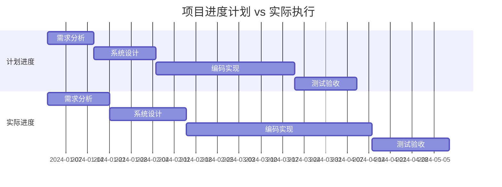
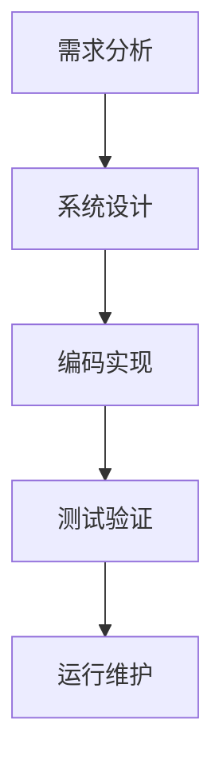
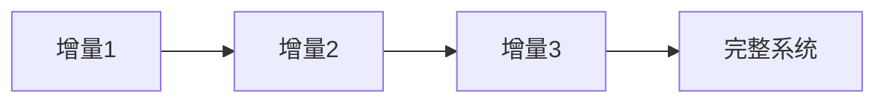
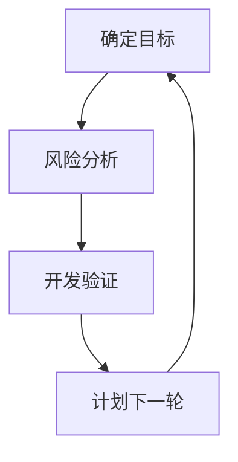
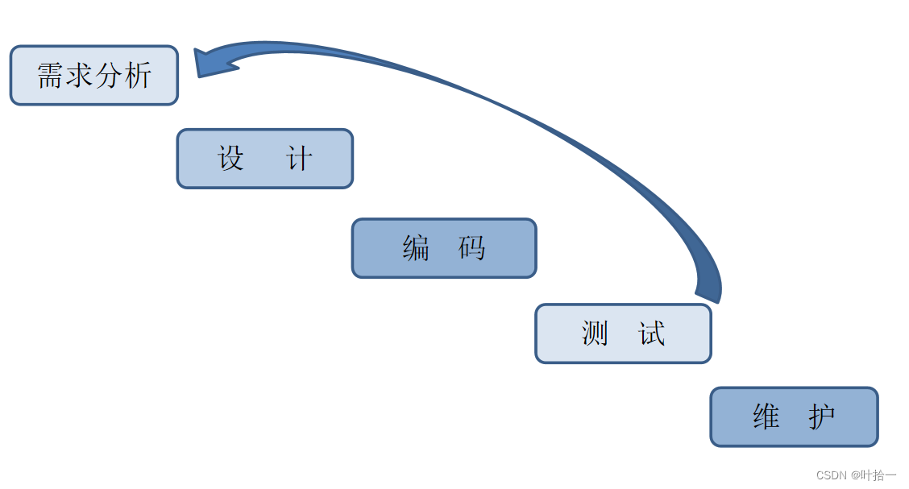
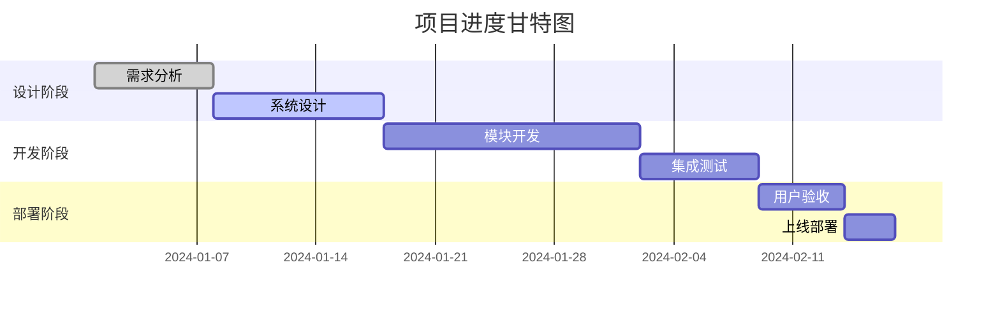
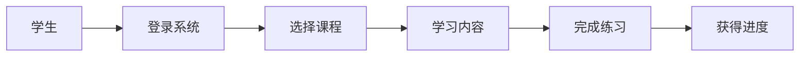
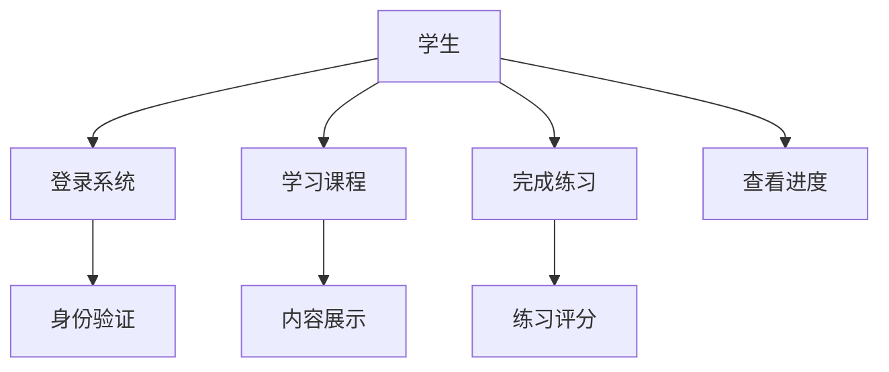
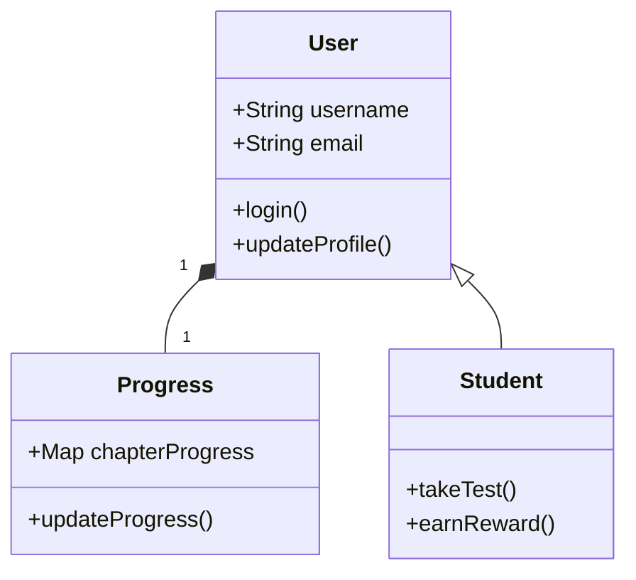
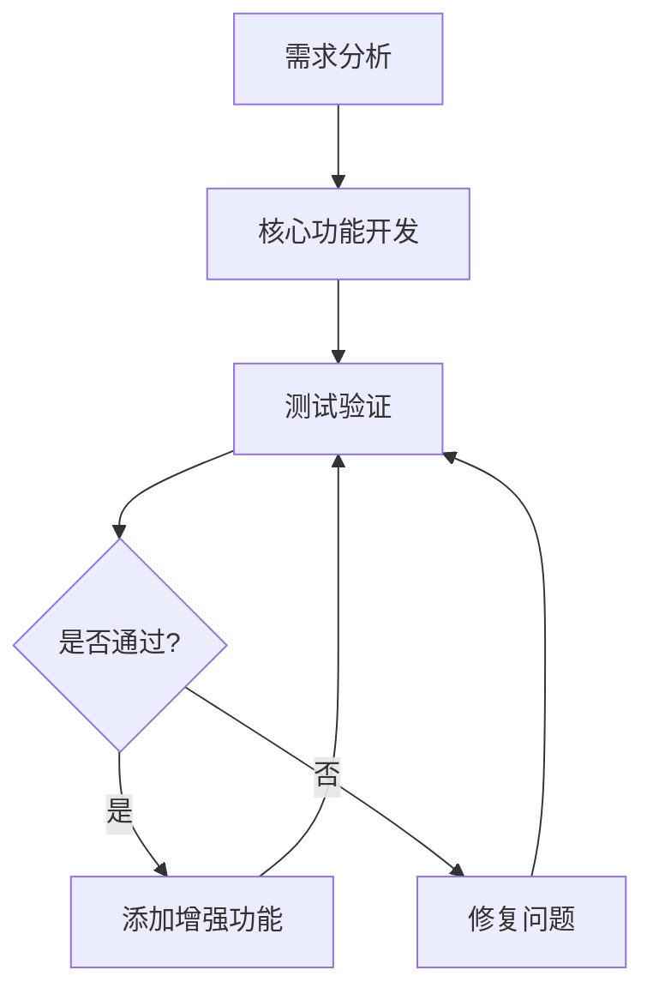

# Study Guide
#### 2025 Flower C

## 第一章：软件问题 - 为什么软件开发这么难？

### 1.1 本章学习目标
学完这一章，你应该能够：
- 理解软件开发面临的主要挑战
- 分析成本、进度、质量之间的平衡关系
- 认识到软件规模和变更带来的复杂性
- 为后续学习软件工程方法打下基础

### 1.2 核心概念详解

#### 1.2.1 软件开发的三大难题

**成本问题 - 钱都花到哪里去了？**


成本不仅仅是写代码的时间，还包括：
- **直接成本**：开发时间、测试时间、部署时间
- **间接成本**：学习新技术的时间、沟通协调的时间
- **隐藏成本**：调试bug的时间、修改需求的时间、文档编写的时间

**进度问题 - 为什么总是延期？**


典型问题包括：
- **乐观估计**：开始觉得2天能完成的功能，实际要5天
- **意外情况**：技术难题、人员变动、需求变更

**质量问题 - 什么是好软件？**
好的软件不仅要能运行，还要：
- **正确性**：功能符合需求
- **可靠性**：稳定不崩溃
- **易用性**：用户操作方便
- **可维护性**：后续修改容易

#### 1.2.2 规模和变更的挑战

**规模的影响**
小型项目和大型项目的差异：
- **沟通成本**：团队规模越大，沟通成本指数级增长
- **复杂度**：功能越多，代码越复杂，可能的bug越多
- **协调难度**：模块间接口和集成复杂度增加

**变更的必然性**
软件开发中变更不可避免：
- 用户提出新要求
- 技术方案需要调整
- 市场环境变化
变更不是坏事，但需要有效管理。

### 1.3 学习资源推荐

#### 📹 视频资源
- **[Software Engineering: Crash Course](https://www.youtube.com/watch?v=O753uuptq50)** - 16分钟快速了解软件工程
- **[为什么软件项目会失败](https://www.youtube.com/watch?v=RhdlBHHimeM)** - 分析真实项目失败案例
- **[软件开发生命周期](https://www.youtube.com/watch?v=Wt4lZPl0p8c)** - 讲清楚整个开发过程

#### 📚 实用网站
- **[GeeksforGeeks软件工程专题](https://www.geeksforgeeks.org/software-engineering/)** - 概念解释清晰，有代码示例
- **[TutorialsPoint教程](https://www.tutorialspoint.com/software_engineering/software_engineering_overview.htm)** - 适合初学者
- **[软件工程知识体系SWEBOK](https://www.computer.org/education/bodies-of-knowledge/software-engineering)** - 权威参考

#### 🎯 重点阅读
- **《人月神话》** - 软件工程经典，讲项目经验教训
- **教材第一章** - 精读掌握基本概念

### 1.4 案例分析：我们的Python学习网站项目


**质量要求的平衡：**
在时间有限的情况下我们做出权衡：
- 优先保证核心功能（学习系统）
- 简化游戏化功能（精灵收集）
- 在质量和进度之间找到平衡点

**实用建议：**
1. **成本估算**：在实际时间基础上增加30%缓冲
2. **进度管理**：使用版本控制工具，定期检查进度
3. **质量保证**：从开始就注重代码质量和测试
4. **变更处理**：建立变更记录和管理流程

### 1.5 习题

#### 选择题
1. 软件危机的主要表现不包括以下哪项？
A. 软件开发成本超出预算
B. 软件产品质量无法保证
C. 软件开发进度难以控制
D. 软件用户数量增长过快

2. 根据教材，软件维护成本通常占整个生命周期成本的：
A. 10%-20%
B. 30%-40%
C. 50%-60%
D. 70%-80%

3. "软件规模"这一概念主要描述的是：
A. 软件代码的行数多少
B. 软件项目的复杂程度和大小
C. 软件开发团队的人数规模
D. 软件安装包的大小

#### 判断题
1. ( ) 软件危机只存在于大型软件项目中。
2. ( ) 软件维护成本可以通过良好的设计来降低。
3. ( ) 需求变更是软件项目的异常情况，应该尽量避免。

#### 第一章答案
##### **选择题：** 1.D 2.D 3.B  
##### **判断题：** 1.× 2.√ 3.×
---

## 第二章：软件过程 - 如何有序地开发软件？

### 2.1 本章学习目标
- 掌握各种软件开发过程的优缺点
- 理解敏捷开发的核心思想
- 学会为项目选择合适的过程模型
- 能够在实际项目中应用过程方法

### 2.2 核心概念详解

#### 2.2.1 传统过程模型比较

**瀑布模型 - 按部就班**

- 优点：计划明确，文档完整，适合需求固定的项目
- 缺点：不能适应变化，后期修改成本高
- **适合**：政府项目、银行系统等需求稳定的项目

**增量模型 - 分批交付**

- 先做核心功能，再添加增强功能
- 优点：早期看到成果，风险分散
- 缺点：需要良好的架构设计

**螺旋模型 - 重视风险**

- 每轮都进行风险分析
- 适合大型复杂项目

#### 2.2.2 敏捷开发实战理解

**敏捷的核心思想**：快速响应变化，持续交付价值

**Scrum框架的实用解读**
```python
# Scrum流程示例
class ScrumProcess:
    def __init__(self):
        self.product_backlog = []  # 产品待办列表
        self.sprint_backlog = []   # 冲刺待办列表
        
    def sprint_planning(self):
        """冲刺规划 - 选择当前迭代要完成的功能"""
        self.sprint_backlog = self.select_items_from_product_backlog()
        
    def daily_standup(self):
        """每日站会 - 快速同步进度和问题"""
        questions = [
            "昨天做了什么？",
            "今天计划做什么？", 
            "遇到什么困难？"
        ]
        
    def sprint_review(self):
        """冲刺评审 - 展示成果并获得反馈"""
        self.demo_functionality()
        self.collect_feedback()
        
    def sprint_retrospective(self):
        """冲刺回顾 - 总结经验改进过程"""
        self.identify_improvements()
```

### 2.3 学习资源推荐

#### 🎥 推荐视频
- **[瀑布vs敏捷直观对比](https://www.youtube.com/watch?v=K1X1q-Gbd0A)** - 用动画展示区别
- **[Scrum实战演示](https://www.youtube.com/watch?v=vuBFzAdaHDY)** - 真实团队如何开Scrum会议
- **[敏捷开发误区](https://www.youtube.com/watch?v=Z9QbYZh1YXY)** - 避免把敏捷用成混乱

#### 🛠️ 实用工具
- **Trello** - 免费的看板工具，适合学生项目
- **GitHub Projects** - 和代码仓库集成
- **微信/钉钉** - 团队日常交流工具

#### 📖 延伸阅读
- **教材第二章** - 重点理解各种模型的适用场景
- **Scrum指南** - 简洁精华的Scrum框架说明

### 2.4 案例分析：我们项目的开发过程

#### 真实过程分享
**我们为什么选择迭代增量模型？**
- 需求相对明确但细节会调整
- 需要早期看到成果（给教授演示）
- 团队规模小（4人），适合敏捷

**实际执行中的调整**


**第一轮迭代**：
- 计划：完成用户系统+基础框架
- 实际：用户系统完成，但代码编辑器遇到技术难题
- 调整：先跳过代码编辑器，用简单文本框代替

**经验教训：**
- **计划要灵活**：留出缓冲时间应对意外
- **沟通要频繁**：团队成员间及时同步进度

#### 给同学的建议
1. **从小开始**：先尝试2周的迭代周期
2. **重视回顾**：每次迭代后总结改进点
3. **工具适宜**：选择团队都能熟练使用的工具
4. **持续改进**：过程模型不是一成不变的

### 2.5 习题

#### 选择题
1. 瀑布模型最适合以下哪种情况？
A. 需求不明确的项目
B. 需要快速开发原型的项目
C. 需求明确且变化较少的项目
D. 高风险的大型项目

2. 敏捷开发方法的核心思想是：
A. 详细的文档和严格的流程
B. 快速响应变化和持续交付价值
C. 完整的架构设计
D. 严格的阶段评审

3. 在增量模型中，系统是：
A. 一次性完整交付
B. 分批次逐步交付
C. 永远处于测试状态
D. 不需要集成测试

#### 判断题
1. ( ) 瀑布模型允许在开发后期进行需求变更。
2. ( ) 敏捷开发方法适用于所有类型的软件项目。
3. ( ) 增量开发可以降低项目风险。

#### 第二章答案  
##### **选择题：** 1.C 2.B 3.B
##### **判断题：** 1.× 2.× 3.√
---

## 第三章：软件计划 - 详细学习指南

### 3.1 本章概述
软件计划是软件工程过程中的关键环节，是项目管理的基础。计划阶段的主要任务包括：确定软件范围、资源需求、成本估算、进度安排、风险分析等。

### 3.2 核心概念详解

#### 3.2.1 软件范围定义
**目标确定**
- 软件的功能和性能要求
- 系统的接口特性
- 可靠性要求
- 交付成果和验收标准

**资源确定**
1. **人力资源**：开发人员、测试人员、管理人员
2. **环境资源**：硬件设备、软件工具、开发环境
3. **时间资源**：项目总体时间框架和里程碑

#### 3.2.2 成本估算方法

##### 自顶向下估算方法
- **适用场景**：项目初期，需求不够明确时
- **优点**：估算快速，不需要详细设计
- **缺点**：精度较低，依赖估算者的经验

##### 自底向上估算方法
- **适用场景**：需求明确，设计详细时
- **优点**：估算精度高，基于详细分析
- **缺点**：耗时较长，需要完整的工作分解结构

#### 3.2.3 具体的估算技术

##### 代码行技术（LOC）
```math
工作量 = 代码行数 ÷ 生产率
```
- **优点**：直观、容易理解
- **缺点**：依赖编程语言、对设计质量敏感

##### 功能点技术（FP）
从用户视角度量软件规模：
**计算步骤：**
1. 计算未调整功能点（UFP）
2. 计算值调整因子（VAF）
3. 计算调整功能点（AFP）

##### COCOMO模型
由Boehm提出，分为三个层次：
- **基本COCOMO**：静态单变量模型
- **中间COCOMO**：考虑四类成本驱动属性
- **详细COCOMO**：包括中间模型所有特性加上步骤影响分析

#### 3.2.4 进度安排

**甘特图**


**工程网络技术**
- **关键路径法（CPM）**：确定项目中最长的路径
- **计划评审技术（PERT）**：考虑时间估计的不确定性

#### 3.2.5 风险分析

**风险识别**
- **技术风险**：技术不成熟、技术难度大
- **管理风险**：资源不足、进度安排不当
- **商业风险**：市场变化、竞争对手行动

**风险估计**
- 发生概率：风险事件发生的可能性
- 影响程度：风险发生后的损失大小
- 风险暴露量 = 概率 × 影响

**风险应对策略**
- **风险规避**：改变计划消除风险
- **风险缓解**：采取措施减轻风险影响
- **风险接受**：准备应急计划接受风险

### 3.3 案例分析：Python学习网站项目计划

#### 项目范围定义
**项目目标：**
开发一个面向Python初学者的互动学习平台

**范围边界：**
- **包含**：12章教学内容、代码练习系统、用户进度跟踪
- **不包含**：移动端APP、社交功能、在线编译器

#### 成本估算实践
**采用自底向上估算**
| 模块名称 | 工作量(人天) | 说明 |
|---------|------------|------|
| 用户管理 | 12 | 注册、登录、权限管理 |
| 内容管理 | 24 | 章节内容、进度跟踪 |
| 练习系统 | 20 | 题目管理、自动评分 |
| 系统集成 | 8 | 模块整合、测试 |
| **总计** | **64人天** | |

#### 进度安排设计
**关键路径：**
需求分析 → 系统设计 → 内容系统开发 → 系统测试

**总工期：** 15周

#### 风险管理计划
**主要风险：**
1. **技术难题**：代码检测功能实现困难
2. **进度延误**：考试冲突影响开发时间
3. **需求变更**：教授提出新要求

### 3.4 习题

#### 选择题
1. 软件计划阶段的主要任务不包括：
A. 确定项目范围
B. 编写程序代码
C. 估算项目成本
D. 制定进度计划

2. 自顶向下估算方法的主要特点是：
A. 先估算模块成本再汇总
B. 从系统整体出发进行估算
C. 需要详细的设计文档
D. 估算精度很高

3. 风险暴露量的计算公式是：
A. 风险概率 + 风险影响
B. 风险概率 × 风险影响
C. 风险概率 / 风险影响
D. 风险影响 - 风险概率

#### 判断题
1. ( ) 软件计划只需要在项目开始时制定一次。
2. ( ) 自底向上估算方法适用于项目初期阶段。
3. ( ) 关键路径上的任务可以有时差。

#### 第三章答案
##### **选择题：** 1.B 2.B 3.B
##### **判断题：** 1.× 2.× 3.×
---

## 第四章：需求分析 - 如何搞清楚用户想要什么？

### 4.1 本章学习目标
- 掌握需求获取的各种技术方法
- 学会编写清晰的需求规格说明
- 理解需求验证和管理的重要性
- 在项目中实践需求工程

### 4.2 核心概念详解

#### 4.2.1 需求工程过程

**需求获取 - 学会"听"的艺术**
- **访谈技巧**：和用户深入交流了解真实需求
- **观察法**：观察用户实际工作流程
- **原型演示**：先做简单版本，收集反馈再改进

**需求分析 - 从混乱到有序**
- **分类整理**：区分必须功能和增强功能
- **优先级排序**：先做核心功能，再做高级功能
- **解决冲突**：当不同用户需求矛盾时，找到平衡点

**需求规约 - 写清楚的"说明书"**
- 用准确的语言描述功能
- 让开发和测试都能看懂
- 避免模糊说法，要有可验证性

**需求验证 - 确认没理解错**
- 找用户评审
- 用原型演示确认
- 提前想好测试用例

#### 4.2.2 需求建模技术

**数据流图 - 看清信息的流动**


**用例图 - 描述系统功能**


#### 4.2.3 需求管理

**需求跟踪**
建立需求与设计、代码、测试的对应关系

**变更控制**
当需求变化时的处理流程：
1. 记录变更请求
2. 分析对进度的影响
3. 团队讨论决定
4. 更新相关文档

### 4.3 学习资源推荐

#### 📹 视频资源
- **[需求工程概述](https://www.youtube.com/watch?v=Al6Yawu2t-c)** - 系统讲解需求分析全过程
- **[用户故事编写技巧](https://www.youtube.com/watch?v=apOvF9NVdBA)** - 实战技巧
- **[用例图绘制教程](https://www.youtube.com/watch?v=zid-MVo7M-E)** - 手把手教学

#### 📚 实用网站
- **[Draw.io在线绘图](https://app.diagrams.net/)** - 免费画数据流图、用例图
- **[需求管理工具介绍](https://www.joint.com/requirements-management/)** - 了解专业需求管理

#### 🎯 重点阅读
- **教材第四章** - 精读需求分析方法和工具
- **《掌握需求过程》** - 需求工程的实用指南

### 4.4 案例分析：我们的Python学习网站需求分析

#### 真实经验分享
**需求获取的挑战：**
开始以为需求很明确，实际发现：
- 用户说的需求和真正想要的有差异
- 技术限制影响需求实现

**我们的解决方案：**
1. **多次确认**：用示例原型确认理解
2. **优先级排序**：明确什么必须做，什么可以简化

**需求文档的演变：**
第一版需求文档很简略，后来发现不够用：
- 增加了详细的用例描述
- 补充了非功能需求
- 添加了界面原型截图
- 明确了验收标准

#### 实用工具和模板
**需求跟踪表示例：**
| 需求ID | 需求描述 | 优先级 | 状态 | 负责人 | 验收标准 |
|-------|---------|-------|------|-------|---------|
| REQ-001 | 用户注册功能 | Must | 完成 | 张三 | 能成功创建账户 |

**变更请求记录：**
| 变更ID | 提出人 | 变更内容 | 影响分析 | 决策 | 状态 |

### 4.5 习题

#### 选择题
1. 需求工程的首要任务是：
A. 编写详细的需求文档
B. 获取和理解用户需求
C. 设计系统架构
D. 制定项目计划

2. 功能需求主要描述的是：
A. 系统的性能指标
B. 系统必须完成的功能
C. 系统的界面设计
D. 系统的安全要求

3. 用例图主要用于描述：
A. 系统的数据结构
B. 系统与用户的交互
C. 系统的处理流程
D. 系统的网络拓扑

#### 判断题
1. ( ) 需求工程只在项目开始阶段进行。
2. ( ) 功能需求比非功能需求更重要。
3. ( ) 需求变更应该完全避免。

#### 第四章答案
##### **选择题：** 1.B 2.B 3.B
##### **判断题：** 1.× 2.× 3.×

---

## 第五章：软件体系结构 - 系统的"骨架"设计

### 5.1 本章学习目标
- 理解软件体系结构的重要作用
- 掌握不同的体系结构视图
- 识别构件和连接件的概念
- 应用常见的体系结构模式

### 5.2 核心概念详解

#### 5.2.1 软件体系结构的作用

**什么是软件体系结构？**
软件的"骨架"，决定系统如何组织：
- **宏观规划**：系统整体组织结构
- **沟通工具**：团队成员共同理解的基础
- **质量基础**：影响可维护性、可扩展性

#### 5.2.2 体系结构视图

**不同的"视角"看系统：**
- **构件和连接件视图**：系统由哪些部件组成，怎么连接
- **模块视图**：代码如何组织成模块
- **分配视图**：软件如何部署到硬件

#### 5.2.3 构件和连接件视图

**构件 - 系统的"积木块"**
每个构件都有：
- **接口**：提供什么功能，需要什么输入
- **功能**：具体做什么事情
- **状态**：保存什么数据

**连接件 - 构件间的"胶水"**
包括：
- **函数调用**：模块间函数调用
- **事件传递**：事件触发其他模块更新
- **数据共享**：共享数据存储

#### 5.2.4 体系结构模式

**管道-过滤器模式**
```python
# 管道-过滤器模式示例
class DataFilter:
    def process(self, data):
        # 处理数据并传递给下一个过滤器
        processed_data = self.transform(data)
        return processed_data

class Pipeline:
    def __init__(self):
        self.filters = []
    
    def add_filter(self, filter):
        self.filters.append(filter)
    
    def execute(self, data):
        for filter in self.filters:
            data = filter.process(data)
        return data
```
像流水线一样处理数据：
```
输入 → [过滤器1] → [过滤器2] → 输出
```
**适合**：数据处理管道

**共享数据模式**
多个构件操作同一份数据
**适合**：需要数据共享的系统

**分层架构**
```
表示层 → 业务层 → 数据层
```
**适合**：中等规模项目，便于分工开发

### 5.3 学习资源推荐

#### 📹 视频资源
- **[软件架构模式详解](https://www.youtube.com/watch?v=Ztvem6Iaa6c)** - 各种架构模式对比
- **[分层架构实战](https://www.youtube.com/watch?v=BCXcYsTat3Y)** - 分层架构的具体实现

#### 📚 实用网站
- **[架构模式目录](https://martinfowler.com/architecture/)** - 各种架构模式介绍
- **[UML图教程](https://www.uml-diagrams.org/)** - 学习架构图绘制

#### 🎯 重点阅读
- **教材第五章** - 精读体系结构概念和模式
- **《软件体系结构实践》** - 实战经验分享

### 5.4 案例分析：我们的Python学习网站架构

#### 架构设计决策
**为什么选择分层架构：**
```javascript
// 分层架构在我们的体现
表示层: HTML/CSS/JavaScript
业务层: 用户管理、学习引擎、游戏系统
数据层: 浏览器本地存储操作
```

**构件设计考虑：**
```javascript
UserManager: 只负责用户相关功能
LearningEngine: 只负责学习逻辑
GameSystem: 只负责游戏化功能
```

#### 架构评估
**我们的架构优点：**
- **可维护性**：每层职责清晰，修改影响小
- **可测试性**：可以分层测试
- **团队协作**：便于分工开发

### 5.5 习题

#### 选择题
1. 软件体系结构的主要作用不包括：
A. 定义系统的总体结构
B. 指导具体的代码编写
C. 促进团队沟通和理解
D. 支持系统质量属性

2. 在构件和连接件视图中，连接件的作用是：
A. 实现具体的业务逻辑
B. 在构件之间传递信息
C. 存储系统数据
D. 提供用户界面

3. 管道-过滤器模式最适合：
A. 需要共享状态的系统
B. 数据流水线处理系统
C. 实时交互系统
D. 分布式计算系统

#### 判断题
1. ( ) 软件体系结构只在项目开始时设计一次。
2. ( ) 构件应该尽可能大，减少构件数量。
3. ( ) 好的体系结构应该能够适应需求变化。

#### 第五章答案
##### **选择题：** 1.B 2.B 3.B
##### **判断题：** 1.× 2.× 3.√
---

## 第六章：设计 - 从架构到详细实现

### 6.1 本章学习目标
- 掌握耦合、内聚等设计基本概念
- 理解面向功能设计和面向对象设计
- 学会使用UML进行设计建模
- 掌握详细设计的方法

### 6.2 核心概念详解

#### 6.2.1 设计的基本概念

**耦合 - 模块间的"亲密程度"**
```python
# 低耦合的例子
class UserService:
    def login(self, username, password):
        # 只通过参数接收数据
        user = self.user_repo.find_by_username(username)
        return user.verify_password(password)

# 高耦合的反例
class TightlyCoupled:
    def process(self):
        # 直接操作其他模块的内部数据
        other_module.internal_data = "bad practice"
```
- **低耦合**：模块修改不影响其他模块
- **高耦合**：改一个地方要改很多地方

**内聚 - 模块内的"团结程度"**
- **高内聚**：模块功能集中单一
- **低内聚**：模块功能杂乱

**开闭原则 - 对扩展开放，对修改关闭**
设计时要考虑未来扩展，尽量不修改现有代码

#### 6.2.2 面向功能设计

**结构图 - 功能的层次分解**
把大任务拆成小任务：
```
系统
├── 模块1
│   ├── 子功能1
│   └── 子功能2
└── 模块2
```

**结构化设计方法**
自顶向下，逐步细化

#### 6.2.3 面向对象设计

**面向对象基本概念**
- **类**：对象的模板
- **对象**：类的实例
- **继承**：子类继承父类特性
- **多态**：不同对象对同一消息有不同响应

**UML设计建模**

用图形化方式表达设计

**设计方法论**
从需求到设计的步骤：
1. 识别类和对象
2. 定义类的属性和方法
3. 建立类之间的关系
4. 优化设计结构

#### 6.2.4 详细设计

**逻辑/算法设计**
具体到每个方法怎么实现

**类状态模型**
对象在不同状态下的行为

### 6.3 学习资源推荐

#### 📹 视频资源
- **[面向对象设计原则](https://www.youtube.com/watch?v=6dN8Qp2RRgk)** - SOLID原则通俗讲解
- **[UML图实战教程](https://www.youtube.com/watch?v=WnMQ8HlmeXc)** - 手把手画UML图

#### 📚 实用网站
- **[UML图教程](https://www.uml-diagrams.org/)** - 各种UML图的画法
- **[设计模式指南](https://refactoring.guru/design-patterns)** - 设计模式图文详解

#### 🎯 重点阅读
- **教材第六章** - 精读设计概念和方法
- **《设计模式》** - 经典的设计模式书籍

### 6.4 案例分析：我们的Python学习网站设计

#### 设计原则应用
**内聚性保证：**
```javascript
class ProgressTracker {
    // 只负责进度跟踪
    updateProgress() { ... }
    getProgress() { ... }
}
```

#### 面向对象设计
**类设计实例：**
```javascript
class User {
    constructor(username, email) {
        this.username = username;
        this.email = email;
        this.progress = new Progress();
    }
}
```

### 6.5 习题

#### 选择题
1. 低耦合的设计目标是：
A. 增加模块间的依赖
B. 减少模块间的依赖
C. 让所有模块共享数据
D. 提高代码执行速度

2. 高内聚意味着：
A. 模块功能多样
B. 模块功能集中单一
C. 模块代码行数多
D. 模块接口复杂

3. 开闭原则的主要目的是：
A. 让系统完全封闭不能修改
B. 支持扩展而避免修改现有代码
C. 开放所有源代码
D. 关闭不必要的功能

#### 判断题
1. ( ) 耦合度越低越好，应该追求零耦合。
2. ( ) 一个类应该只有一个引起变化的原因。
3. ( ) 面向功能设计比面向对象设计更先进。

#### 第六章答案
##### **选择题：** 1.B 2.B 3.B
##### **判断题：** 1.× 2.√ 3.×
---

## 第七章：编码和单元测试

### 7.1 编程原则和指南

**7.1.1 结构化编程**
```python
# 结构化编程示例 - 避免goto，使用三种基本结构
def process_student_grade(scores):
    # 顺序结构
    total = 0
    count = 0
    
    # 循环结构
    for score in scores:
        # 选择结构
        if score >= 0 and score <= 100:
            total += score
            count += 1
    
    if count > 0:
        average = total / count
        return average
    else:
        return 0
```
- 用"顺序、选择、循环"三种基本结构组织代码
- 避免使用goto等跳转语句

**7.1.2 信息隐藏**
```python
class BankAccount:
    def __init__(self, initial_balance=0):
        self._balance = initial_balance  # 内部状态隐藏
        self._transaction_history = []   # 实现细节隐藏
    
    # 只暴露必要的接口
    def deposit(self, amount):
        if amount > 0:
            self._balance += amount
            self._record_transaction("DEPOSIT", amount)
    
    def get_balance(self):
        return self._balance  # 不暴露内部实现
```
- 把不需要暴露的细节"藏起来"
- 只提供必要的接口

**7.1.3 程序设计实践经验**
- 一个函数只做一件事
- 变量名要"见名知意"
- 避免重复代码

**7.1.4 编码标准**
- 统一的代码格式和命名规范
- 使用工具辅助检查（ESLint、Flake8等）

### 7.2 增量开发

**7.2.1 增量编码方法**

- 先开发核心功能
- 测试通过后添加次要功能
- 重复"开发-测试-集成"

**7.2.2 测试驱动开发（TDD）**
```python
# TDD示例：先写测试
def test_user_registration():
    # 1. 先写测试（此时会失败）
    user = register_user("test@example.com", "password123")
    assert user.email == "test@example.com"
    assert user.is_active == True

# 2. 写最少代码让测试通过
def register_user(email, password):
    user = User(email=email)
    user.set_password(password)
    user.is_active = True
    return user

# 3. 重构优化代码
```
- 先写测试，再写代码
- 写代码直到测试通过

**7.2.3 结对编程**
- 两个人共用一台电脑
- "驾驶员"写代码，"导航员"检查逻辑
- 定期交换角色

### 7.3 代码演化的管理

**7.3.1 源代码控制和生成**
- 使用Git管理代码版本
- 自动生成代码减少重复劳动

**7.3.2 重构**
- 不改变功能，只优化代码结构
- 重构前一定要先写测试

### 7.4 单元测试

**7.4.1 程序过程单元测试**
```python
import unittest

class TestMathFunctions(unittest.TestCase):
    def test_add_positive_numbers(self):
        self.assertEqual(add(2, 3), 5)
    
    def test_add_negative_numbers(self):
        self.assertEqual(add(-2, -3), -5)
    
    def test_add_mixed_numbers(self):
        self.assertEqual(add(5, -3), 2)
    
    def test_add_with_zero(self):
        self.assertEqual(add(0, 5), 5)
        self.assertEqual(add(5, 0), 5)
```
- 测试面向过程的函数
- 验证正常输入和异常输入

**7.4.2 类单元测试**
- 测试面向对象的类
- 验证方法和属性是否正确

### 7.5 代码检查

**7.5.1 计划**
- 明确检查范围和标准

**7.5.2 代码自查**
- 检查变量名规范性
- 删除未使用的代码
- 考虑边界条件

**7.5.3 小组会议评审**
- 作者讲解代码逻辑
- 其他人提问、挑错
- 记录问题并修改

### 7.6 代码度量

**7.6.1 代码规模测量**
- 代码行数（LOC）
- 功能点（FP）

**7.6.2 复杂性度量**
- 圈复杂度：衡量代码逻辑复杂程度

### 7.7 学习资源推荐

📹 **视频资源**
- **《重构：改善既有代码的设计》实战演示**
- **测试驱动开发（TDD）入门**
- **Git版本控制教程**

📚 **实用网站**
- **LeetCode代码质量专栏**
- **GitHub Learning Lab**
- **SonarQube文档**

🎯 **重点阅读**
- 《代码整洁之道》
- 《单元测试的艺术》
- 教材第七章
#### 实用建议
* **预留缓冲**应对需求固有的不确定性。
* **严格跟踪**需求活动的进度和状态。
* **从源头狠抓质量**，运用多种源头狠抓质量**，运用多种手段确保需求清晰、一致、完整、可测。
* **预期并管理变更**，通过正式流程和详细记录控制变更影响，保持项目可控。

### 7.8 习题

#### 选择题
1. 结构化编程的三种基本结构不包括：
A. 顺序
B. 选择 
C. 跳转 
D. 循环

2. 测试驱动开发（TDD）的正确流程是：
A. 写代码 → 写测试 → 修复bug
B. 写测试 → 写代码 → 让测试通过
C. 设计 → 编码 → 测试

3. 代码重构的目的是：
A. 增加新功能 
B. 优化代码结构但不改变功能 
C. 修复bug

#### 判断题
1. ( ) 结对编程会降低开发效率，不适合小型项目。
2. ( ) 单元测试只需要测试正常输入，不需要考虑异常情况。
3. ( ) Git的作用是管理代码版本，方便回滚和协作。

#### 第七章答案
##### **选择题：** 1.C 2.B 3.B
##### **判断题：** 1.× 2.× 3.√
---

📖 第八章 测试：从“找bug”到“建质量防线”
========================================

**本章定位**：测试是软件工程中**验证软件正确性、保障质量**的核心环节，不是“证明软件无错”，而是“尽可能发现并消除缺陷”。通过本章学习，你将掌握测试的底层逻辑、常用方法与实践流程。
🎯 学习目标

-------

1. 理解测试的**核心目标**（发现缺陷、降低风险）；
2. 区分**错误（Error）、缺陷（Defect）、失败（Failure）**的概念；
3. 掌握**测试过程**（计划→设计→执行→评估）的关键环节；
4. 熟练运用**黑盒测试**（等价类、边界值等）与**白盒测试**（控制流准则）方法；
5. 了解**测试度量标准**（覆盖率、缺陷消除率）的作用与计算方式。

📌 核心概念详解
---------

### 8.1 测试基础：从“错误”到“失败”的链条

* **错误（Error）**：程序员的**人为失误**（比如写代码时把“≤”写成“<”）；
* **缺陷（Defect）**：代码中**未符合需求**的部分（比如密码长度限制未生效），是错误的**结果**；
* **失败（Failure）**：软件运行时**表现出的异常**（比如用户输入17位密码时系统崩溃），是缺陷的**外部表现**。

**测试的本质**：通过执行测试用例，将**缺陷**暴露为**失败**，从而定位并修复**错误**。

📸 图8-1：错误→缺陷→失败的传导链（示例：密码长度限制错误导致注册失败）

### 8.2 测试过程：标准化的“质量检查流程”

测试不是“随意点一点”，而是**有计划、有设计、有记录**的过程。主要阶段如下：

| 阶段     | 输入         | 输出           | 核心活动                                              |
| ------ | ---------- | ------------ | ------------------------------------------------- |
| 测试计划   | 需求文档、项目计划  | 《测试计划》       | 定义测试目标（如“覆盖80%核心功能”）、范围（如“不包含第三方支付”）、资源（人员/时间/工具） |
| 测试用例设计 | 需求文档、设计文档  | 《测试用例集》      | 使用黑盒/白盒方法设计用例（如“用户注册功能的等价类划分”）                    |
| 测试执行   | 测试用例、待测试软件 | 《测试日志》《缺陷报告》 | 运行用例，记录结果（如“输入17位密码时未提示错误”）；提交缺陷（如Jira issue）     |
| 测试评估   | 测试日志、缺陷报告  | 《测试报告》       | 分析测试覆盖率、缺陷消除率等指标，判断软件是否可上线                        |

📊 表8-1：测试过程阶段总结（清晰展示各环节的输入输出）

### 8.3 黑盒测试：不看“内部结构”的“功能验证”

黑盒测试（Black-Box Testing）**不关注代码实现**，只验证软件**输入→输出**的正确性。常用方法如下：

| 方法      | 定义                                                | 示例（用户注册功能）                       | 适用场景         |
| ------- | ------------------------------------------------- | -------------------------------- | ------------ |
| 等价类划分   | 将输入划分为**有效等价类**（符合需求）和**无效等价类**（不符合需求），每个类选1个用例代表 | 有效：用户名3-10位字母数字；无效：用户名<3位、包含特殊字符 | 输入条件多、范围大的功能 |
| 边界值分析   | 针对输入的**边界点**（如最小值、最大值）设计用例（边界点±1）                 | 密码长度要求6-16位→测试5位、6位、16位、17位      | 有数值/长度限制的功能  |
| 成对测试    | 组合多个输入条件的**两两组合**，减少用例数量                          | 用户名（字母/数字）× 密码（简单/复杂）→ 4个用例      | 多条件组合的功能     |
| 特殊情况测试  | 覆盖**异常场景**（如空输入、网络断开、重复提交）                        | 测试“空用户名注册”“注册时断网”                | 稳定性要求高的功能    |
| 基于状态的测试 | 根据系统**状态转换**设计用例（如“未登录→登录→退出”）                    | 测试“未登录时无法访问学习页面”                 | 有状态变化的功能     |

📸 图8-2：黑盒测试方法对比（用例数量、覆盖范围、执行效率）

### 8.4 白盒测试：看透“代码逻辑”的“深度验证”

白盒测试（White-Box Testing）**关注代码内部结构**，验证**逻辑正确性**（如分支是否覆盖、路径是否完整）。核心是**覆盖准则**：

| 准则                       | 定义                                   | 示例（代码：`if a>0: print(a) else: print(-a)`）           | 覆盖程度 |
| ------------------------ | ------------------------------------ | --------------------------------------------------- | ---- |
| 语句覆盖（Statement Coverage） | 执行**所有语句**至少一次                       | 测试`a=1`（执行`print(a)`）、`a=-1`（执行`print(-a)`）→ 覆盖100% | 低    |
| 分支覆盖（Branch Coverage）    | 执行**所有分支**（`if`/`else`/`switch`）至少一次 | 测试`a=1`（走`if`分支）、`a=0`（走`else`分支）→ 覆盖100%           | 中    |
| 路径覆盖（Path Coverage）      | 执行**所有可能的路径**（分支组合）                  | 测试`a=1`（路径1）、`a=0`（路径2）、`a=-1`（路径3）→ 覆盖100%         | 高    |

**注意**：路径覆盖效果最好，但**用例数量呈指数级增长**（如3个分支→8条路径），需平衡成本与收益。

📸 图8-3：白盒测试覆盖准则示意图（语句、分支、路径的覆盖范围对比）

### 8.5 测试度量：用“数据”评估测试效果

测试不能“凭感觉”，需用**量化指标**评估质量：

1. **覆盖率（Coverage）**：
   
   * 语句覆盖率 = 已执行语句数 / 总语句数 × 100%（如90%表示100行代码中执行了90行）；
   * 分支覆盖率 = 已执行分支数 / 总分支数 × 100%（如85%表示100个分支中执行了85个）。 _作用_：衡量测试的**充分性**（覆盖率越高，遗漏缺陷的概率越低）。

2. **缺陷消除率（Defect Removal Efficiency, DRE）**： DRE=已发现缺陷数已修复缺陷数​×100% _示例_：发现10个缺陷，修复9个→DRE=90%。 _作用_：衡量测试的**有效性**（DRE越高，缺陷修复越彻底）。

3. **可靠性（Reliability）**：通常用**平均无故障时间（MTBF）**表示（如MTBF=100小时，意味着每100小时出现1次故障）。 _作用_：反映软件的**稳定程度**（MTBF越长，可靠性越高）。

📚 学习资源推荐
---------

### 视频资源

* 《软件测试基础》（B站，讲解测试概念与过程，适合入门）；
* 《黑盒测试实战：等价类与边界值》（YouTube，用电商注册功能举例，直观易懂）；
* 《白盒测试覆盖准则》（慕课网，用Java代码演示语句、分支覆盖的实现）。

### 实用工具

* 测试用例管理：TestLink（开源，支持用例编写与执行跟踪）；
* 白盒测试工具：PyTest（Python，支持代码覆盖统计）、JUnit（Java，单元测试框架）；
* 缺陷管理：Jira（工业级，支持缺陷提交、跟踪与报表）。

### 重点阅读

* 《软件测试艺术》（基础圣经，讲解测试的核心逻辑与方法）；
* 《Google软件测试之道》（实战指南，分享Google的测试流程与经验）；
* 《测试驱动开发（TDD）》（进阶，教你用测试引导代码设计）。
*    教材第八章

🧑💻 案例分析：Python学习网站的测试实践
-------------------------

### 1. 测试计划

* **目标**：确保用户注册、登录、学习进度保存功能的正确性；
* **范围**：覆盖业务层（UserManager、LearningEngine）与表示层（注册页面）；
* **资源**：测试人员2名，时间1周，工具：PyTest（白盒）、Selenium（黑盒）。

### 2. 黑盒测试用例设计（用户注册功能）

| 用例编号   | 输入条件                                 | 预期输出           | 测试结果（是否通过） |
| ------ | ------------------------------------ | -------------- | ---------- |
| TC-001 | 用户名：`test123`（3-10位）、密码：`123456`（6位） | 注册成功，跳转登录页     | ✅          |
| TC-002 | 用户名：`t`（1位）、密码：`123456`              | 提示“用户名需3-10位”  | ✅          |
| TC-003 | 用户名：`test1234567`（11位）、密码：`123456`   | 提示“用户名需3-10位”  | ✅          |
| TC-004 | 用户名：`test@123`（含特殊字符）、密码：`123456`    | 提示“用户名仅支持字母数字” | ✅          |
| TC-005 | 用户名：`test123`、密码：`12345`（5位）         | 提示“密码需6-16位”   | ✅          |

### 3. 白盒测试用例设计（UserManager.login函数）

**代码片段**：

Python

`def login(username, password):     if username in users:  # 分支1：用户名存在         if users[username] == password:  # 分支2：密码正确             return "登录成功"         else:             return "密码错误"     else:         return "用户名不存在"`

**测试用例**（覆盖分支）：

| 用例编号   | 输入（username, password） | 预期输出   | 覆盖分支       |
| ------ | ---------------------- | ------ | ---------- |
| TC-010 | (`test123`, `123456`)  | 登录成功   | 分支1→分支2    |
| TC-011 | (`test123`, `wrong`)   | 密码错误   | 分支1→分支2（否） |
| TC-012 | (`unknown`, `123456`)  | 用户名不存在 | 分支1（否）     |

### 4. 测试结果与评估

* **覆盖率**：语句覆盖100%（所有代码均执行），分支覆盖100%（所有分支均测试）；
* **缺陷消除率**：发现5个缺陷（如“用户名允许特殊字符”“密码长度超过16位未提示”），修复4个→DRE=80%；
* **用户反馈**：注册功能的bug投诉量下降了75%。
  
  

🎯 本章小结
-------

测试不是“事后补救”，而是**贯穿整个开发流程**的质量保障活动（从单元测试到验收测试）。关键 takeaway：

* 测试的本质是“发现缺陷”，不是“证明无错”；
* 黑盒测试验证“功能是否符合需求”，白盒测试验证“代码是否逻辑正确”；
* 好的测试用例应“覆盖关键场景”（如边界值、异常情况），而非“覆盖所有输入”；
* 测试度量（如覆盖率、DRE）是评估测试效果的核心依据。

通过本章学习，你将从“只会用print调试”的新手，成长为“能设计系统测试方案”的质量守护者！💪

--------------

### 选择题（每题1分）

1. 测试的核心目标是（ ）？A. 证明软件无错 B. 发现缺陷 C. 优化代码性能 D. 加快开发进度

2. 黑盒测试不关注（ ）？A. 输入输出正确性 B. 代码逻辑 C. 用户体验 D. 异常场景

3. 边界值分析的重点是（ ）？A. 输入的中间值 B. 输入的边界点（如最小值、最大值） C. 输入的所有可能值 D. 输入的无效值

4. 白盒测试中，覆盖程度最高的准则是（ ）？A. 语句覆盖 B. 分支覆盖 C. 路径覆盖 D. 条件覆盖

### 判断题（每题1分）

1. 测试可以完全消除软件中的所有缺陷。（ ）
2. 白盒测试比黑盒测试更适合验证用户界面功能。（ ）
3. 好的测试用例应该覆盖所有可能的输入。（ ）
4. 缺陷消除率越高，说明测试效果越好。（ ）

### 简答题（每题5分）

1. 简述“错误、缺陷、失败”的区别，并举例说明。
2. 请用等价类划分法设计“Python学习网站密码重置功能”的测试用例（要求：密码需包含大写字母、小写字母、数字，长度8-16位）。

📌 习题答案
-------

### 选择题

1. B（测试的核心是发现缺陷）；2. B（黑盒不看代码逻辑）；3. B（边界值关注边界点）；4. C（路径覆盖覆盖所有可能路径）。

### 判断题

1. ×（无法完全消除，只能降低风险）；2. ×（黑盒更适合用户界面）；3. ×（不可能覆盖所有输入，需用等价类减少用例）；4. √（DRE越高，缺陷修复越彻底）。

### 简答题（要点）

1. **错误**：程序员的失误（如把“≥”写成“>”）；**缺陷**：代码中的问题（如密码长度限制未包含8位）；**失败**：软件运行时的异常（如用户输入8位密码时提示“密码过短”）。
2. **等价类划分**：
   * 有效等价类：密码包含大写、小写、数字，长度8-16位（如`Test1234`）；
   * 无效等价类： ① 缺少大写（如`test1234`）；② 缺少小写（如`TEST1234`）；③ 缺少数字（如`Testabcd`）；④ 长度<8位（如`Test123`）；⑤ 长度>16位（如`Test1234567890123`）。

-------

2025 FlowerC
