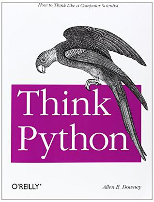

# FlowerC项目需求规格说明书

## 文档版本控制
| 版本号 | 修订日期 | 修订内容 | 
|--------|----------|----------|
| 1.0 | 2024-09-16 | 初始版本创建 

## 1. 引言

### 1.1 编写目的
本文档旨在明确FlowerC项目——Python学习网站的功能需求、非功能需求和技术要求，为项目开发、测试和验收提供完整依据。本文档面向项目开发团队、测试人员及项目指导教师。

### 1.2 项目背景
随着编程教育的普及，传统在线学习平台缺乏趣味性和互动性。本项目基于《Think Python》教材，开发一个结合游戏化元素的Python学习网站，通过创新的学习模式提高用户的学习动力和完成率。

### 1.3 范围界定
**本项目包含：**
- 基于《Think Python》前12章的完整教学内容
- 用户学习管理系统
- 交互式练习和代码检测功能
- 游戏化奖励机制

**本项目不包含：**
- 高级社交功能
- 移动端原生应用开发
- 复杂的精灵养成系统

### 1.4 参考文献
- 《Think Python: How to Think Like a Computer Scientist》

- 项目计划文档v1.0
- 软件工程需求分析规范

## 2. 总体描述

### 2.1 产品愿景
打造一个集系统性、趣味性于一体的Python初学者在线学习平台，通过游戏化机制提升用户学习动力和完成率。

### 2.2 用户特征
| 用户类型 | 特征描述 | 主要需求 |
|---------|----------|----------|
| 编程零基础学生 | 无编程经验，需要从基础开始 | 结构化的学习路径、直观的操作界面 |
| 有基础的学习者 | 有少量编程经验，希望系统学习 | 进阶内容、实践机会 |
| 游戏化学习爱好者 | 喜欢互动式学习方式 | 奖励机制、进度可视化 |

### 2.3 系统架构概述
```
前端展示层 (HTML5/CSS3/JavaScript)
    ↓
业务逻辑层 (JavaScript核心功能)
    ↓
数据持久层 (IndexedDB本地存储)
    ↓
内容资源层 (教学文本/图片/代码示例)
```

## 3. 功能需求

### 3.1 用户管理模块 (FUN-USER)

#### FUN-USER-001 用户注册
**优先级：** 高  
**描述：** 新用户创建学习账户  
**前置条件：** 用户未登录状态  
**后置条件：** 创建新用户账户并跳转到登录页面  
**基本流程：**
1. 用户点击注册按钮
2. 系统显示注册表单（用户名、密码、确认密码）
3. 用户填写信息并提交
4. 系统验证用户名唯一性
5. 系统验证密码复杂度（≥6位）
6. 系统加密存储用户信息
7. 显示注册成功提示
8. 自动跳转到登录页面

**异常流程：**
- 用户名已存在：显示"用户名已被使用"
- 密码不符合要求：显示"密码至少6位字符"
- 两次密码不一致：显示"密码不一致"

#### FUN-USER-002 用户登录
**优先级：** 高  
**描述：** 已注册用户登录系统  
**前置条件：** 用户已注册但未登录  
**后置条件：** 用户成功登录并进入学习主页  
**基本流程：**
1. 用户输入用户名和密码
2. 系统验证用户凭证
3. 创建用户会话
4. 加载用户学习数据
5. 跳转到学习主页

**异常流程：**
- 用户名不存在：显示"用户不存在"
- 密码错误：显示"密码错误"

#### FUN-USER-003 学习进度管理
**优先级：** 高  
**描述：** 自动保存和恢复学习状态  
**数据存储内容：**
- 已完成章节列表
- 各章节测试成绩（最高分）
- 金币余额
- 精灵收集情况
- 最后学习位置

**同步机制：**
- 章节完成时自动保存
- 测试提交时保存成绩
- 金币变化时实时更新

### 3.2 教学管理模块 (FUN-LEARN)

#### FUN-LEARN-001 课程内容展示
**优先级：** 高  
**内容范围：** 《Think Python》第1-12章  
**章节结构：**
```
第1章：程序之道 (The Way of the Program)
第2章：变量、表达式和语句 (Variables, Expressions and Statements)
第3章：函数 (Functions)
第4章：接口设计 (Case Study: Interface Design)
第5章：条件和递归 (Conditionals and Recursion)
第6章：有返回值的函数 (Fruitful Functions)
第7章：迭代 (Iteration)
第8章：字符串 (Strings)
第9章：文字游戏 (Case Study: Word Play)
第10章：列表 (Lists)
第11章：字典 (Dictionaries)
第12章：元组 (Tuples)
```

**展示形式：**
- 结构化文本内容（Markdown格式）
- 交互式代码示例（可运行演示）
- 配套图示说明（流程图、关系图）
- 关键词高亮显示

#### FUN-LEARN-002 学习进度控制
**优先级：** 高  
**解锁机制：**
- 第1章默认解锁
- 必须完成当前章节（学习+测试≥80分）才能解锁下一章
- 支持重复学习已解锁章节

**进度可视化：**
- 章节树状导航（完成/未完成状态标识）
- 进度条显示总体完成度
- 章节分数星级评价（1-5星）

### 3.3 练习评估模块 (FUN-PRACTICE)

#### FUN-PRACTICE-001 随堂练习
**优先级：** 中  
**出现时机：** 每个知识点讲解后立即出现  
**题型分布：**
- 单项选择题（70%）
- 判断题（30%）

**交互特性：**
- 即时答案验证
- 详细解析展示
- 相关知识点链接
- 不计入正式评分

#### FUN-PRACTICE-002 章节测试
**优先级：** 高  
**测试结构：**
| 题型 | 题目数量 | 分值比例 | 考查重点 |
|------|----------|----------|----------|
| 选择题 | 5题 | 50% | 概念理解、语法知识 |
| 填空题 | 3题 | 30% | 代码补全、关键语法 |
| 代码题 | 1题 | 20% | 实际编程能力 |

**评分规则：**
- 总分100分，80分及格
- 选择题：每题10分
- 填空题：每题10分
- 代码题：按测试用例通过率评分

**重试机制：**
- 不及格可无限次重试
- 记录最高成绩

### 3.4 游戏化模块 (FUN-GAME)

#### FUN-GAME-001 金币系统
**优先级：** 中  
**金币获取规则：**
| 活动类型 | 金币奖励 | 说明 |
|----------|----------|------|
| 完成章节学习 | +50金币 | 首次完成 |
| 通过章节测试 | +100金币 | 成绩≥80分 |
| 满分通过测试 | +50金币 | 额外奖励 |
| 每日登录 | +20金币 | 连续登录有加成 |

**金币显示：**
- 实时显示在右上角
- 变化时有动画效果
- 支持金币收支记录查询

#### FUN-GAME-002 精灵收集系统
**优先级：** 中  
**精灵分类和概率：**
| 稀有度 | 出现概率 | 对应知识点 | 示例精灵 |
|--------|----------|------------|----------|
| 普通 | 70% | 基础语法 | Print精灵、Var精灵 |
| 稀有 | 25% | 核心概念 | Function精灵、Class精灵 |
| 传说 | 5% | 高级特性 | Decorator精灵、Generator精灵 |

**精灵属性：**
- 名称、图片、描述
- 稀有度星级（1-3星）
- 获取章节关联
- 特殊技能说明

#### FUN-GAME-003 抽奖机制
**优先级：** 低  
**抽奖规则：**
- 100金币兑换1次抽奖机会
- 使用精灵球进行抽奖
- 随机遇到不同稀有度精灵
- 重复获得精灵转化为金币

**抽奖界面：**
- 精灵球投掷动画
- 随机转盘效果
- 结果展示页面
- 获得新精灵的庆祝效果

## 4. 非功能需求


### 4.1 可用性需求
**易用性标准：**
- 新用户10分钟内掌握基本操作
- 界面符合Web设计惯例
- 操作流程不超过3步
- 错误提示清晰明确

**可访问性要求：**
- 字体大小可调整（浏览器缩放）
- 图片有替代文本

### 4.3 可靠性需求

**数据完整性：**
- 操作日志记录
- 数据一致性校验

## 5. 技术需求

### 5.1 前端技术栈
**核心技术：**
- HTML5（界面内容）
- CSS3（界面效果）
- JavaScript（模块化开发、异步编程）


### 5.2 数据存储方案
**IndexedDB数据库设计：**
```javascript
// 数据库结构
const dbSchema = {
    users: {
        keyPath: 'username',
        indexes: ['createdAt']
    },
    progress: {
        keyPath: ['username', 'chapterId'],
        indexes: ['username', 'score']
    },
    collections: {
        keyPath: ['username', 'pokemonId'],
        indexes: ['username', 'rarity']
    },
    transactions: {
        keyPath: 'id',
        indexes: ['username', 'type', 'timestamp']
    }
};
```

## 6. 接口需求

### 6.1 用户界面设计
**整体风格：**
- 主色调：蓝紫色系
- 字体：系统默认无衬线字体栈

**布局规范：**
```
Header（导航栏 + 用户信息）
┌─────────────────────────────────────┐
│ Sidebar   │         Main Content    │
│（章节导航） │    （学习内容/测试区）     │
│           │                         │
└─────────────────────────────────────┘
Footer（状态信息 + 操作按钮）
```

## 7. 约束条件

### 7.1 技术约束
- 纯前端解决方案，无后端服务器
- 使用指定技术栈（HTML5/CSS3/JavaScript）
- 支持现代浏览器
- 本地存储，无云端同步

### 7.2 时间约束
- 总开发周期：15周
- 分两轮迭代开发
- 每周进度检查和调整
- 最终演示日期固定

### 7.3 资源约束
- 开发团队：4名成员
- 开发设备：个人笔记本电脑
- 测试环境：本地开发环境
- 预算：无资金支持

## 8. 质量属性

### 8.1 可维护性
**代码规范：**
- 语义化的HTML结构
- 规范的CSS
- 模块化的JavaScript
- 统一的代码风格

### 8.2 可扩展性
**架构设计：**
- 插件化的功能模块
- 配置化的游戏规则
- 易于添加新的教学内容
- 支持主题切换

## 9. 验收标准

### 9.1 功能验收标准
**核心功能验收清单：**
- [ ] 用户能够完成完整的注册-登录-学习流程
- [ ] 所有12章教学内容正常展示和导航
- [ ] 随堂练习即时反馈准确
- [ ] 章节测试评分系统正确
- [ ] 代码检测引擎准确识别代码错误
- [ ] 金币系统计算和显示正确
- [ ] 精灵收集和展示功能正常
- [ ] 抽奖机制随机性合理

### 9.2 质量验收标准
**性能测试标准：**
- [ ] 页面加载时间≤3秒（Lighthouse评分≥90）
- [ ] 代码检测响应≤5秒
- [ ] 在Chrome、Firefox、Safari上功能一致
- [ ] 移动端核心功能可用

**用户体验标准：**
- [ ] 新用户10分钟内完成首个章节学习
- [ ] 操作错误率≤5%
- [ ] 用户满意度评分≥4/5分

## 附录A：术语表

| 术语 | 解释 |
|------|------|
| IndexedDB | 浏览器端NoSQL数据库 |
| 游戏化 | 将游戏元素应用于非游戏场景 |
| 响应式设计 | 适应不同屏幕尺寸的网页设计 |

