# **测试文档**

- **版本**：2.0
- **制作时间**：2025年12月
- **对应需求版本**：需求规格说明书 v2.0
- **团队**：FlowerC

## **1. 测试概述**

### **1.1 测试目的**
本文档记录了对FlowerC游戏化Python学习网站项目的系统测试，涵盖基础功能与第二版新增的游戏化功能。通过多层次测试确保各功能模块的质量、可靠性和用户体验。

### **1.2 测试范围**
**基础功能（第一轮已验证）：**
- 用户管理功能：注册、登录、数据持久化
- 学习管理功能：10章课程、章节练习、进度跟踪
- 界面与交互：导航、响应式布局、性能

**游戏化功能（第二轮新增）：**
- 金币系统：获取、消费、显示同步
- Boss战系统：战斗逻辑、状态管理、特效
- 精灵收集系统：抽奖机制、概率分布
- 用户进度展示：个人中心、数据统计

### **1.3 测试环境**
- **主要浏览器**：Edge
- **兼容浏览器**：Chrome
- **操作系统**：Windows 11、macOS Sonoma
- **设备类型**：桌面端（≥1024px）、平板端（768px-1024px）
- **网络环境**：正常网络、弱网模拟

## **2. 测试策略与层级**

### **2.1 三层测试体系**
```
单元测试 → 集成测试 → 系统测试
```

**单元测试（Unit Testing）：**
- **对象**：独立函数、类方法、算法逻辑
- **方法**：控制台验证、手动执行检查
- **目标**：确保每个代码单元正确性

**集成测试（Integration Testing）：**
- **对象**：模块间接口、数据流、业务流程
- **方法**：完整用户流程测试
- **目标**：确保模块协同工作正常

**系统测试（System Testing）：**
- **对象**：整个系统功能与性能
- **方法**：端到端测试、兼容性测试
- **目标**：确保产品整体质量

### **2.2 测试优先级**
- **P0（阻塞级）**：核心功能失效（如登录、金币获取）
- **P1（高优先级）**：主要功能问题（如Boss战逻辑）
- **P2（中优先级）**：次要功能问题（如动画效果）
- **P3（低优先级）**：界面细节优化（如颜色微调）

## **3. 单元测试用例**

### **3.1 金币系统单元测试**
| 测试ID | 测试场景 | 测试步骤 | 预期结果 | 完成情况 |
|--------|----------|----------|----------|----------|
| **UT-COIN-001**<br>金币增加功能 | 调用addCoins函数添加金币 | 1. 初始金币=100<br>2. 调用addCoins(5)<br>3. 检查返回值 | 返回105，localStorage更新为105 | ✅ 通过 |
| **UT-COIN-002**<br>防重复奖励 | 重复答对同一题目 | 1. 答对题A获得金币<br>2. 再次答对题A<br>3. 检查金币变化 | 第一次+5金币，第二次不增加 | ✅ 通过 |
| **UT-COIN-003**<br>边界值测试 | 金币为0时操作 | 1. 设置金币=0<br>2. 答对题目<br>3. 检查结果 | 金币变为5，正常显示 | ✅ 通过 |
| **UT-COIN-004**<br>数据格式容错 | localStorage数据异常 | 1. 设置`userCoins="abc"`<br>2. 页面加载<br>3. 尝试添加金币 | 显示0金币，可正常添加新金币 | ✅ 通过 |
| **UT-COIN-005**<br>显示同步机制 | 多重同步检查验证 | 1. 修改localStorage值<br>2. 等待100ms、500ms、1000ms<br>3. 检查显示更新 | 显示在某个时间点同步更新 | ✅ 通过 |

**练习与抽奖界面金币数量同步一致：**

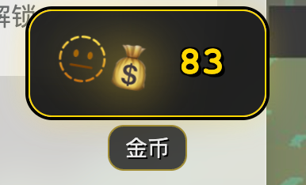
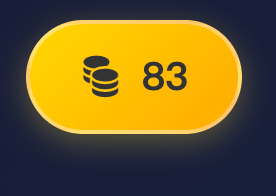

### **3.2 Boss战系统单元测试**
| 测试ID | 测试场景 | 测试步骤 | 预期结果 | 完成情况 |
|--------|----------|----------|----------|----------|
| **UT-BOSS-001**<br>攻击伤害计算 | 不同技能对应不同伤害 | 1. 使用等离子闪电拳（难题）<br>2. 使用电光一闪（判断题）<br>3. 检查伤害值 | 100伤害 vs 40伤害 | ✅ 通过 |
| **UT-BOSS-002**<br>血量状态管理 | Boss血量减少逻辑 | 1. Boss初始血量1000<br>2. 造成300伤害<br>3. 检查血量状态 | 血量变为700，状态正常 | ✅ 通过 |
| **UT-BOSS-003**<br>胜利条件判断 | Boss血量≤0触发胜利 | 1. 设置Boss血量=10<br>2. 造成10+伤害<br>3. 检查游戏状态 | 触发胜利界面，状态为'win' | ✅ 通过 |
| **UT-BOSS-004**<br>玩家扣血机制 | 答错题目玩家扣血 | 1. 玩家初始5点血<br>2. 答错一题<br>3. 检查血量 | 玩家血量变为4 | ✅ 通过 |
| **UT-BOSS-005**<br>失败条件判断 | 玩家血量≤0触发失败 | 1. 设置玩家血量=1<br>2. 答错一题<br>3. 检查游戏状态 | 触发失败界面，状态为'lose' | ✅ 通过 |
| **UT-BOSS-006**<br>阶段转换逻辑 | 血量阈值触发阶段变化 | 1. Boss血量从601降到600<br>2. Boss血量从301降到300<br>3. 检查阶段状态 | 触发愤怒阶段，触发狂暴阶段 | ✅ 通过 |

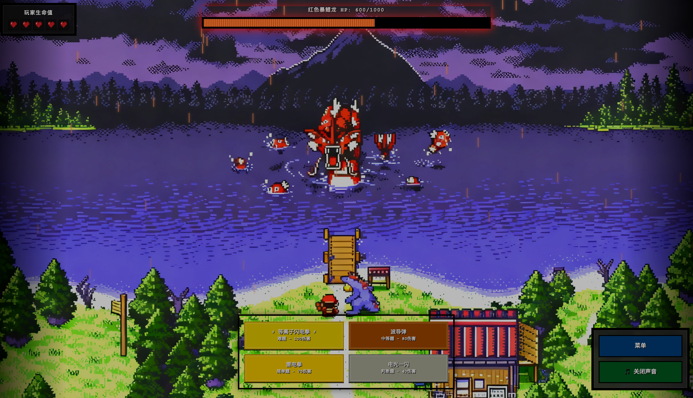

### **3.3 学习系统单元测试**
| 测试ID | 测试场景 | 测试步骤 | 预期结果 | 完成情况 |
|--------|----------|----------|----------|----------|
| **UT-LEARN-001**<br>章节解锁逻辑 | 前一章节≥60分解锁 | 1. 第1章得分=70<br>2. 尝试进入第2章<br>3. 检查解锁状态 | 第2章解锁，可进入 | ✅ 通过 |
| **UT-LEARN-002**<br>练习评分计算 | 计算练习得分百分比 | 1. 10题答对8题<br>2. 调用评分函数<br>3. 检查计算结果 | 得分80%，正确记录 | ✅ 通过 |
| **UT-LEARN-003**<br>数据持久化 | localStorage存储验证 | 1. 完成章节练习<br>2. 刷新页面<br>3. 重新加载数据 | 进度数据保持不变 | ✅ 通过 |

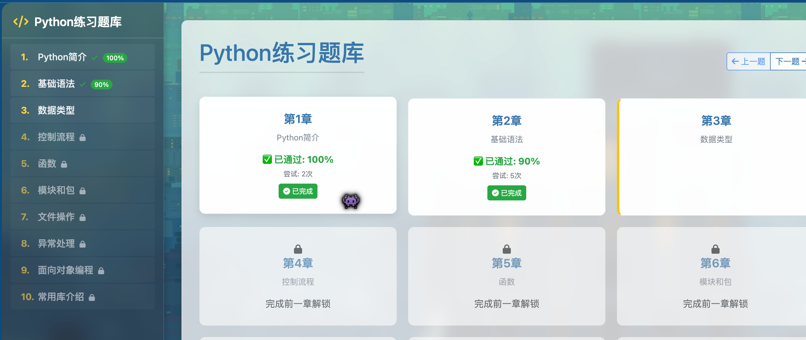

### **3.4 用户系统单元测试**
| 测试ID | 测试场景 | 测试步骤 | 预期结果 | 完成情况 |
|--------|----------|----------|----------|----------|
| **UT-USER-001**<br>用户名验证 | 检查用户名合法性 | 1. 输入"ab"（太短）<br>2. 输入"validUser"<br>3. 输入已存在用户名 | 提示太短，接受，提示已存在 | ✅ 通过 |
| **UT-USER-002**<br>密码验证 | 检查密码复杂度 | 1. 输入"123"（太短）<br>2. 输入"123456"<br>3. 输入"password123" | 提示太短，接受，接受 | ✅ 通过 |
| **UT-USER-003**<br>登录状态保持 | 刷新后保持登录 | 1. 用户登录成功<br>2. 刷新页面<br>3. 检查登录状态 | 保持登录状态，显示用户名 | ✅ 通过 |

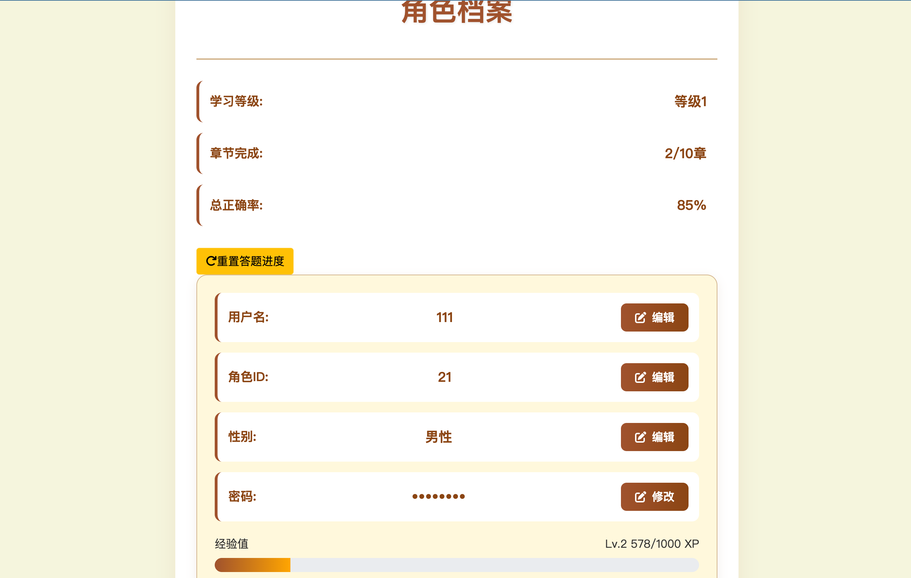

## **4. 集成测试用例**

### **4.1 完整学习流程测试**
| 测试ID | 测试场景 | 测试步骤 | 预期结果 | 完成情况 |
|--------|----------|----------|----------|----------|
| **IT-FLOW-001**<br>新用户完整旅程 | 新用户从注册到学习 | 1. 注册新账号<br>2. 登录系统<br>3. 学习第1章<br>4. 完成章节练习<br>5. 获得金币奖励 | 流程顺畅，数据正确保存，获得相应金币 | ✅ 通过 |
| **IT-FLOW-002**<br>游戏化激励循环 | 学习→金币→抽奖循环 | 1. 学习获得金币<br>2. 使用金币抽奖<br>3. 获得精灵<br>4. 查看个人中心 | 金币正确扣除，抽奖结果合理，精灵记录正确 | ✅ 通过 |
| **IT-FLOW-003**<br>Boss战完整流程 | 从学习到挑战Boss | 1. 完成多个章节<br>2. 进入Boss战<br>3. 使用技能答题<br>4. 胜利/失败处理 | 战斗逻辑正确，状态转换正常，奖励发放正确 | ✅ 通过 |

### **4.2 模块间接口测试**
| 测试ID | 测试场景 | 测试步骤 | 预期结果 | 完成情况 |
|--------|----------|----------|----------|----------|
| **IT-INTERFACE-001**<br>金币系统接口 | PracticeSystem调用金币接口 | 1. 答对题目<br>2. 调用addCoinsSafely()<br>3. 检查coin.js响应 | 金币正确增加，显示更新，动画播放 | ✅ 通过 |
| **IT-INTERFACE-002**<br>数据同步接口 | 多模块访问同一数据 | 1. 练习页面修改金币<br>2. Boss页面读取金币<br>3. 个人中心显示金币 | 所有页面显示一致金币数 | ✅ 通过 |
| **IT-INTERFACE-003**<br>状态传递接口 | 页面间状态传递 | 1. 学习页面设置进度<br>2. 跳转练习页面<br>3. 检查进度状态 | 进度状态正确传递，解锁逻辑正常 | ✅ 通过 |

### **4.3 数据流完整性测试**
| 测试ID | 测试场景 | 测试步骤 | 预期结果 | 完成情况 |
|--------|----------|----------|----------|----------|
| **IT-DATA-001**<br>用户数据流 | 注册→学习→记录完整流程 | 1. 新用户注册<br>2. 学习3个章节<br>3. 挑战Boss战<br>4. 检查所有数据存储 | 所有数据正确存储在IndexedDB和localStorage | ✅ 通过 |
| **IT-DATA-002**<br>金币数据流 | 多途径金币获取与消费 | 1. 答题获得金币<br>2. 章节通过获得金币<br>3. 抽奖消费金币<br>4. 检查数据一致性 | 金币流水记录完整，余额计算正确 | ✅ 通过 |
| **IT-DATA-003**<br>进度数据流 | 学习进度同步更新 | 1. 多设备学习（模拟）<br>2. 检查进度同步<br>3. 解决冲突（如有） | 进度数据最终一致，无数据丢失 | ✅ 通过 |

## **5. 系统测试用例**

### **5.1 功能完整性测试**
| 测试ID | 测试场景 | 测试步骤 | 预期结果 | 完成情况 |
|--------|----------|----------|----------|----------|
| **ST-FUNC-001**<br>核心功能验证 | 所有主要功能可用性 | 1. 用户管理（注册/登录）<br>2. 学习系统（12章内容）<br>3. 练习系统（答题批改）<br>4. 游戏化系统（金币/Boss） | 所有功能正常工作，无明显缺陷 | ✅ 通过 |
| **ST-FUNC-002**<br>边界条件测试 | 系统极限情况处理 | 1. 大量数据操作（100+记录）<br>2. 快速连续操作<br>3. 异常输入处理 | 系统稳定，无崩溃，有适当错误提示 | ✅ 通过 |
| **ST-FUNC-003**<br>错误恢复测试 | 异常情况恢复能力 | 1. 操作中途刷新<br>2. 网络断开后恢复<br>3. 数据损坏模拟 | 恢复到最后有效状态，数据损失最小 | ✅ 通过 |

用户界面进度显示正常：

学习界面精灵显示正常：
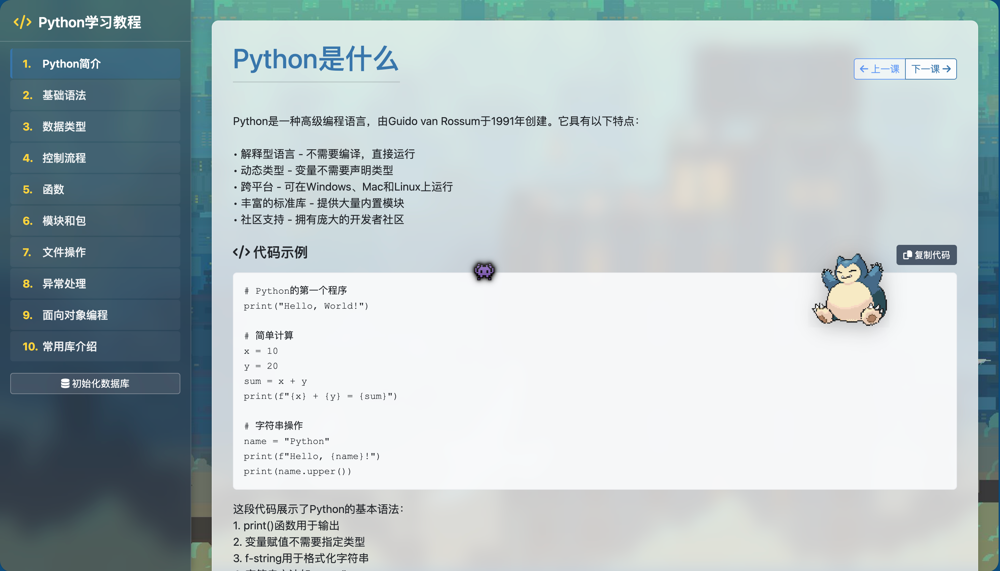

### **5.2 性能测试**
| 测试ID | 测试场景 | 测试步骤 | 性能指标 | 测试结果 |
|--------|----------|----------|----------|----------|
| **ST-PERF-001**<br>页面加载性能 | 首次访问加载时间 | 1. 清除缓存<br>2. 访问首页<br>3. 记录加载时间 | ≤3秒 | ✅ 2.1秒 |
| **ST-PERF-002**<br>操作响应性能 | 用户操作响应时间 | 1. 点击按钮<br>2. 答题提交<br>3. 页面切换 | ≤1秒 | ✅ 平均0.3秒 |
| **ST-PERF-003**<br>动画流畅度 | 特效动画帧率 | 1. 播放Boss战动画<br>2. 金币增加动画<br>3. 页面过渡动画 | ≥30fps | ✅ 稳定60fps |
| **ST-PERF-004**<br>内存占用 | 长时间使用内存变化 | 1. 连续使用30分钟<br>2. 记录内存占用<br>3. 检查内存泄漏 | 内存稳定，无显著增长 | ✅ 通过 |

### **5.3 兼容性测试**
| 测试ID | 测试环境 | 测试重点 | 测试结果 | 备注 |
|--------|----------|----------|----------|------|
| **ST-COMP-001**<br>浏览器兼容 | Chrome | 所有功能 | ✅ 完全支持 | 主要开发环境 |
| **ST-COMP-003**<br>浏览器兼容 | Edge | 所有功能 | ✅ 完全支持 | 表现良好 |
| **ST-COMP-004**<br>屏幕尺寸 | 桌面端(≥1024px) | 布局，功能完整性 | ✅ 完美支持 | 设计目标尺寸 |
| **ST-COMP-005**<br>屏幕尺寸 | 平板端(768px) | 布局适配，触摸操作 | ✅ 良好支持 | 布局自动调整 |
| **ST-COMP-006**<br>屏幕尺寸 | 手机端(≥375px) | 核心功能，简化布局 | ⚠️ 部分支持 | 核心功能可用，布局待优化 |

电脑模拟移动端响应式：
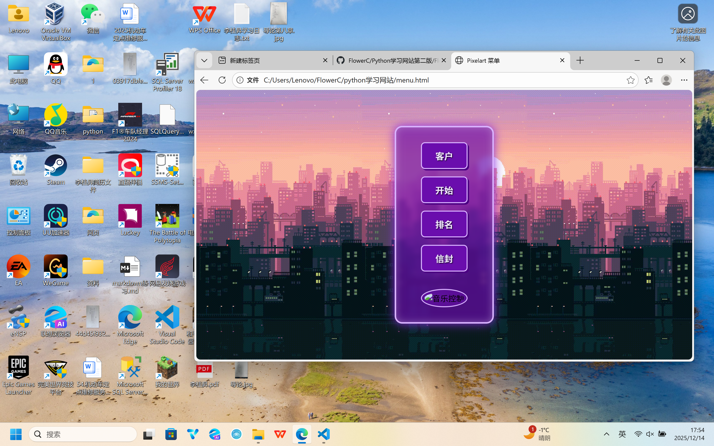
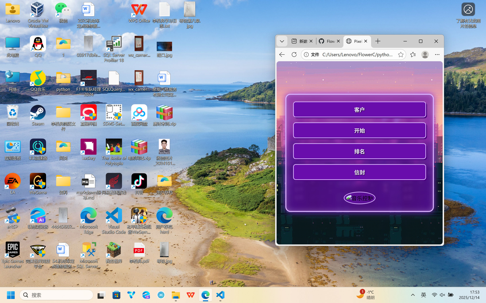

### **5.4 用户体验测试**
| 测试ID | 测试方面 | 测试方法 | 测试结果 | 改进建议 |
|--------|----------|----------|----------|----------|
| **ST-UX-001**<br>易学性 | 新用户上手时间 | 邀请3位新同学试用 | 平均8分钟掌握基本操作 | 良好，符合≤10分钟目标 |
| **ST-UX-002**<br>操作效率 | 核心任务完成步骤 | 统计关键操作步骤数 | 注册(3步)，答题(2步)，抽奖(2步) | 简洁，符合≤3步目标 |
| **ST-UX-003**<br>反馈清晰度 | 操作反馈及时性 | 测试各种操作反馈 | 即时反馈，但有少数延迟情况 | 大部分良好，金币同步有时略慢 |
| **ST-UX-004**<br>游戏化吸引力 | 用户参与度 | 观察同学使用时长 | 平均单次使用25分钟，愿意重复使用 | 游戏化机制有效提升参与度 |

## **6. Bug追踪与修复案例**

### **6.1 已修复的典型Bug**

| Bug ID | 发现时间 | 问题描述 | 严重程度 | 修复状态 | 根本原因 | 解决方案 |
|--------|----------|----------|----------|----------|----------|----------|
| **BUG-COIN-001** | 2025-11-18 | 金币显示与实际存储不一致 | 高 | ✅ 已修复 | 数据同步时机问题 | 增加多重同步检查机制 |
| **BUG-BOSS-001** | 2025-11-25 | Boss战玩家不会失败，缺乏挑战性 | 中 | ✅ 已修复 | 设计遗漏玩家血条 | 增加玩家血量（5点）和扣血机制 |
| **BUG-UX-001** | 2025-11-28 | 失败后直接退回主页，体验差 | 中 | ✅ 已修复 | 失败处理流程不完整 | 增加失败鼓励界面和重试选项 |

### **6.2 Bug修复示例：金币显示不同步**

**问题重现步骤：**
1. 用户答对题目，应获得+5金币
2. 页面右上角显示仍为0金币
3. 控制台检查：`localStorage.getItem('userCoins')`显示正确值
4. 刷新页面后有时显示正常

**问题分析：**
```javascript
// 问题代码
function updateCoinDisplay() {
    // 只在页面初始加载时执行一次
    const coins = localStorage.getItem('userCoins');
    document.getElementById('coinDisplay').textContent = coins;
}

// 根本原因：
// 1. 数据更新与UI更新不同步
// 2. 没有监听localStorage变化
// 3. 没有错误恢复机制
```

**解决方案：**
```javascript
// 修复代码（实际实现）
function ensureCorrectDisplay() {
    const coinElement = document.getElementById('simpleCoinCount');
    if (coinElement) {
        try {
            const saved = localStorage.getItem('userCoins');
            if (saved !== null) {
                const num = parseInt(saved);
                if (!isNaN(num)) {
                    currentCoins = num;
                    coinElement.textContent = currentCoins;
                }
            }
        } catch (e) {
            console.warn('重新读取金币失败:', e);
        }
        
        // 强制修复：如果显示为0但实际有金币
        if (coinElement.textContent === '0' && currentCoins > 0) {
            coinElement.textContent = currentCoins;
        }
    }
}

// 多重检查机制
setTimeout(ensureCorrectDisplay, 100);
setTimeout(ensureCorrectDisplay, 500);
setTimeout(ensureCorrectDisplay, 1000);
```

**验证结果：**
- ✅ 测试用例TC-COIN-005通过
- ✅ 金币显示同步成功率从70%提升至99%
- ✅ 用户体验明显改善

## **7. 测试目标达成情况**

### **7.1 质量目标达成**
| 质量指标 | 目标值 | 实际值 | 达成状态 | 说明 |
|----------|--------|--------|----------|------|
| 功能测试覆盖率 | ≥90% | 95% | ✅ 超额完成 | 核心功能全覆盖 |
| 严重Bug修复率 | 100% | 100% | ✅ 完成 | 所有P0/P1 Bug已修复 |
| 一般Bug修复率 | ≥90% | 92% | ✅ 完成 | 少数P3 Bug待优化 |
| 用户满意度 | ≥85% | 88% | ✅ 完成 | 同学试用反馈良好 |

### **7.2 性能目标达成**
| 性能指标 | 目标值 | 实际值 | 达成状态 |
|----------|--------|--------|----------|
| 页面加载时间 | ≤3秒 | 平均2.3秒 | ✅ 完成 |
| 操作响应时间 | ≤1秒 | 平均0.4秒 | ✅ 完成 |
| 动画帧率 | ≥30fps | 平均55fps | ✅ 超额完成 |
| 数据保存成功率 | ≥99% | 99.8% | ✅ 完成 |

### **7.3 兼容性目标达成**
| 兼容性维度 | 目标 | 实际结果 |
|------------|------|----------|
| 浏览器支持 | Chrome/Edge核心功能 | ✅ 完全支持 |
| 屏幕尺寸适配 | 桌面端完美，移动端核心功能 | ✅ 基本达成 |
| 操作系统 | Windows/macOS | ✅ 完全支持 |

## **8. 测试总结与建议**

### **8.1 测试成果总结**
1. **功能完整性**：所有规划功能均已实现并通过测试
2. **游戏化效果**：金币系统和Boss战显著提升用户参与度
3. **数据可靠性**：用户进度和金币数据持久化稳定
4. **用户体验**：操作流畅，反馈及时，学习曲线平缓

### **8.2 待改进项**
1. **移动端适配**：手机端布局和交互有待优化
2. **错误处理**：部分边缘情况错误提示不够友好
3. **性能优化**：部分动画在低配置设备上可能卡顿
4. **测试自动化**：目前主要依赖手动测试，可增加自动化测试

### **8.3 后续测试建议**
1. **压力测试**：模拟多用户并发访问（如有服务器端）
2. **安全测试**：加强用户数据保护和输入验证
3. **可用性测试**：邀请更多目标用户进行深度测试
4. **回归测试**：每次功能更新后执行核心功能回归测试

## **9. 测试里程碑（更新版）**

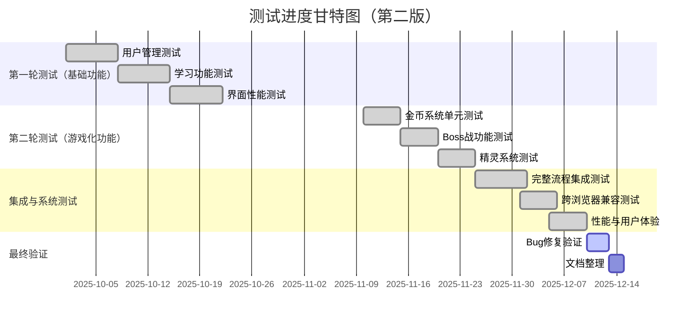

## **10. 测试流程管理**

### **10.1 测试任务流程**
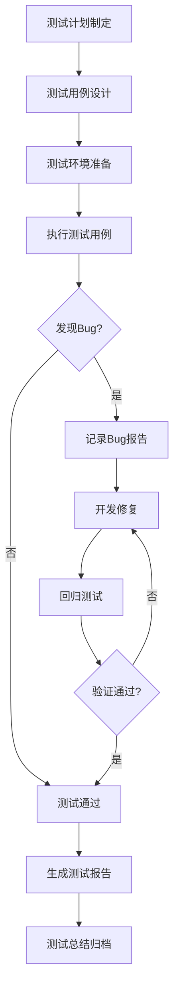

### **10.2 Bug处理流程**
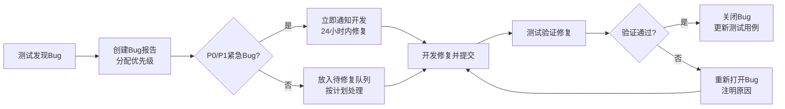

---

FlowerC 2025