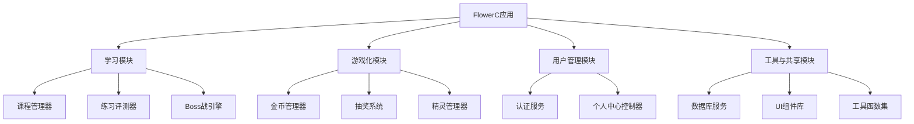

# FlowerC网站项目 - 软件设计文档

## 文档版本信息

| 项目 | 内容 |
|------|------|
| **项目名称** | FlowerC Python游戏化学习平台 |
| **文档版本** | v2.0 |
| **文档类型** | 软件设计文档 (Software Design Document) |
| **对应需求版本** | 需求规格说明书 v2.0 |
| **编写日期** | 2025年12月 |
| **编写团队** | FlowerC开发团队 |

## 1. 引言

### 1.1 文档目的
本文档旨在为FlowerC项目的第二版开发提供详细的技术设计方案。它定义了系统的整体架构、模块划分、数据模型、接口规范以及关键技术实现方案，是指导开发人员编码实现和测试人员验证的核心技术文档。

### 1.2 范围
本文档涵盖第二版的所有新增功能设计：
- 金币系统的完整实现方案
- 精灵收集系统的抽奖与展示逻辑
- 个人中心页面的详细设计
- 游戏化数据模型扩展
- 前端与数据层的交互设计

### 1.3 术语表
| 术语 | 定义 |
|------|------|
| **MVP** | 最小可行产品 (Minimum Viable Product) |
| **IndexedDB** | 浏览器内置的客户端数据库 |
| **Gamification** | 游戏化，将游戏设计元素应用于非游戏场景 |
| **RPG** | 角色扮演游戏 (Role-Playing Game) |
| **Toast提示** | 短暂的弹出式通知消息 |

## 2. 系统架构设计

### 2.1 架构概览
FlowerC采用**客户端单页应用(SPA)架构**，所有逻辑和数据处理在浏览器中完成。

```mermaid
graph TB
    subgraph “客户端 (浏览器)”
        subgraph “表示层”
            UI[UI组件<br/>HTML/CSS]
        end
        
        subgraph “业务逻辑层”
            App[应用控制器]
            LM[学习管理模块]
            GM[游戏化模块]
            AM[认证与状态管理]
        end
        
        subgraph “数据访问层”
            DB[IndexedDB包装器]
        end
        
        subgraph “数据持久层”
            IDB[(IndexedDB数据库)]
        end
    end
    
    subgraph “外部依赖”
        Pyodide[Pyodide运行时<br/>Python沙箱]
    end
    
    UI --> App
    App --> LM
    App --> GM
    App --> AM
    LM --> DB
    GM --> DB
    AM --> DB
    DB --> IDB
    LM --> Pyodide
```

### 2.2 技术栈选择
| 层次 | 技术选型 | 版本/说明 |
|------|----------|-----------|
| **表示层** | HTML5, CSS3, JavaScript(ES6+) | 原生技术栈，无框架依赖 |
| **样式框架** | 自定义CSS + 少量CSS变量 | 保持轻量，便于定制 |
| **代码执行** | Pyodide | 0.24.1+，支持在浏览器运行Python |
| **数据存储** | IndexedDB | 浏览器原生API |
| **构建工具** | 无（或可选Vite） | 开发阶段可使用构建工具优化 |
| **版本控制** | Git + GitHub | 代码托管与协作 |

### 2.3 架构决策理由
1. **纯前端架构**：项目规模适中，无多用户协作需求，IndexedDB存储容量足够（通常250MB+）。
2. **选择Pyodide而非Skulpt**：Pyodide基于WebAssembly，支持完整的Python科学计算库，扩展性更好。
3. **无前端框架**：项目复杂度可控，原生JS足够应对，避免框架学习成本和打包体积。

## 3. 模块详细设计

### 3.1 模块划分
系统划分为四大核心模块：



### 3.2 学习模块设计

#### 3.2.1 课程管理器 (`CourseManager`)
```javascript
class CourseManager {
  constructor() {
    this.currentChapter = null;
    this.userProgress = new Map(); // 章节ID -> 进度对象
  }
  
  // 主要方法
  async loadChapter(chapterId) {
    // 1. 检查是否解锁
    // 2. 加载章节内容JSON
    // 3. 记录学习开始时间
  }
  
  async markChapterViewed(chapterId) {
    // 滚动检测触发：标记章节内容已学习
    // 触发金币奖励
  }
  
  async getUnlockStatus(chapterId) {
    // 根据前一章节进度判断是否解锁
  }
}
```

#### 3.2.2 练习评测器 (`QuizEvaluator`)
```javascript
class QuizEvaluator {
  constructor() {
    this.pyodide = null; // Pyodide实例
  }
  
  async initialize() {
    this.pyodide = await loadPyodide();
  }
  
  // 评测选择题/判断题
  evaluateMultipleChoice(question, userAnswer) {
    return {
      isCorrect: question.correctAnswer === userAnswer,
      explanation: question.explanation
    };
  }
  
  // 评测代码题
  async evaluateCode(question, userCode) {
    try {
      // 1. 安全检查（禁止危险导入）
      // 2. 设置执行超时
      // 3. 运行用户代码
      // 4. 与预期输出比对
      // 5. 返回评分结果
    } catch (error) {
      return { 
        isCorrect: false, 
        error: error.message 
      };
    }
  }
}
```

### 3.3 游戏化模块设计

#### 3.3.1 金币管理器 (`CoinManager`)
```javascript
class CoinManager {
  constructor(userId) {
    this.userId = userId;
    this.currentBalance = 0;
    this.transactions = [];
  }
  
  // 关键设计：所有金币变动通过统一入口
  async addCoins(amount, source, description) {
    // 1. 验证参数
    if (amount <= 0) throw new Error('金额必须为正数');
    
    // 2. 更新内存余额
    this.currentBalance += amount;
    
    // 3. 记录交易流水
    const transaction = {
      id: Date.now(),
      userId: this.userId,
      amount,
      type: 'INCOME',
      source, // 'CHAPTER_COMPLETE', 'QUIZ_PASS', 'DAILY_LOGIN'等
      description,
      timestamp: new Date().toISOString(),
      balanceAfter: this.currentBalance
    };
    
    // 4. 保存到IndexedDB
    await this.saveTransaction(transaction);
    
    // 5. 触发UI更新事件
    this.notifyBalanceChanged();
    
    return transaction;
  }
  
  async spendCoins(amount, purpose, description) {
    // 类似addCoins，但进行余额检查
    if (this.currentBalance < amount) {
      throw new Error('余额不足');
    }
    this.currentBalance -= amount;
    // ... 记录支出交易
  }
  
  // 每日登录奖励计算
  async calculateDailyBonus(consecutiveDays) {
    let bonus = 20; // 基础奖励
    
    // 连续登录加成（上限7天）
    if (consecutiveDays > 1) {
      const extra = Math.min(consecutiveDays - 1, 7) * 10;
      bonus += extra;
    }
    
    return bonus;
  }
}
```

#### 3.3.2 抽奖系统 (`GachaSystem`)
```javascript
class GachaSystem {
  constructor() {
    // 精灵稀有度配置
    this.rarityRates = {
      'COMMON': 0.70,   // 70%
      'RARE': 0.25,     // 25%
      'LEGENDARY': 0.05 // 5%
    };
    
    // 按稀有度分组的精灵列表
    this.pokemonByRarity = this.loadPokemonCatalog();
  }
  
  // 单次抽奖核心逻辑
  async performGacha(userId, cost = 100) {
    // 1. 扣费
    const coinManager = new CoinManager(userId);
    await coinManager.spendCoins(cost, 'GACHA', '精灵抽奖');
    
    // 2. 根据概率随机选择稀有度
    const rarity = this.selectRarityByProbability();
    
    // 3. 从该稀有度池中随机选择一个精灵
    const pool = this.pokemonByRarity[rarity];
    const pokemon = pool[Math.floor(Math.random() * pool.length)];
    
    // 4. 检查是否已拥有
    const owned = await this.checkIfOwned(userId, pokemon.id);
    
    let result;
    if (owned) {
      // 重复：转换为金币
      result = {
        type: 'DUPLICATE',
        pokemon: pokemon,
        coinCompensation: 30
      };
      await coinManager.addCoins(30, 'DUPLICATE_CONVERT', `重复精灵转换`);
    } else {
      // 新精灵：添加到收藏
      result = {
        type: 'NEW',
        pokemon: pokemon
      };
      await this.addToCollection(userId, pokemon);
    }
    
    // 5. 返回结果（用于UI展示）
    return result;
  }
  
  selectRarityByProbability() {
    const rand = Math.random();
    let cumulative = 0;
    
    for (const [rarity, rate] of Object.entries(this.rarityRates)) {
      cumulative += rate;
      if (rand <= cumulative) {
        return rarity;
      }
    }
    return 'COMMON'; // 兜底
  }
}
```

### 3.4 用户管理模块

#### 3.4.1 个人中心控制器 (`ProfileController`)
```javascript
class ProfileController {
  constructor(userId) {
    this.userId = userId;
    this.profileData = null;
  }
  
  async loadProfileData() {
    // 聚合多个数据源
    const [progress, coins, pokemon, achievements] = await Promise.all([
      this.getLearningProgress(),
      this.getCoinBalance(),
      this.getCollectedPokemon(),
      this.getAchievements()
    ]);
    
    this.profileData = {
      overview: {
        totalProgress: this.calculateOverallProgress(progress),
        chapters: progress,
        bossRecord: await this.getBossRecord()
      },
      assets: {
        coins: coins,
        achievements: achievements
      },
      collection: {
        pokemonCount: pokemon.length,
        totalPokemon: 50, // 配置的总数
        companionPokemon: await this.getCompanion(),
        allPokemon: pokemon
      }
    };
    
    return this.profileData;
  }
  
  // 计算总体进度
  calculateOverallProgress(chapterProgress) {
    const completed = chapterProgress.filter(ch => ch.isPassed).length;
    return Math.round((completed / 12) * 100); // 12个章节
  }
}
```

## 4. 数据库设计

### 4.1 IndexedDB数据库规划

#### 4.1.1 对象存储设计
```javascript
// database.js - 数据库初始化配置
const DB_CONFIG = {
  name: 'FlowerC_v2',
  version: 2,
  stores: [
    {
      name: 'users',
      keyPath: 'username',
      indexes: [
        { name: 'registerDate', keyPath: 'registerDate' }
      ]
    },
    {
      name: 'user_progress',
      keyPath: ['username', 'chapterId'], // 复合键
      indexes: [
        { name: 'byUsername', keyPath: 'username' },
        { name: 'byChapter', keyPath: 'chapterId' }
      ]
    },
    {
      name: 'coin_transactions',
      keyPath: 'id',
      autoIncrement: true,
      indexes: [
        { name: 'byUser', keyPath: 'username' },
        { name: 'byDate', keyPath: 'timestamp' }
      ]
    },
    {
      name: 'pokemon_collection',
      keyPath: ['username', 'pokemonId'], // 复合键
      indexes: [
        { name: 'byUser', keyPath: 'username' },
        { name: 'byRarity', keyPath: 'rarity' }
      ]
    },
    {
      name: 'quiz_attempts',
      keyPath: 'id',
      autoIncrement: true,
      indexes: [
        { name: 'byUserChapter', keyPath: ['username', 'chapterId'] }
      ]
    },
    {
      name: 'app_state',
      keyPath: 'key' // 用于存储全局状态，如'current_user'
    }
  ]
};
```

#### 4.1.2 核心数据模型
```javascript
// 用户表记录示例
const userRecord = {
  username: 'student123',
  passwordHash: 'a1b2c3...', // 实际为bcrypt哈希值
  displayName: 'Python新手',
  totalCoins: 850, // 可缓存，也可动态计算
  consecutiveLoginDays: 3,
  lastLoginDate: '2025-11-15T08:30:00Z',
  registerDate: '2025-10-01T10:00:00Z',
  settings: {
    theme: 'light',
    notification: true
  }
};

// 精灵收藏记录
const pokemonRecord = {
  username: 'student123',
  pokemonId: 'pikachu_001',
  rarity: 'RARE',
  obtainedAt: '2025-11-15T09:15:00Z',
  isCompanion: true,
  metadata: {
    timesDrawn: 1, // 抽到次数（用于图鉴统计）
    firstObtained: '2025-11-15T09:15:00Z'
  }
};
```

### 4.2 数据访问层设计
```javascript
// DBService.js - 统一数据访问接口
class DBService {
  constructor() {
    this.db = null;
  }
  
  async initialize() {
    return new Promise((resolve, reject) => {
      const request = indexedDB.open(DB_CONFIG.name, DB_CONFIG.version);
      
      request.onupgradeneeded = (event) => {
        this.db = event.target.result;
        // 创建所有对象存储
        DB_CONFIG.stores.forEach(storeConfig => {
          if (!this.db.objectStoreNames.contains(storeConfig.name)) {
            const store = this.db.createObjectStore(storeConfig.name, {
              keyPath: storeConfig.keyPath,
              autoIncrement: storeConfig.autoIncrement
            });
            
            // 创建索引
            storeConfig.indexes?.forEach(idx => {
              store.createIndex(idx.name, idx.keyPath, idx.options);
            });
          }
        });
      };
      
      request.onsuccess = (event) => {
        this.db = event.target.result;
        resolve(this);
      };
      
      request.onerror = (event) => {
        reject(event.target.error);
      };
    });
  }
  
  // 通用CRUD方法
  async add(storeName, data) {
    return new Promise((resolve, reject) => {
      const tx = this.db.transaction(storeName, 'readwrite');
      const store = tx.objectStore(storeName);
      const request = store.add(data);
      
      request.onsuccess = () => resolve(request.result);
      request.onerror = () => reject(request.error);
    });
  }
  
  async get(storeName, key) {
    // 实现获取逻辑
  }
  
  async update(storeName, key, updates) {
    // 实现更新逻辑
  }
  
  // 特定业务查询
  async getUserProgress(username) {
    const tx = this.db.transaction('user_progress', 'readonly');
    const store = tx.objectStore('user_progress');
    const index = store.index('byUsername');
    
    return new Promise((resolve, reject) => {
      const request = index.getAll(username);
      request.onsuccess = () => resolve(request.result);
      request.onerror = () => reject(request.error);
    });
  }
}
```

## 5. 用户界面设计

### 5.1 组件化设计
系统采用组件化设计，主要UI组件包括：

```javascript
// UI组件结构
components/
├── layout/
│   ├── Header.js      // 顶部导航（含金币显示）
│   ├── Sidebar.js     // 章节导航
│   └── Footer.js
├── learning/
│   ├── ChapterView.js // 章节内容展示
│   ├── QuizCard.js    // 练习卡片
│   └── CodeEditor.js  // 代码编辑器
├── gamification/
│   ├── CoinDisplay.js // 金币显示组件
│   ├── GachaButton.js // 抽奖按钮
│   ├── PokemonCard.js // 精灵展示卡片
│   └── ProgressRing.js // 进度环形图
└── profile/
    ├── ProfileStats.js // 个人数据统计
    ├── AchievementBadge.js // 成就徽章
    └── PokemonGallery.js // 精灵图库
```

### 5.2 关键界面状态流转

#### 5.2.1 金币状态同步机制
```javascript
// CoinDisplay.js - 实时金币显示
class CoinDisplay extends HTMLElement {
  constructor() {
    super();
    this.currentAmount = 0;
    this.coinManager = null;
    
    // 监听全局金币变化事件
    document.addEventListener('coinsChanged', (event) => {
      this.updateDisplay(event.detail.newBalance);
      this.animateChange(event.detail.change);
    });
  }
  
  updateDisplay(newAmount) {
    const oldAmount = this.currentAmount;
    this.currentAmount = newAmount;
    
    // 平滑数字动画
    this.animateCounter(oldAmount, newAmount);
  }
  
  animateCounter(from, to) {
    // 实现数字滚动动画
    const duration = 500; // 毫秒
    const steps = 20;
    const increment = (to - from) / steps;
    
    let current = from;
    const timer = setInterval(() => {
      current += increment;
      this.querySelector('.amount').textContent = Math.round(current);
      
      if ((increment > 0 && current >= to) || 
          (increment < 0 && current <= to)) {
        clearInterval(timer);
        this.querySelector('.amount').textContent = to;
      }
    }, duration / steps);
  }
}
```

#### 5.2.2 抽奖动画序列
```javascript
// GachaAnimation.js - 抽奖动画状态机
const GACHA_STATES = {
  IDLE: 'idle',           // 初始状态
  INITIATING: 'initiating', // 点击开始
  BALL_THROW: 'ball_throw', // 扔球动画
  SHAKING: 'shaking',     // 精灵球晃动
  REVEAL: 'reveal',       // 揭示结果
  RESULT: 'result',       // 展示结果详情
  COMPLETE: 'complete'    // 完成
};

class GachaAnimation {
  constructor(containerElement) {
    this.state = GACHA_STATES.IDLE;
    this.container = containerElement;
  }
  
  async play(result) {
    // 状态流转序列
    this.setState(GACHA_STATES.INITIATING);
    await this.showThrowAnimation();
    
    this.setState(GACHA_STATES.BALL_THROW);
    await this.throwBall();
    
    this.setState(GACHA_STATES.SHAKING);
    await this.shakeBall(3); // 晃动3次
    
    this.setState(GACHA_STATES.REVEAL);
    await this.revealPokemon(result.pokemon);
    
    this.setState(GACHA_STATES.RESULT);
    await this.showResultDetails(result);
    
    this.setState(GACHA_STATES.COMPLETE);
    return this.reset();
  }
  
  setState(newState) {
    this.state = newState;
    this.container.setAttribute('data-state', newState);
    
    // 触发状态变化事件
    this.container.dispatchEvent(
      new CustomEvent('gachaStateChange', { detail: { state: newState } })
    );
  }
}
```

## 6. 关键技术实现方案

### 6.1 滚动检测与章节完成标记
```javascript
// 章节内容滚动检测
class ChapterCompletionTracker {
  constructor(chapterElement) {
    this.chapter = chapterElement;
    this.sections = Array.from(chapterElement.querySelectorAll('.content-section'));
    this.viewedSections = new Set();
    this.completionThreshold = 0.9; // 90%内容被浏览
    
    this.setupIntersectionObserver();
  }
  
  setupIntersectionObserver() {
    const options = {
      root: null,
      rootMargin: '0px',
      threshold: 0.5 // 50%可见即视为"浏览过"
    };
    
    this.observer = new IntersectionObserver((entries) => {
      entries.forEach(entry => {
        if (entry.isIntersecting) {
          const sectionId = entry.target.dataset.sectionId;
          this.viewedSections.add(sectionId);
          
          // 检查是否达到完成阈值
          this.checkCompletion();
        }
      });
    }, options);
    
    // 开始观察所有章节段落
    this.sections.forEach(section => {
      this.observer.observe(section);
    });
  }
  
  checkCompletion() {
    const viewedRatio = this.viewedSections.size / this.sections.length;
    
    if (viewedRatio >= this.completionThreshold && !this.isCompleted) {
      this.markChapterAsCompleted();
      this.isCompleted = true;
    }
  }
  
  async markChapterAsCompleted() {
    const chapterId = this.chapter.dataset.chapterId;
    
    // 调用章节管理器
    const courseManager = await CourseManager.getInstance();
    await courseManager.markChapterViewed(chapterId);
    
    // 显示完成提示
    this.showCompletionToast();
  }
  
  showCompletionToast() {
    // 显示获得金币的提示
    const toast = document.createElement('div');
    toast.className = 'completion-toast';
    toast.innerHTML = `
      <span>🎉 完成本章学习！</span>
      <span class="coin-reward">+50金币</span>
    `;
    
    document.body.appendChild(toast);
    
    // 3秒后自动消失
    setTimeout(() => {
      toast.classList.add('fade-out');
      setTimeout(() => toast.remove(), 500);
    }, 3000);
  }
}
```

## 7. 性能与优化考虑

### 7.1 性能优化策略
1. **IndexedDB批量操作**：减少事务数量，使用批量读写
2. **懒加载内容**：章节内容按需加载，不一次性加载全部
3. **资源预加载**：预加载下一章内容或常用精灵图片
4. **缓存计算结果**：如进度百分比、金币总额等

### 7.2 内存管理
```javascript
// 内存缓存管理器
class CacheManager {
  constructor() {
    this.cache = new Map();
    this.maxSize = 50; // 最大缓存条目数
  }
  
  // LRU（最近最少使用）缓存策略
  get(key) {
    if (!this.cache.has(key)) return null;
    
    const entry = this.cache.get(key);
    // 更新访问时间
    entry.lastAccessed = Date.now();
    return entry.value;
  }
  
  set(key, value) {
    // 如果缓存已满，移除最久未使用的
    if (this.cache.size >= this.maxSize) {
      let oldestKey = null;
      let oldestTime = Infinity;
      
      for (const [k, v] of this.cache.entries()) {
        if (v.lastAccessed < oldestTime) {
          oldestTime = v.lastAccessed;
          oldestKey = k;
        }
      }
      
      if (oldestKey) {
        this.cache.delete(oldestKey);
      }
    }
    
    this.cache.set(key, {
      value,
      lastAccessed: Date.now(),
      created: Date.now()
    });
  }
  
  // 定期清理过期的缓存（如超过1小时）
  cleanup() {
    const oneHourAgo = Date.now() - (60 * 60 * 1000);
    
    for (const [key, entry] of this.cache.entries()) {
      if (entry.created < oneHourAgo) {
        this.cache.delete(key);
      }
    }
  }
}
```

### 7.3 离线能力
```javascript
// 离线检测与处理
class OfflineManager {
  constructor() {
    this.isOnline = navigator.onLine;
    
    window.addEventListener('online', () => {
      this.isOnline = true;
      this.syncPendingData();
    });
    
    window.addEventListener('offline', () => {
      this.isOnline = false;
      this.showOfflineNotification();
    });
  }
  
  async syncPendingData() {
    // 检查是否有本地未同步的数据
    // （对于纯前端应用，主要是IndexedDB数据已持久化）
    // 这里主要用于未来扩展后端时的数据同步
  }
  
  showOfflineNotification() {
    if (this.offlineToast) return;
    
    this.offlineToast = document.createElement('div');
    this.offlineToast.className = 'offline-notification';
    this.offlineToast.textContent = '⚠️ 当前处于离线模式，进度将保存在本地';
    
    document.body.appendChild(this.offlineToast);
    
    setTimeout(() => {
      this.offlineToast.classList.add('fade-out');
      setTimeout(() => {
        this.offlineToast.remove();
        this.offlineToast = null;
      }, 500);
    }, 5000);
  }
}
```

## 8. 测试策略

### 8.1 单元测试重点
| 模块 | 测试重点 | 测试工具 |
|------|----------|----------|
| **CoinManager** | 金币增减逻辑、余额检查、交易记录 | Jest |
| **GachaSystem** | 概率分布、重复检测、金币补偿 | Jest + 模拟 |
| **QuizEvaluator** | 答案判断、代码执行安全 | Jest + Pyodide模拟 |
| **DBService** | CRUD操作、索引查询 | IndexedDB模拟库 |

### 8.2 集成测试场景
1. **完整学习流程**：注册 → 学习第1章 → 完成练习 → 获得金币 → 抽奖
2. **Boss挑战流程**：从各个章节抽取题目 → 计算伤害 → 结算奖励
3. **数据持久化**：刷新页面后所有进度、金币、精灵数据不丢失

### 8.3 性能测试指标
1. **页面加载时间**：首次加载 < 3秒，章节切换 < 1秒
2. **抽奖响应时间**：动画开始到结果展示 < 5秒
3. **代码执行时间**：Python代码评测 < 10秒（含安全检测）

## 9. 部署与维护

### 9.1 部署方案
由于是纯静态网站，部署非常简单：
1. 构建生产版本（压缩JS/CSS，优化资源）
2. 上传至GitHub Pages / Netlify / Vercel等静态托管服务
3. 配置自定义域名（可选）

### 9.2 数据迁移策略（版本升级）
```javascript
// 数据库版本迁移脚本
function migrateDatabase(oldVersion, newVersion) {
  const migrations = {
    1: async (db) => {
      // 从v1迁移到v2：添加游戏化相关表
      if (!db.objectStoreNames.contains('coin_transactions')) {
        db.createObjectStore('coin_transactions', {
          keyPath: 'id',
          autoIncrement: true
        });
      }
      // ... 更多迁移
    },
    2: async (db) => {
      // 未来v2到v3的迁移
    }
  };
  
  // 执行所有需要的迁移
  for (let v = oldVersion + 1; v <= newVersion; v++) {
    if (migrations[v]) {
      await migrations[v](db);
    }
  }
}
```

### 9.3 监控与维护
1. **错误追踪**：使用Sentry或自定义错误日志
2. **使用分析**：匿名统计功能使用频率（需用户同意）
3. **内容更新**：通过JSON配置文件更新题目、精灵数据

## 附录A：配置文件示例

### 精灵配置 (pokemon.json)
```json
{
  "pokemon": [
    {
      "id": "print_charmander",
      "name": "打印小火龙",
      "rarity": "COMMON",
      "image": "assets/pokemon/charmander.gif",
      "description": "代表print()函数，是所有Python之旅的开始",
      "unlockCondition": "完成第1章学习"
    },
    {
      "id": "function_squirtle",
      "name": "函数杰尼龟",
      "rarity": "COMMON",
      "image": "assets/pokemon/squirtle.gif",
      "description": "代表函数定义与调用，是代码复用的基础",
      "unlockCondition": "完成第3章学习"
    },
    {
      "id": "recursion_mewtwo",
      "name": "递归超梦",
      "rarity": "LEGENDARY",
      "image": "assets/pokemon/mewtwo.gif",
      "description": "代表递归思想，是编程中最强大也最难以掌握的概念之一",
      "unlockCondition": "完成第5章且抽奖概率获得"
    }
  ]
}
```

## 附录B：API接口约定（内部）

虽然是无后端应用，但模块间通过事件和Promise进行通信：

```javascript
// 模块间通信事件
const SYSTEM_EVENTS = {
  // 金币相关
  COINS_CHANGED: 'coinsChanged',
  COINS_EARNED: 'coinsEarned',
  COINS_SPENT: 'coinsSpent',
  
  // 学习相关
  CHAPTER_STARTED: 'chapterStarted',
  CHAPTER_COMPLETED: 'chapterCompleted',
  QUIZ_SUBMITTED: 'quizSubmitted',
  QUIZ_PASSED: 'quizPassed',
  
  // 游戏化相关
  GACHA_PERFORMED: 'gachaPerformed',
  POKEMON_OBTAINED: 'pokemonObtained',
  COMPANION_CHANGED: 'companionChanged',
  
  // 用户相关
  USER_LOGGED_IN: 'userLoggedIn',
  USER_LOGGED_OUT: 'userLoggedOut',
  PROFILE_UPDATED: 'profileUpdated'
};

// 使用示例
document.addEventListener(SYSTEM_EVENTS.COINS_EARNED, (event) => {
  console.log(`获得金币: ${event.detail.amount}，来源: ${event.detail.source}`);
  // 更新UI显示
});
```

---

FlowerC 2025