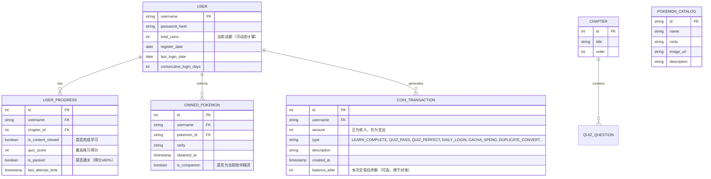

# FlowerC网站项目 - 需求规格说明书（第二版）

## 修订历史

| 版本 | 日期 | 作者 | 描述 |
| :--- | :--- | :--- | :--- |
| 1.0 | 2025年9月 | FlowerC团队 | 初始版本，定义核心学习流程与MVP功能。 |
| **2.0** | **2025年11月** | **FlowerC团队** | **第二版：聚焦游戏化机制落地。** <br> - 新增：金币系统的详细收支规则与状态显示<br> - 新增：精灵收集系统的完整抽奖、展示逻辑<br> - 新增：用户个人中心（进度总览）<br> - 细化：所有游戏化界面的交互流程<br> - 优化：部分文档结构与术语 |

## 1. 项目概述

### 1.1 项目背景与目标
随着在线编程教育的普及，学习者的“入门即放弃”现象依然突出。FlowerC项目旨在通过**游戏化（Gamification）** 设计，为Python初学者构建一个沉浸式、高激励的学习环境。我们将《Think Python》的核心知识体系与成长、收集、挑战元素相结合，以提升用户的学习粘性与完成率。

**第一版目标**：已验证核心学习路径的可行性，实现了基于12章内容的教学、练习、Boss挑战及基础用户系统。

**第二版核心目标**：**全面落地游戏化驱动循环**。通过引入完整的金币经济系统与精灵收集系统，将学习行为与游戏奖励强绑定，形成“学习 → 奖励 → 消费/收集 → 获得成就感 → 持续学习”的良性闭环，最终提升用户留存与课程完成率。

### 1.2 项目范围（第二版迭代）

| 功能模块 | 第一版（已完成） | **第二版（新增/变更）** |
| :--- | :--- | :--- |
| **核心学习** | 12章课程内容、代码运行环境 | **优化内容展示体验** |
| **练习与挑战** | 章节练习、Boss挑战 | **完善挑战结果的金币结算** |
| **用户系统** | 注册、登录、进度持久化 | **新增：个人中心页面**<br>- 可视化学习进度总览<br>- 成就系统框架<br>- 金币与精灵藏品展示 |
| **游戏化系统** | Boss挑战框架 | **新增：完整金币系统**<br>- 金币获取/消费规则<br>- 全局金币状态显示<br>**新增：精灵收集系统**<br>- 抽奖界面与动画<br>- 精灵图鉴<br>- 精灵展示（陪伴） |
| **数据存储** | 用户进度、答题记录 | **扩展：金币、精灵拥有记录** |

## 2. 整体描述

### 2.1 用户角色与画像
| 角色 | 特征 | 核心需求 | 对应功能偏好 |
| :--- | :--- | :--- | :--- |
| **探索型新手** | 零基础，好奇心强，易被有趣形式吸引。 | “学习不能太枯燥，最好像玩游戏。” | 精灵收集、抽奖动画、即时金币反馈。 |
| **成就驱动者** | 喜欢完成清单，追求百分百和排名。 | “我要打通所有关卡，收集全部精灵。” | 进度条、成就徽章、完成度统计、图鉴。 |
| **效率学习者** | 目标明确，希望系统化掌握知识。 | “内容要结构清晰，让我能稳步前进。” | 清晰的章节地图、知识图谱、错题本。 |

### 2.2 系统架构（第二版更新）
第二版在数据层和逻辑层进行了扩展，以支持游戏化功能。

## 3. 详细功能需求

### 3.1 用户账号与个人中心（第二版增强）
**3.1.1 注册/登录**：同第一版，保持稳定。
**3.1.2 个人中心页面（新增）**
- **FR-UC-01 进度总览面板**：
    - 以进度环/条形图展示 **12章整体完成度**。
    - 列表展示每章状态（未开始/进行中/已完成）及**最高练习得分**。
    - 显示 **Boss挑战最佳记录**（造成伤害值/剩余血量）。
- **FR-UC-02 资产看板**：
    - 醒目显示当前**金币总额**。
    - 以徽章墙形式展示已获得的**成就**（如“初窥门径”：完成第1章；“小有积累”：金币首次达到500）。
    - 展示**精灵收藏数量**（如“已收集 12/50”）。
- **FR-UC-03 精灵展示区**：
    - 展示用户指定的“**当前陪伴精灵**”（默认显示最新获得的精灵）。
    - 提供精灵切换功能，可从已收集精灵中选择。

### 3.2 课程与练习系统（优化）
在第一版基础上，强化与游戏化系统的联动。
- **FR-LE-01 章节解锁**：逻辑不变（前一章练习≥60%解锁下一章）。
- **FR-LE-02 学习完成奖励（细化）**：
    - 用户首次进入某章学习页面，即视为“开始学习”。
    - 用户**滚动浏览完本章所有主要内容区块**后，前端触发一个完成标记。
    - **系统自动发放一次性章节学习奖励 +50金币**，并伴有Toast提示。

### 3.3 练习与Boss挑战（结算规则细化）
Boss战低保真模型图：
[boss](boss战设计.jpg)
**3.3.1 章节练习（规则更新）**
- 题型、次数限制不变。
- **FR-EX-01 练习结算规则**：
    - 提交后，系统计算得分（百分比）。
    - 若**得分 ≥ 60%**，系统发放 **+100金币**（基础通关奖励）。
    - 若**得分 == 100%**，在通关奖励基础上，额外发放 **+50金币**（满分嘉奖）。
    - 金币奖励需在结果页面明确提示。

**3.3.2 Boss挑战（规则更新）**
- 战斗机制（血量、技能）不变。
- **FR-BO-01 挑战结算规则**：
    - **胜利结算**：击败Boss后，根据**答题所用总回合数**给予额外奖励。例如：5回合内胜利，+300金币；6-10回合，+200金币；10回合以上，+100金币。
    - **失败结算**：挑战失败（玩家血量归零）不扣除金币，但**无金币奖励**，鼓励重试。
    - 结算界面需清晰展示本次获得的金币。

### 3.4 游戏化系统（第二版核心新增）

**3.4.1 全局金币系统**
- **FR-CO-01 金币状态显示**：在网站**顶部导航栏右侧**，常驻显示一个金币图标及当前数量。点击可快速跳转至个人中心资产页。
- **FR-CO-02 金币获取途径汇总表**：
    | 行为 | 金币数 | 条件/说明 | 是否一次性 |
    | :--- | :--- | :--- | :--- |
    | 完成章节学习 | +50 | 首次浏览完该章所有内容 | 是 |
    | 通过章节练习 | +100 | 得分≥60% | 是（可重复挑战，但仅首次通过给） |
    | 章节练习满分 | +50 | 得分=100%，在通关奖励基础上叠加 | 是 |
    | 每日登录 | +20 | 每日首次访问网站 | 否（每日） |
    | 连续登录奖励 | +10*N | N为连续登录天数（上限7） | 否（每日） |
    | Boss挑战胜利 | +100~300 | 根据回合数表现浮动 | 否（可重复） |
- **FR-CO-03 金币消费途径**：
    - **抽奖**：消耗 **100金币** 进行一次精灵捕捉（使用普通精灵球）。
    - （未来扩展）商城购买装饰品、高级精灵球等。

**3.4.2 精灵收集系统**
- **FR-PK-01 精灵图鉴**：在个人中心或独立页面，展示所有可收集的精灵。已获得的清晰显示，未获得的显示为剪影，并标注获取方式（如“通过抽奖获得”）。
- **FR-PK-02 抽奖界面**：
    - 界面中心为一个可点击的 **“精灵球”**。
    - 用户点击后，消耗100金币，播放简短的 **“投掷球”动画**（2-3秒）。
    - 动画后，显示抽奖结果：**弹出的精灵形象、名称、稀有度**。
    - 如果抽到**重复精灵**，则提示“捕捉成功！但这是重复的，自动转化为**30金币**！”。
- **FR-PK-03 精灵稀有度与概率**：
    | 稀有度 | 出现概率 | 视觉设计 | 说明 |
    | :--- | :--- | :--- | :--- |
    | 普通 | 70% | 常见配色，简单动画 | 对应基础语法概念 |
    | 稀有 | 25% | 更具设计感，带光效 | 对应函数、数据结构等核心概念 |
    | 传说 | 5% | 华丽特效，专属出场动画 | 对应递归、高阶函数等高级概念 |
- **FR-PK-04 陪伴功能**：用户在个人中心可选择一只已拥有的精灵作为“陪伴精灵”，该精灵会出现在个人中心页面，未来可扩展至学习页面角落作为彩蛋。

## 4. 数据需求与设计（第二版更新）

### 4.1 核心实体关系图（ERD）


## 5. 非功能性需求（第二版细化）

### 5.1 性能需求
- **页面响应时间**：绝大多数操作（点击、跳转）应在 **1秒内** 得到视觉反馈。
- **抽奖动画**：动画总时长应控制在 **3-5秒** 内，避免用户长时间等待。
- **数据保存**：用户的学习进度、金币变动应在操作触发后 **2秒内** 异步保存至本地数据库，防止意外丢失。

### 5.2 可用性需求
- **学习中断恢复**：用户关闭浏览器后重新打开，应自动恢复到上次所在的学习章节或界面。
- **金币即时反馈**：任何导致金币变动的操作，都应在屏幕**醒目位置（如顶部状态栏）** 有数字增减动画提示。
- **新手引导**：首次进入个人中心、抽奖界面时，应有简单的**气泡提示**说明核心功能。

### 5.3 兼容性需求
- **浏览器支持**：需在 Chrome (最新版)、Edge (最新版) 上功能完整、样式正常。
- **移动端适配**：核心学习流程（阅读、答题）在主流手机浏览器上应基本可用，布局可调整为单列。

## 6. 界面与交互原型（第二版关键界面）

### 6.1 个人中心原型
```
+-----------------------------------------------------------------------+
|  FlowerC Logo                    [用户昵称]  金币: 999  [退出]        |
+-----------------------------------+-----------------------------------+
|                                   |                                   |
|  << 章节导航列表 >>           |        **学习进度总览**           |
|  - Chap1 [✓ 100%]             |        [环形图: 总体进度58%]       |
|  - Chap2 [✓ 85%]              |                                    |
|  - Chap3 [进行中]             |        **我的成就**                 |
|  - Chap4 [锁定]               |        [徽章1] [徽章2] [徽章3]     |
|  ...                          |                                    |
|                                   |        **我的精灵 (12/50)**       |
|  **Boss挑战记录**             |        [点击切换]                  |
|  最佳战绩: 10回合胜利         +--------------+                      |
|  造成伤害: 1000               |              |                      |
|                               |    [当前陪伴精灵动图]              |
|                               |              |                      |
|                               +--------------+                      |
+-----------------------------------+-----------------------------------+
```

### 6.2 抽奖界面原型
```
+-----------------------------------------------------------------------+
|                              **捕捉精灵！**                           |
|                                                                       |
|             点击下方的精灵球，消耗100金币进行一次捕捉。                |
|                                                                       |
|                              [展示区]                                 |
|                                                                       |
|                              （默认显示精灵球）                        |
|                              （抽奖后显示精灵形象）                    |
|                                                                       |
|                                                                       |
|                          [大大的精灵球按钮]                           |
|                                                                       |
|                     **当前金币: 999**      [返回]                     |
+-----------------------------------------------------------------------+
```

## 7. 验收标准（第二版更新）

### 7.1 新增功能验收清单
- [ ] **FR-UC-01/02/03**：个人中心页面能正确显示进度总览、金币总额、成就徽章、精灵收藏数及陪伴精灵。
- [ ] **FR-LE-02**：完整浏览章节内容后，顶部金币数增加50，并有提示。
- [ ] **FR-EX-01**：章节练习得分≥60%时，获得100金币；得满分时，共获得150金币。提示清晰。
- [ ] **FR-BO-01**：Boss挑战胜利后，根据回合数获得不同数量的金币奖励。
- [ ] **FR-CO-01**：网站顶部导航栏始终显示正确的当前金币数量，点击可跳转。
- [ ] **FR-CO-02**：每日登录和连续登录奖励能正确计算和发放。
- [ ] **FR-PK-02**：点击抽奖按钮，消耗100金币，播放动画后显示结果。抽到重复精灵自动转为30金币。
- [ ] **FR-PK-04**：在个人中心可以切换不同的已拥有精灵作为陪伴精灵。

### 7.2 数据持久化验收清单
- [ ] 所有金币变动（学习、练习、登录、抽奖）均被准确记录，刷新页面后余额不变。
- [ ] 获得的精灵被永久记录，可在个人中心查看。
- [ ] 用户指定的“陪伴精灵”状态被保存。

## 8. 项目约束与假设

### 8.1 技术约束
- **纯前端实现**：所有数据（用户数据、进度、金币、精灵）均使用 **IndexedDB** 存储在用户浏览器本地。无后端服务器。
- **代码运行安全**：用户提交的Python代码在安全的沙箱环境（如 `Pyodide` 或封装后的 `Skulpt`）中运行，并进行超时和资源限制。

### 8.2 开发约束
- **团队规模**：4名学生
- **开发周期**：第二轮开发周期为 **4周**。
- **优先级**：**确保游戏化核心循环（赚金币 -> 抽奖 -> 收集）的完整性和流畅体验**，优先于界面的极致美化。

### 8.3 假设
- 用户在同一台设备的同一浏览器中使用本网站，以保障本地数据的连续性。
- 用户理解金币和精灵数据仅保存在本地，清除浏览器数据会导致进度丢失。

---

FlowerC 2025