# 项目日志
#### 2025 FlowerC
|组员1|组员2|组员3|组员4|
|:---:|:---:|:---:|:---:|
|常如意|李佳浩|李桂昇|褚一满|
# 第一轮
## 节点一（团队的组建和内容的选定）

**8月26日，我们成功组队，第一次开会确定了组名和要做的东西(HTML学习网站)，明确分工，并建立了微信群方便及时沟通。**

**节点二（项目计划、任务表、网站设计图等初步文件的确立）**

**9月1日，我们创建了大致的任务表并整理成Excel，讨论初步探索了Git与Gitee并建好了小组gitee库，初步探讨了技术实现问题（决定基本可以全部使用前端实现HTML、CSS、javascript）。**

**9月2日，我们合力讨论完成了初版的项目计划word文档（虽然没有根据第四章内容不合格）**

**9月8日，我们的网站页面设计图出炉，进行一些初步的资源整理后开始按照设计图纸与教授提供的资料进行网站框架的搭建**

## 节点三（网页内容的制作与功能的实现）

**9月9日，已经制作出了首页和登录/注册界面的页面，我们在上课时制作了项目启动ppt并进行展示，更加明确了需要完成的内容与软件工程课程的教学目的。创建了Github库。**

**9月16日，教授提出修改计划的三轮为两轮，我们在这周更新了任务表，对每周和每轮的任务目标进行了调整同时进一步分工，准备同时进行用户界面以及教学界面的制作**

**9月23日，我们完成了菜单和教学部分第一级页面的制作，同时借助人工智能，使用indexedDB实现了登录/注册功能可用**
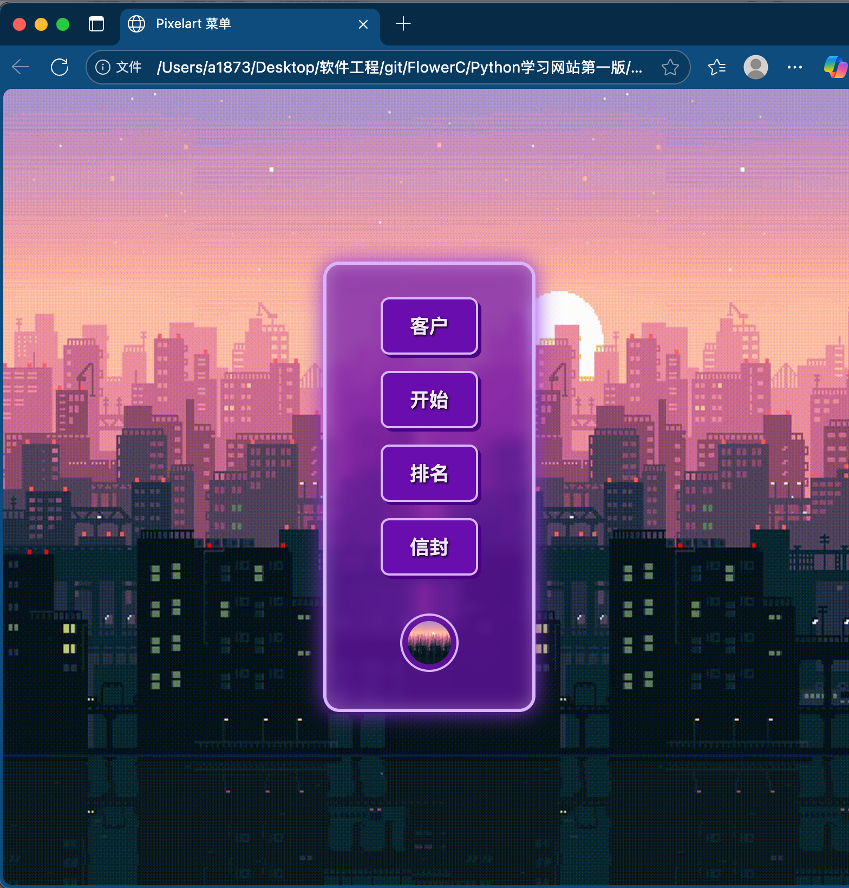

**9月27日，我们修改完善了项目计划，制作了需求文档以及study guide的前三个章节**

**10月17日，明天就是第一轮的截止时间，虽然主力军即将考试，人手有些短缺，但我们还是完成了：在网站方面：主界面，登录/注册界面，教学界面和用户功能。软件工程文档方面：第一版的Study guide，需求文档，设计文档，测试文档，当然还有本篇记录。**

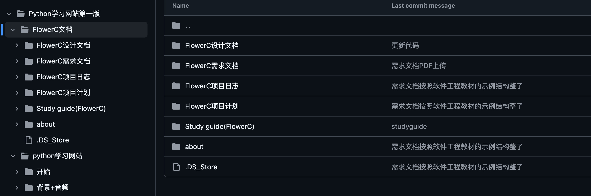

*在此第一轮制作就完工了，组员都很辛苦也很用功，希望我们能享受过程，学习技能，做出让自己开心的作品*

#### *以下为打分表*
|组员|贡献|得分|
|:---:|:---|:---:|
|李佳浩|记录了小组制作过程，并制作了一些文档，实现了登录与注册功能|95|
|常如意|设计了各级界面的排版布局，内容与功能，查找了图片等必要资源|100|
|李桂昇|修改完善了项目计划，制作了用户存储功能js，用户界面html|100|
|褚一满|制作了主界面，登录/注册界面，教学界面，测试简化了js代码|100|

---

# 第二轮

第二轮会议记录在此处：
|会议日期（2025）|参会人员|会议内容|决议事项|是否完成|
|------|-------|-------|-------|-------|
|10月21日|全员|第二轮制作内容商讨与第一轮回顾|明确了第二轮将会制作的内容|已完成|
|10月28日|全员|解决任务分配问题|编码任务补位给没有ppt任务的同学|已完成|
|11月4日|全员|同步制作目标与进度|继续ppt同时编码不耽误进度|已完成|
|11月18日|全员|进度同步与制作内容讨论|将金币与精灵待定，优先完成用户系统，准备ppt展示|已完成|
|11月25日|全员|网站剩余制作内容讨论|新增用户进度界面，boss界面玩家扣血|待完成|
|12月9日|全员|最终汇报内容讨论||

## 节点四（需求ppt展示，软件工程文档与study guide完成）

**10月21日，课上进行了第一轮的成果总结，以及第二轮的具体安排。新增了一项小组ppt的展示，我们选择了聚焦于需求章进行设计，并确定了主要负责的组员，明确了分工。在网站制作与软件工程文档方面，我们组已经有了第一版的基础与经验，准备在这一轮优化**
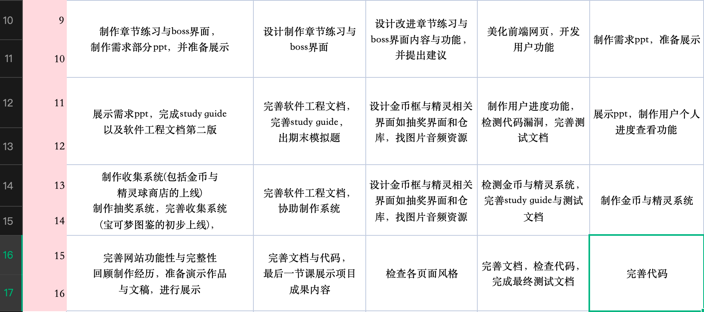

**10月28日，小组会议后调整了分工，由于原编写代码的同学要进行需求ppt的制作，编码任务进行了补位，并开始了新的网站设计**

**11月4日，小组ppt制作中，同时调整了start网页结构，只留下教学、练习和boss。依照教学章节的格式完成了练习界面，实现了进度管理，前一章节做完才可进入下一章练习，且用户每次登录不会丢失以往练习进度。优化了教学界面与练习界面的视觉效果**
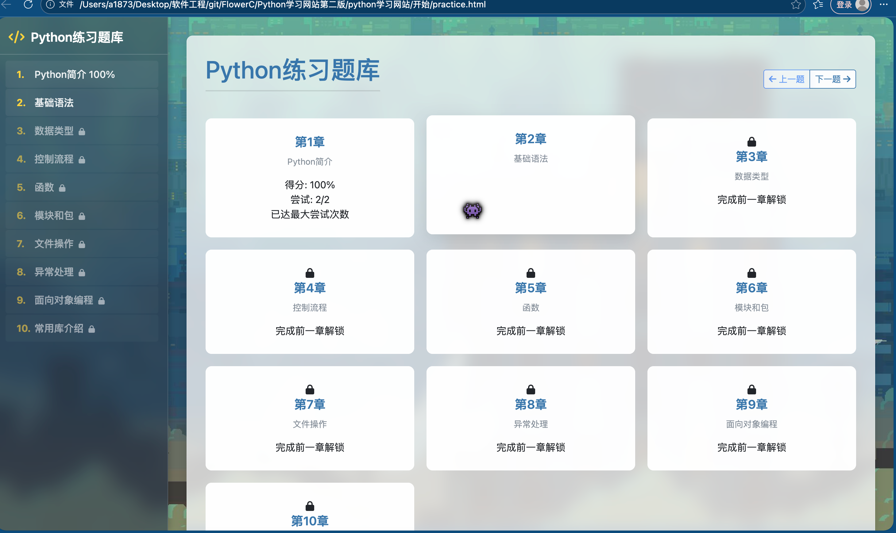

**11月11日，本周最终测试也就是boss界面完成，ppt也取得了很多进展，即将完成。boss界面由一张图片而诞生，将最终测试设计成了游戏一般的体验，从“纸上谈兵”到最后成品可以运行的那一刻，成就感又何尝没有具像化。**
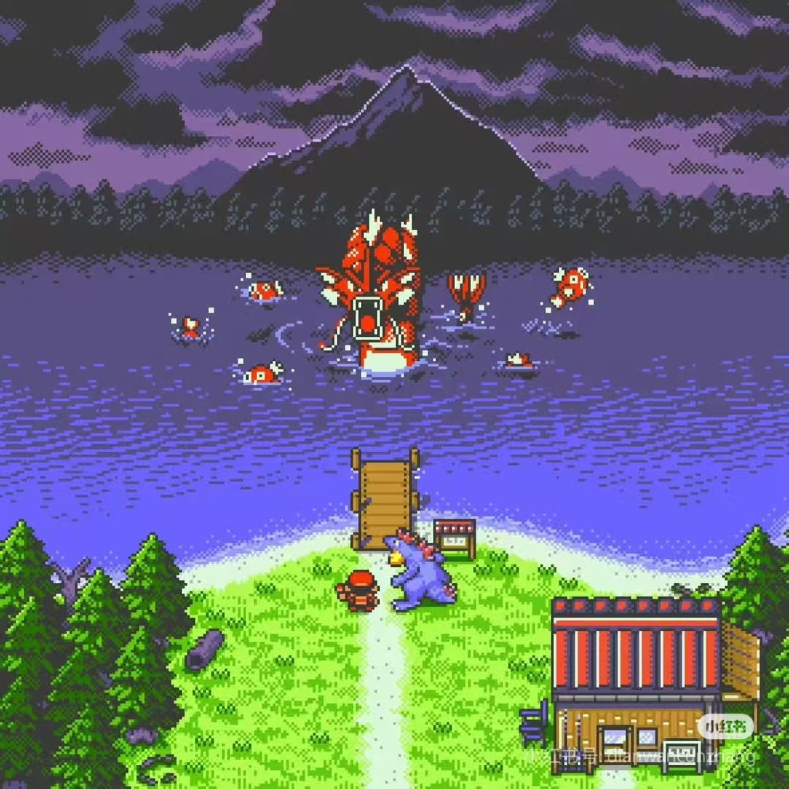
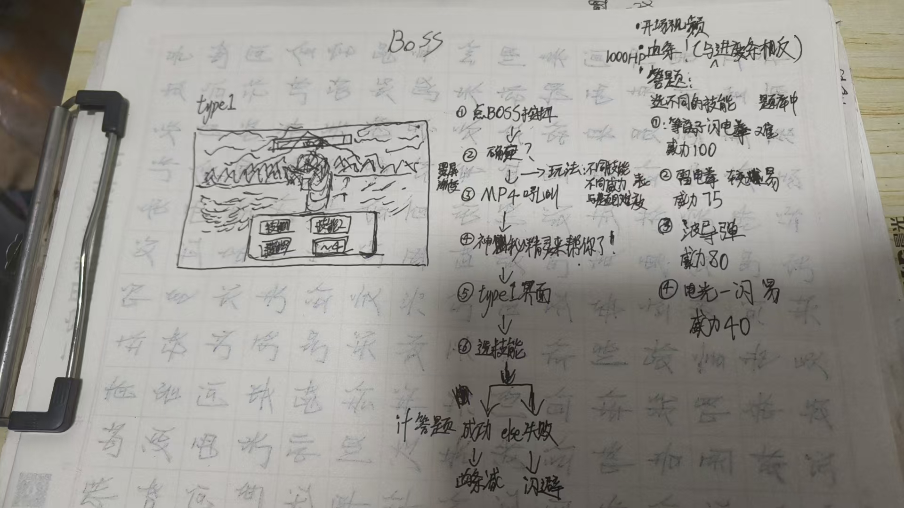
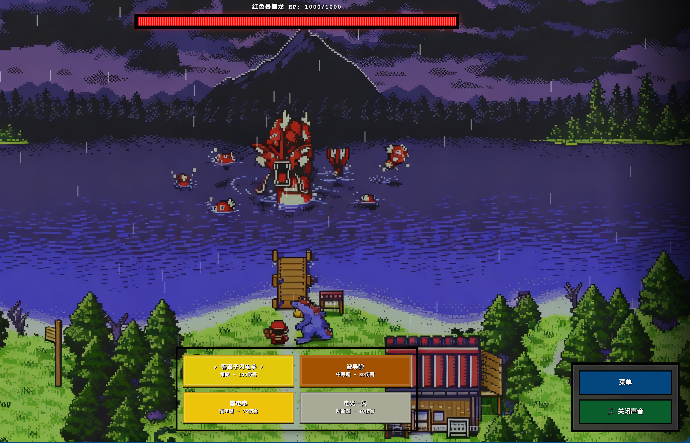

**11月18日，ppt已经完成并进行提前预演，由于新增任务以及进度原因暂时决定游戏化功能搁置，准备优先制作用户查询进度的功能界面**

**11月25日，课上进行了小组ppt展示，网页部分也实现了boss界面玩家答错扣血的功能**
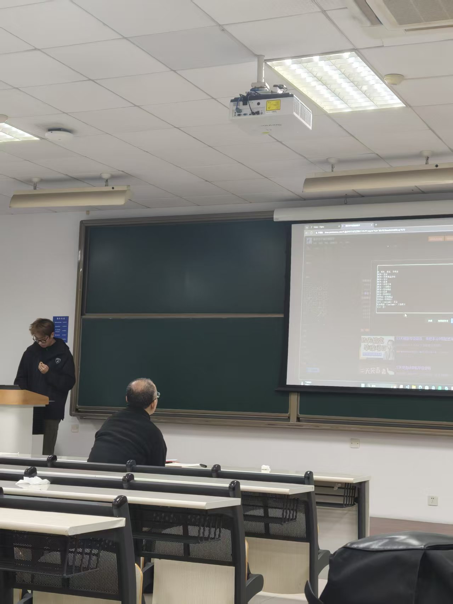
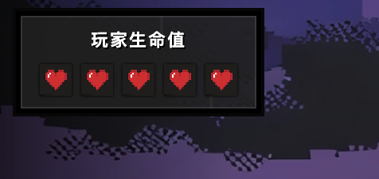

## 节点五（用户进度查看与游戏化系统的上线）

**12月9日，完成了用户系统与练习获得金币**
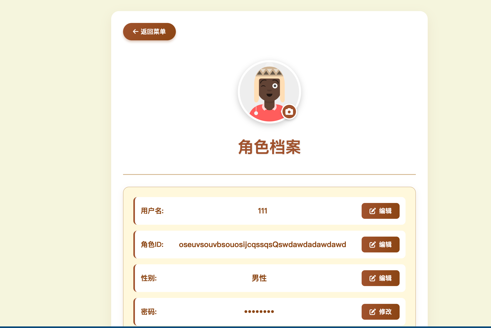
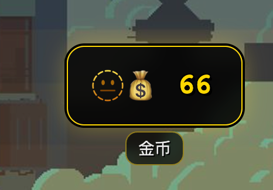

## 最终报告